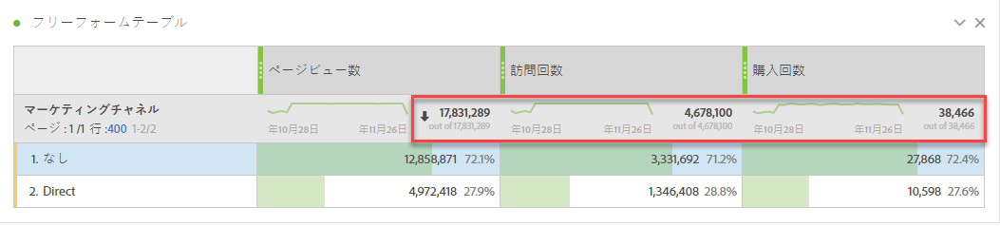
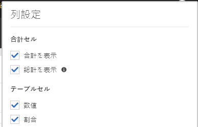
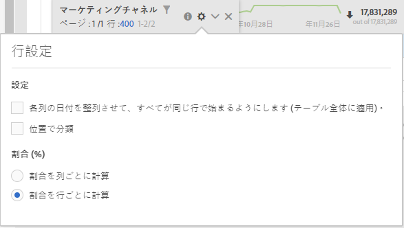

# ワークスペースの合計

フリーフォームテーブルでは、合計行が各分類レベルに表示され、2つの合計を表示できます。

* **[!UICONTROL 総合計]** （灰色の「不足」数） — この合計は、収集されたすべてのヒットを表し、「レポートスイートの合計」とも呼ばれます。 セグメントがパネルレベルまたはフリーフォームテーブル内で適用されると、この合計は、セグメント条件に一致するすべてのヒットを反映するように調整されます。
* **[!UICONTROL テーブル合計]** （黒い数字） — 通常、この合計は総合計と等しいか、またはそのサブセット [!UICONTROL です]。 「なしを含む」オプションなど、フリーフォームテーブル内で適用されたすべてのテー [!UICONTROL ブルフィルタ] を反映します。

## 合計設定を表示

[列の設 **[!UICONTROL 定]**]の下に、[合計を表示 **と[総合計を表]** 示]のオプションがあ **[!UICONTROL ります]**。 これらの設定がオフの場合、合計は表から削除されます。 これは、特定の計算指標のシナリオなどで合計が意味を持たない場合に [必要です](https://docs.adobe.com/content/help/en/analytics/components/calculated-metrics/calcmetrics-reference/cm-totals.html)。

## 静的行の合計の設定

[静的な行の合計は](https://docs.adobe.com/content/help/en/analytics/analyze/analysis-workspace/build-workspace-project/column-row-settings/manual-vs-dynamic-rows.html) 、動作が異なり、「行の設定」で制御 **[!UICONTROL されます]**。

* **[!UICONTROL 現在の行の合計を合計として表示]** — 表内の行のクライアント側の合計を表示します。これは、合計が訪問回数や訪問者数などの指標の重複を排 **除しない** ことを意味します。
* **[!UICONTROL 総合計を表示]** — サーバー側の合計を表示します。つまり、合計が訪問回数や訪問者数などの指標の重複を排除します。

## 合計のエクスポート

フリーフォームテーブルからデータをコピーして貼り付けるか、CSVでダウンロードすると、合計行にはテーブル合計のみが [!UICONTROL 反映され] ます。

## よくある質問

| 質問 | 回答 |
|---|---|
| 灰色の列の割合の基準はどれか。 | これは、「行の設定」で選択 **[!UICONTROL した]** 「割合」の設定に **[!UICONTROL よって異なります]**。<ul><li>列別にパーセントを計算 — これがデフォルト設定です。 割合は、表の合計に基づきます。</li><li>行別にパーセントを計算 — パーセントは総合計に基づきます。</li></ul> |
| 「未指定（なし）を含 **[!UICONTROL む」設定は、合計にどのように影響しますか]** 。 | 「未指 **[!UICONTROL 定（なし）を含む」設定がオフの場合]** 、「なし/未指定」の行はテーブル（テーブルの合計）から削除され、「合計」の指標タイプを使用する計算指標にも適用さ [れます](https://docs.adobe.com/content/help/en/analytics/components/calculated-metrics/calcmetric-workflow/m-metric-type-alloc.html) |
| フリーフォームテーブルにカスタムテーブルフィルターを適用する場合、そのフィルターに対してすべての計算指標と条件付き書式設定を利用できますか。 | 現在はありません。 **[!UICONTROL 「未指定（なし）を含む」は]** 、計上されますが、カスタム表フィルターは次に影響しません。<ul><li>条件付き書式で使用される列の最大/最小範囲は、すべてのデータを対象とします。</li><li>総合計指標タイプを **[!UICONTROL 利用する計算指標]** 。</li><li>フリーフォームテーブルの行全体を計算する関数（列合計、列最大、列最小、数、平均、中央値、百分位、四分位数、行数、標準偏差、偏差、累積平均、回帰、T — スコア、T — スコア、Z — スコア、Z — テストなど）を持つ計算指標。</li></ul> |
| 「計算指標」で、「総合計」指標タ **[!UICONTROL イプは]** 何を反映しますか。 | **[!UICONTROL 総合計は]** 、引き続き総合計 **[!UICONTROL を参照します]**。また、表または表の合計に適用されたフィルタは反 **[!UICONTROL 映されません]**。 |

