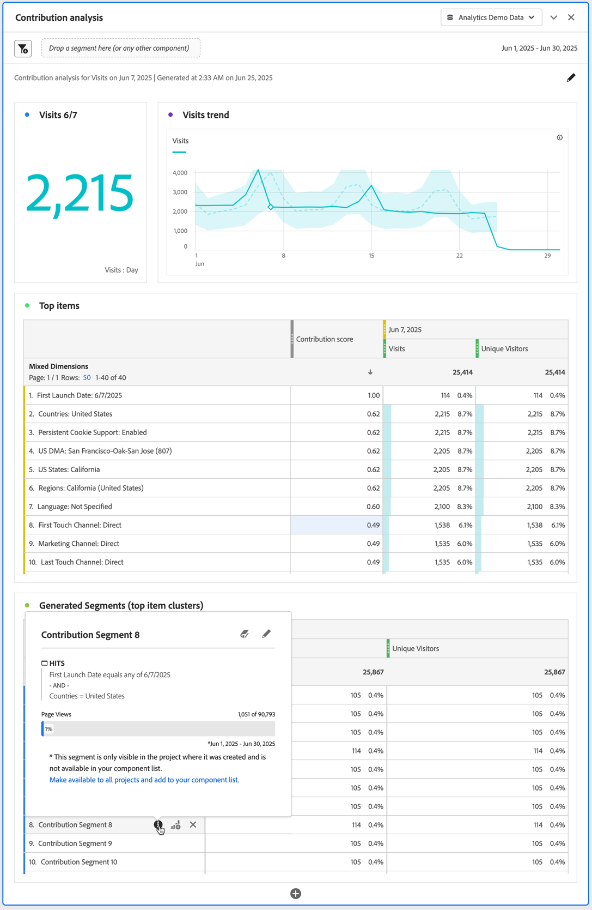
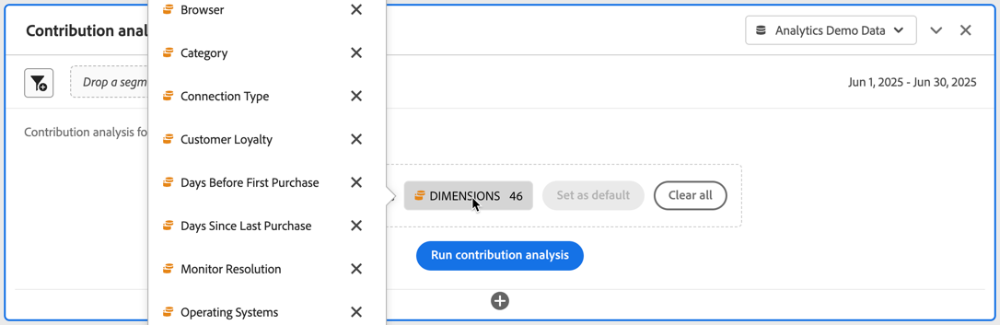

# 貢献度分析の実行

[貢献度分析](/help/analyze/analysis-workspace/c-anomaly-detection/anomaly-detection.md#contribution-analysis) は、Adobe Analytics で異常値と見なされた結果に貢献した要因を発見するために設計された、集中的な機械学習プロセスです。 目的は、ユーザーが重点領域や追加分析の機会をより迅速に見つけられるように支援することです。

>[!NOTE]
>
>貢献度分析は、日次の精度を持つデータに対してのみサポートされます。

貢献度分析を実行する手順は次のとおりです。

1. プロジェクトで貢献度分析を呼び出します。

   

   1. 行のビジュアライゼーションで、1日当たりの精度を持つフリーフォームテーブルに基づいて、異常データポイントを選択します。 ポップアップから、**[!UICONTROL 分析]**&#x200B;を選択します。
   1. 1日当たりの詳細を含むフリーフォームテーブルで、任意の行のコンテキストメニューから「**[!UICONTROL 貢献度分析を実行]**」を選択します。 異常が表示されない行に対して分析を実行することもできます。
   1. 毎日の粒度を持つフリーフォームテーブルで、異常を示す行に：
      1. インジケーター◥を選択します。
      1.  **[!UICONTROL 異常値が検出されました]** ダイアログから、「**[!UICONTROL 貢献度分析を開く]**」を選択します。

1. （オプション）分析の範囲を[ ディメンションを除く](#exclude-dimensions)で絞り込むことができます（したがって、速度を上げることができます）。

   

1. 「**[!UICONTROL 貢献度分析を実行]**」を選択します。

1. 貢献度分析が処理されるまでお待ちください。 レポートスイートのサイズやディメンションの数によっては、処理に膨大な時間がかかることがあります。 貢献度分析では、ディメンションごとに上位5万件の項目について分析を実行します。 残りの[貢献度分析トークン ](anomaly-detection.md#contribution-analysis-tokens)の数についても通知されます。

   

1. Analysis Workspaceは、このプロジェクト内で新しい&#x200B;**[!UICONTROL 貢献度分析]** パネルを直接読み込みます。

   

   * [要約番号](/help/analyze/analysis-workspace/visualizations/summary-number-change.md)のビジュアライゼーション。
   * 月別トレンドの[行](/help/analyze/analysis-workspace/visualizations/line.md) ビジュアライゼーション。
   * この異常値に貢献する上位アイテムを表示する&#x200B;**[!UICONTROL 上位アイテム]** [ フリーフォームテーブル ](/help/analyze/analysis-workspace/visualizations/freeform-table/freeform-table.md)は、[貢献度スコア ](/help/analyze/analysis-workspace/c-anomaly-detection/anomaly-detection.md#contribution-analysis)でソートされています。 追加の列には、問題の指標と、コンテキストを提供する&#x200B;**[!UICONTROL ユニーク訪問者]**&#x200B;指標が表示されます。

   * **[!UICONTROL 生成セグメント （上位アイテムクラスター）]** [ フリーフォームテーブル ](/help/analyze/analysis-workspace/visualizations/freeform-table/freeform-table.md)は、貢献度スコア、異常値の発生、異常指標に貢献する全体的な割合に基づいて、上位アイテムの関連付けを識別します。 この関連付けは、オーディエンスセグメント（貢献度セグメント 1、貢献度セグメント 2など）としてキャプチャされます。 「」を選択して、セグメントが構成されている上位アイテムを含むセグメントの定義を表示します。

1. 貢献度分析はAnalysis Workspaceの一部となったため、フリーフォームのテーブルコンテキストメニューから様々な機能を利用して、分析をさらに有意義なものにすることができます。

   * [各ディメンション項目を別のディメンションごとに分類](/help/analyze/analysis-workspace/components/dimensions/t-breakdown-fa.md)
   * [1つ以上の行をトレンドにしています](/help/analyze/analysis-workspace/home.md#section_34930C967C104C2B9092BA8DCF2BF81A)
   * [新しいビジュアライゼーションを追加](/help/analyze/analysis-workspace/visualizations/freeform-analysis-visualizations.md)
   * [ アラートの作成](/help/components/alerts/alerts-overview.md)
   * [セグメントの作成または比較：](/help/analyze/analysis-workspace/c-panels/c-segment-comparison/segment-comparison.md)

>[!NOTE]
>
>分析された異常値は、貢献度分析内の青い点と、それにリンクされたインテリジェントアラートプロジェクトで強調表示されます。 このハイライトは、分析中の異常をより明確に示します。

## ディメンションを除外

貢献度分析からいくつかのディメンションを除外することができます。 例えば、ブラウザーやハードウェア関連のディメンションは気にせず、それらを削除して分析を高速化する必要があります。

除外されたディメンションを管理するには、次の手順に従います。

* 不要なディメンションを&#x200B;**[!UICONTROL 除外ディメンション]** パネルにドラッグし、**[!UICONTROL デフォルトとして設定]**&#x200B;をクリックしてリストを保存します。

* **[!UICONTROL すべてをクリア]**&#x200B;を選択して、最初からやり直します。

* 「」を選択してコンテキストメニューを表示し、を使用して、選択した除外ディメンションをリストから削除します。

  

除外するディメンションを変更したら、**[!UICONTROL 貢献度分析を実行]**&#x200B;をもう一度選択します。

