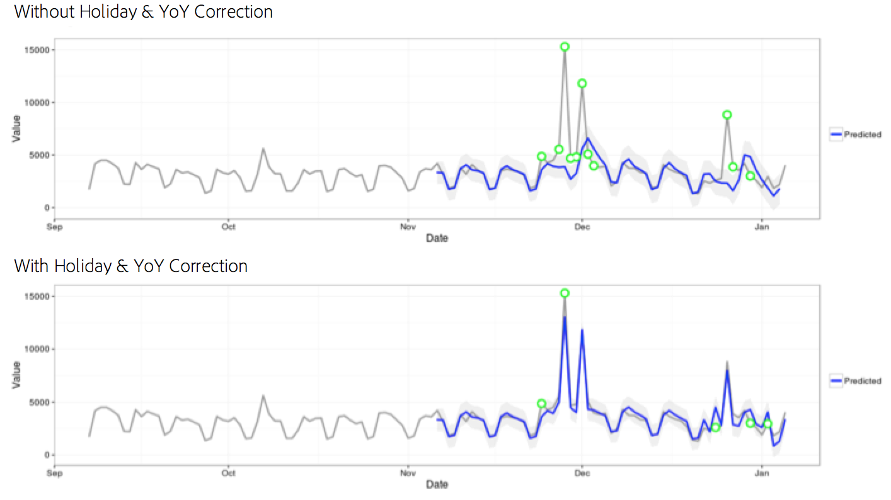
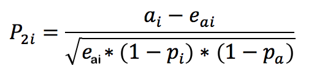

# 統計的手法

Analysis Workspace の異常値検出は、一連の高度な統計的手法を用いて、計測値を異常値と見なすべきかどうかを判定します。

レポートで使用しているデータ精度に応じて、特に 1 時間ごと、毎日、毎週／毎月の異常値検出用に、3 つの異なる統計的手法が使用されます。 各統計的手法の概要を次に示します。

## 毎日の精度の異常値検出

毎日の精度のレポートの場合、アルゴリズムは、いくつかの重要な要素を考慮して、可能性のある最も正確な結果を産出します。 まず、アルゴリズムは、利用可能なデータに基づいて、適用するモデルのタイプを決定します。このモデルでは、時系列ベースモデルと異常値検出モデル（機能フィルタリングと呼ばれます）のふたつのクラスのいずれかを選択します。

時系列モデルの選択は、エラーのタイプ、トレンド、シーズナリティ（ETS）の組み合わせに基づいています（[Hyndman 他著 (2008)](https://link.springer.com/book/10.1007/978-3-540-71918-2). 具体的には、アルゴリズムは次の組み合わせを試みます。

1. ANA （付加誤差、トレンドなし、付加季節性）
1. AAA （加法誤差、加法傾向、加法季節性）
1. MNM （乗法誤差、トレンドなし、乗法季節性）
1. MNA （乗法誤差、トレンドなし、加法季節性）
1. AAN （加法誤差、加法傾向、季節性なし）

このアルゴリズムは、平均の絶対誤差（MAPE）が最も大きい組み合わせを選択することで、各組み合わせの適合性をテストします。 ただし、最適な時系列モデルのMAPEが15%を超える場合は、機能フィルタリングが適用されます。 通常、時系列モデルでは、反復の程度が高いデータ（例えば、週ごとに、月ごとに）が最適です。

モデルを選択すると、アルゴリズムは休日と前年比の季節性にもとづいて結果を調整します。 休日の場合、アルゴリズムは、レポート日付範囲に次の休日があるかどうかを確認します。

* 記念日
* 4 年 7 月（PT）
* 感謝祭
* Black Friday
* Cyber Monday
* 12 月 24～26 日（PT）
* 1 月 1 日（PT）
* 12 月 31 日（PT）

これらの休日は、顧客のトレンドの最多数に対して最も重要な休日を識別するために、多くの顧客データポイントにわたる広範な統計分析に基づいて選択されました。 リストはすべての顧客またはビジネスサイクルに対して完全ではありませんが、これらの休日を適用すると、ほぼすべての顧客のデータセットのアルゴリズム全体のパフォーマンスが大幅に向上します。

モデルが選択されて、レポートの日付範囲で休日が識別されると、アルゴリズムは、次の方法で進行します。

1. 異常値参照期間の設定： この期間には、レポートの日付範囲の35日前までの期間と、一致する日付範囲の1年前までの期間が含まれます。 また、前年の異なる暦日に発生した可能性のある該当する祝日を含め、必要に応じてうるう日数を考慮します。
1. 現在の期間（前年を除く）の休日が最近のデータに基づいて異常かどうかをテストします。
1. 現在の日付範囲の休日が異常である場合、前年の休日を前提として現在の休日の期待値と信頼区間を調整します（前後 2 日間を考慮）。 現在の休日の修正は、次の最低平均絶対率誤差に基づいています。

   1. 加法効果
   1. 乗法効果
   1. 前年差額

次の例では、クリスマスおよび元日のパフォーマンスが大幅に向上していることがわかります。

## 時間単位の精度の異常値検出

時間別データは、日次の精度アルゴリズムと同じ時系列アルゴリズムのアプローチに依存します。 しかし、このモデルは2つのトレンドパターンに大きく依存しています。24時間サイクルと週末/平日サイクルです。 これらの2つの季節的効果を捉えるために、時間別アルゴリズムは、上記で概説した同じアプローチを使用して、週末と平日の2つの別々のモデルを構築します。

時間別トレンドのトレーニングウィンドウは、336時間のルックバックウィンドウに依存しています。

## 毎週および毎月の精度の異常値検出

週単位と月単位のトレンドは、日単位または時間単位の精度で見つかる週単位または日単位のトレンドとは異なるため、別個のアルゴリズムが使用されます。 週単位および月単位では、2段階の異常値検出アプローチは一般化された極端な学習偏差（GESD）テストとして知られています。 このテストでは、予想される異常値の最大数と、調整されたボックスプロットアプローチ（異常値検出の非パラメトリック手法）を組み合わせて、異常値の最大数を判断します。 2つの手順は次のとおりです。

1. 調整済みボックスプロット関数：この関数は、入力データに指定された異常値の最大数を決定します。
1. GESD関数：手順1の出力で入力データに適用されます。

ホリデーシーズンと前年同期異常値検出ステップでは、今年のデータから昨年のデータを差し引きます。 異常が季節的に適切かどうかを検証するために、上記の2つのステップのプロセスを使用してデータを繰り返します。 これらのデータ精度のそれぞれは、選択したレポート日付範囲（15 ヶ月または 15 週間のどちらか）を含む 15 期間のルックバックおよびトレーニングに関する対応する日付範囲 1 年前を使用します。

## 貢献度分析で使用される統計的手法

貢献度分析は、Adobe Analyticsで観測された異常値の原因を明らかにするために設計された強力なマシンラーニングプロセスです。 目的は、ユーザーが重点領域や追加分析の機会をより迅速に見つけられるように支援することです。

貢献度分析では、ユーザーの貢献度分析レポートで使用可能なすべてのディメンション項目に対して2部構成のアルゴリズムを実行します。 アルゴリズムは、次の順序で動作します。

1. 各ディメンションの場合、クラメールの V 検定統計を計算します。 次の例では、2 つの期間にわたる国別ページビュー数の分割表について検討します。

   

   表1では、CramerのVを使用して、期間1 （例えば、履歴）と期間2 （例えば、異常が発生した日）の国ごとのページビュー間の関連性を測定することができます。 クラメールの V の低い値は、関連が低レベルであることを示しています。 クラメールの V の範囲は、0（関連なし）から 1（完全な関連性）です。 クラメールの V 統計は、次のように計算されます。

   

1. 各ディメンション項目の場合、ピアソン残差（PR）が、異常な指標と各ディメンション項目の間の関連の測定に使用されます。 PRは標準的な正規分布に従うため、偏差が匹敵しない場合でも、アルゴリズムは2つのランダム変数のPRを比較できます。 実際には、この誤差は既知ではなく、有限サンプル補正を使用して推定されます。

   表1の前の例では、国iと期間2に対する有限サンプル補正を含むPRは、次のように与えられます

   

   場所

   

   （1期については同様の式を得ることができる。）

   最終結果として、各ディメンション項目のスコアは、クラメールの V 指標で重み付けされ、0～1 の数値に再測定されて、貢献度スコアが提供されます。
