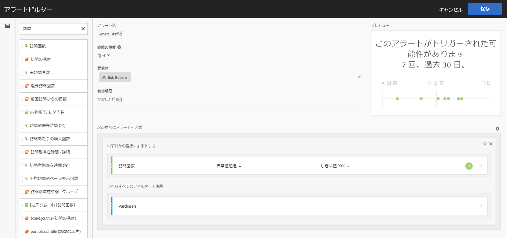
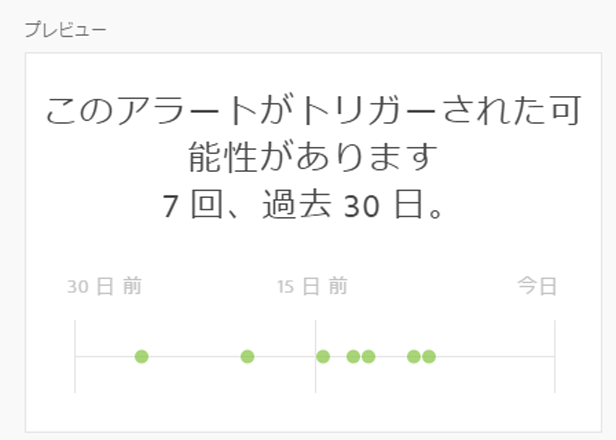

# アラートビルダー

>[!IMPORTANT]
>
>インテリジェントアラートは、Adobe Analytics PrimeおよびAdobe Analytics Ultimateのお客様のみ利用できます。

## アクセスアラートビルダー

アラートビルダーには、以下の 4 つのうちいずれかの方法でアクセスします。

* Analysis Workspace で以下のショートカットを使用する。

   `ctrl (or cmd) + shift + a`
* **[!UICONTROL ワークスペース]** / **[!UICONTROL コンポーネント]** / **[!UICONTROL 新しいアラート]**&#x200B;に移動します。
* By selecting one or more freeform table line items, right-clicking and selecting **[!UICONTROL Create Alert from Selection]**.
* From within a Reports &amp; Analytics report, by going to **[!UICONTROL More]** &gt; **[!UICONTROL Add Alert]**.

## アラートの構築

アラートビルダーインターフェイスは、Analytics でセグメントや計算指標を作成していたユーザーにとってなじみのあるものです。

<!--Meike, I edited this table for validation -->

**アラート名**

アラート名を指定します。アラート名には、レポート名または指標のしきい値を含めることができます。

**時間の精度**

いつ指標がチェックされるかを、1 時間ごと、毎日、毎週または毎月から指定します。

>[!NOTE]
>
>カスタムカレンダーのレポートスイートでは、アラートビルダーの毎月の精度はサポートされません。

**受信者**

アラートの送信先を指定します。アラートは、Analytics ユーザー、Analytics グループ、生の電子メールアドレスまたは電話番号に送信できます。

>[!IMPORTANT]
>
>The phone number must be preceded by a "+" and a [country code](https://countrycode.org/).

アラートがトリガーされるとユーザーが受け取る電子メールは、次のようになります。

**有効期限**

アラートの有効期限を設定します。

**次の場合にアラートを送信...**

*... いずれかの指標によるトリガー*

* トリガーを追加するキャンバスに指標をドラッグ＆ドロップします。

   **アラート内のすべてのコンポーネント（指標/ディメンション/セグメント）が現在選択されているレポートスイートと互換性がある場合、«互換性のないコンポーネント»** メッセージが表示されます。
* アラートが設定される前に指標が超過している必要があるしきい値を指定します。この値をしきい値に設定し、以下のいずれかの条件にすることができます。

   * 異常値が存在する
   * 異常値が予測より上
   * 異常値が予測より下
   * 以上
   * 以下
   * 変更（％）
   * 90％、95％、99％、99.75％、99.9％ のしきい値を設定できます。
   計算指標も使用できることに注意してください。

*... これらすべてのフィルターを使用*

* セグメントまたはディメンションをここにドラッグ＆ドロップしてフィルターを追加します。例えば、「モバイルデバイスのみ」セグメントの追加は、ルールがモバイルデバイスに対してのみトリガーするということを意味します。
* 追加のフィルターは、AND ステートメントを使用して追加されます。

**ルールを追加**

ギアアイコンをクリックして、AND または OR ルールを追加できます。

## Preview Alerts {#section_10D75BA7B77E4C5FAF58A719C082E070}

インタラクティブアラートプレビューは、過去の経験に基づいて、アラートが実行されるおよその頻度を表示します。

例えば、時間の精度を毎日に設定すると、プレビューにより、最近の 30 または 31 日間で、特定の指標に対してアラートが何回トリガーされたかがわかります。

トリガーされているアラートが多すぎる場合は、[アラートマネージャー](/help/components/c-alerts/alert-manager.md)でしきい値を調整できます。

