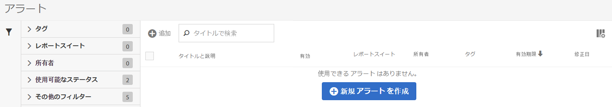
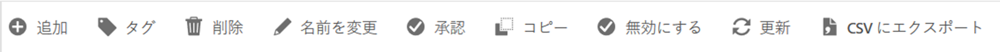

# アラートマネージャー

The Alert Manager ( **[!UICONTROL Analytics]** &gt; **[!UICONTROL Components]** &gt; **[!UICONTROL Alerts]**) is structured very much like the [Segment Manager](https://marketing.adobe.com/resources/help/en_US/analytics/segment/seg_manage.html) and the [Calculated Metric Manager](https://marketing.adobe.com/resources/help/en_US/analytics/calcmetrics/cm_manager.html) and allows you to

* Access the Alert Builder by clicking **[!UICONTROL + Add]**.
* アラートのタグ付け。これにより、アラートを使いやすく整理できます。
* アラートの削除。
* アラートの名前の変更。
* アラートの承認。
* アラートのコピー。
* アラートの有効化／無効化。
* アラートの有効期限の&#x200B;**更新**。When one or more alerts are selected, they can be renewed by clicking **Renew**.This extends their expiration dates to be 1 year from the day Renew was clicked, regardless of their original expiration date.
* アラートの .CSV ファイルへの書き出し。
* アラートタイトルのダブルクリックによるアラートの編集。
* アラートの検索。
* 他のレポートスイートへのアラートの追加。
* アラートの所有者の指定／変更。
* 他のフィルターの追加。
* アラートの&#x200B;**有効期限**&#x200B;の定義。

