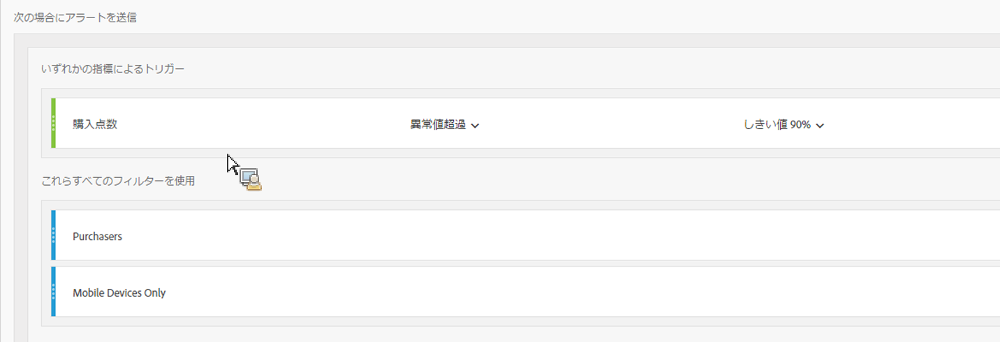
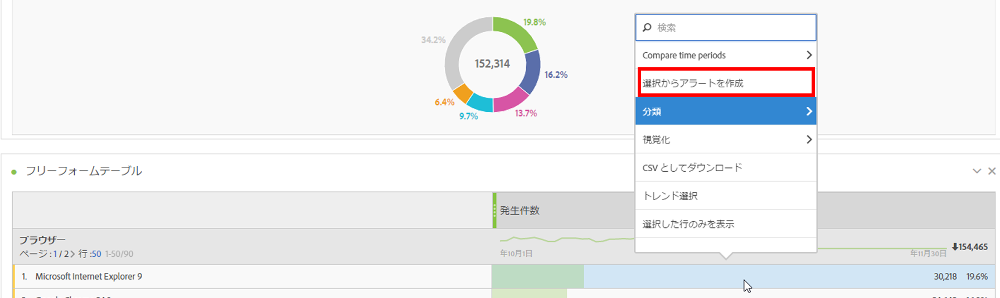
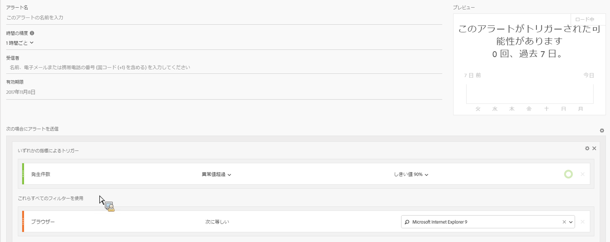
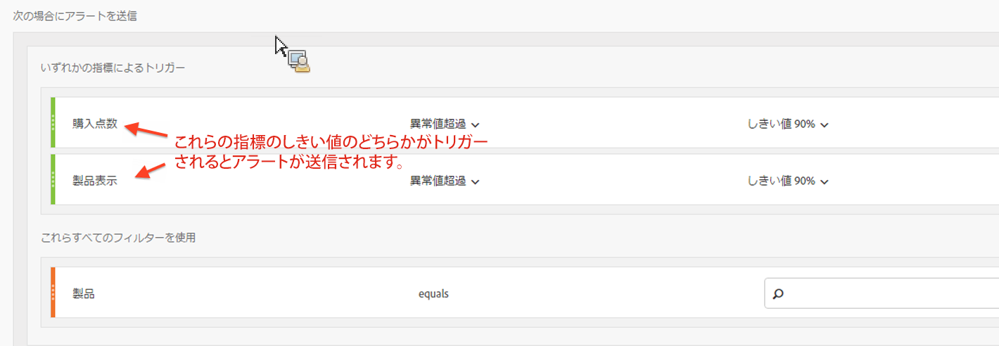

# インテリジェントアラート - 使用例

## 2 つのセグメントでフィルターしたシンプルなアラートの作成 {#section_2E96FFFA93D44F7D8DBCEC97203204AA}

<!-- 

Update screenshots for better readability.

 -->

## テーブルの選択範囲からアラートを作成する {#section_AE6D42E1255D498D908A2FA60370A419}

フリーフォームテーブルで、テーブル行を右クリックして「**[!UICONTROL 選択からアラートを作成]**」を選択することで、コンテキスト内アラートを作成できるようになりました。

これにより、即座にアラートビルダーに事前入力して、適切な指標およびフィルターでアラートを作成できます。

## 複数のアラートを作成する代わりに（スタック）アラートを統合する {#section_B27B0856BA104B9FB6D0BBB317633F18}

アラートのスタックは、アラートを組み合わせて、多数の異なるアラートを受け取ることがないようにします。

