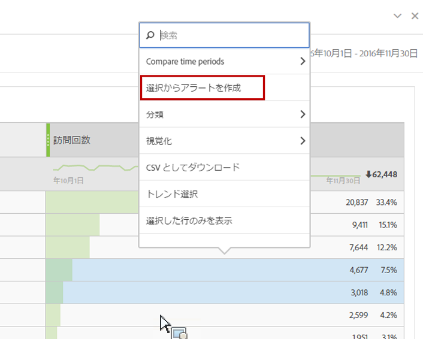
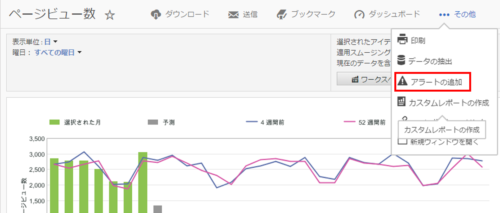

# インテリジェントアラートの概要

インテリジェントアラートシステムでは、異常値検出とアラートを統合して、アラートをより詳細に制御します。

[インテリジェントアラート](https://docs.adobe.com/content/help/ja-JP/analytics-learn/tutorials/data-science/intelligent-alerts.html)（5:34）のビデオチュートリアルを紹介します。

## 概要

Analysis Workspace の新しいアラートビルダーおよびアラートマネージャーは、Reports &amp; Analytics の既存のアラート機能を置き換えます。インテリジェントアラートを使用すると、次のことができます。

* 異常値（90％、95％、99％、99.75％、99.9％のしきい値、変化率、超過／未満）に基づいてアラートを構築
* アラートがトリガーされる頻度のプレビュー
* 自動生成される Analysis Workspace プロジェクトへのリンクが記載された電子メールまたは SMS によるアラートの送信
* 1 つのアラートで複数の指標を示す「積み重ね」アラートの作成

アラートビルダーにアクセスするには、次の 4 つの方法があります。

* アラートビルダーに直接移動する場合：**[!UICONTROL コンポーネント]**／**[!UICONTROL アラート]**
* Workspace でのキーボードショートカットの使用：`Ctrl + Shift + A`（Windows）または`Cmd + Shift + A`（Mac OS）
* 1 つまたは複数のフリーフォームテーブル行項目を選択し、右クリックして、「**[!UICONTROL 選択からアラートを作成]**」を選択する。これにより、アラートビルダーが開き、テーブルから適用した適切な指標およびフィルターが事前設定されます。必要に応じて、アラートを編集できます。

   

* Reports &amp; Analytics レポートから、**[!UICONTROL その他]**／**[!UICONTROL アラートの追加]**&#x200B;に移動する。これにより、アラートビルダーが開き、レポートから適用した適切な指標およびフィルターが事前設定されます。必要に応じて、アラートを編集できます。

   

パーセントしきい値は標準偏差です。例えば、95% = 2 標準偏差と 99% = 3 標準偏差です。選択した時間の精度に応じて、[異なるモデル](../virtual-analyst/c-anomaly-detection/statistics-anomaly-detection.md)が使用され、各データポイントが標準からどれくらい離れているか（標準偏差からの乖離）が計算されます。しきい値を低く（90％など）設定すると、しきい値を高く（99.75％など）設定した場合よりも多くの異常値が取得されます。

>[!IMPORTANT]
>
>タイムスタンプ付きデータを使用してアラートを作成すると、アラートが誤って起動される可能性があります。インテリジェントアラートには、タイムスタンプのないデータの使用をお勧めします。

## アラートの異常値ルックバック

異常値検出を使用するアラートの場合、トレーニング期間は、アラートに選択した精度に応じて異なります。

* 月単位の精度：15 ヶ月 + 前年の同じ時間範囲
* 週単位の精度：15 週 + 前年の同じ時間範囲
* 日単位の精度：35 日 + 前年の同じ時間範囲
* 時間単位の精度：336 時間

詳しくは、[異常値検出で使用される統計的手法](../virtual-analyst/c-anomaly-detection/statistics-anomaly-detection.md)を参照してください。
