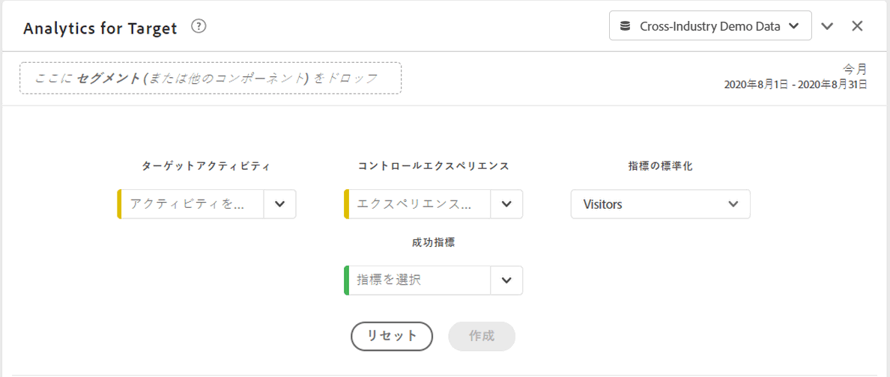
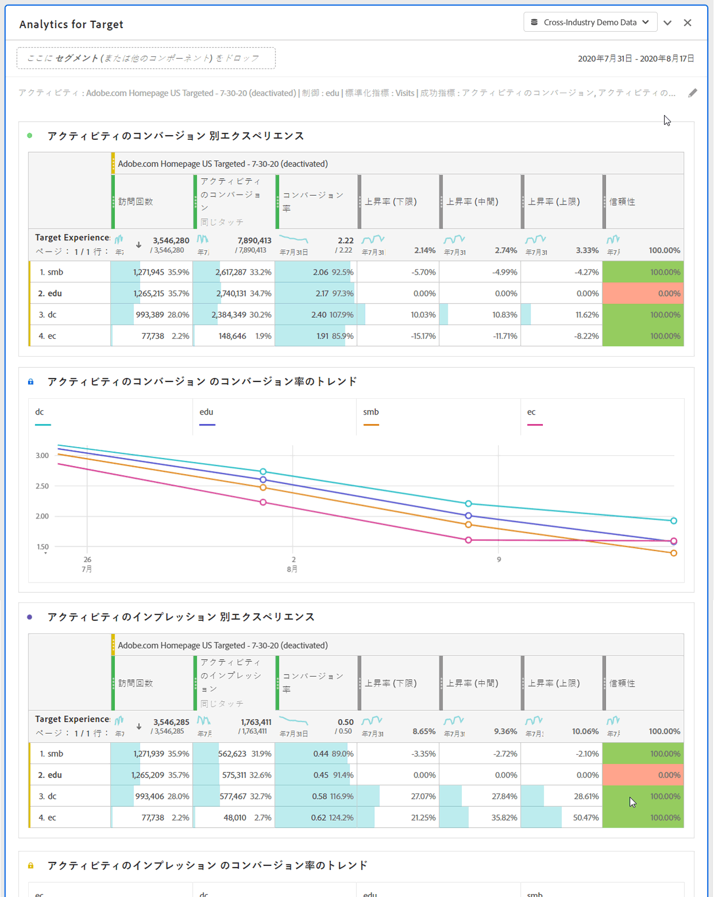

# Analytics for Target（A4T）パネル

Analytics for Target（A4T）パネルを使用すると、Analysis Workspace で Adobe Target のアクティビティとエクスペリエンスを分析できます。また、最大 3 つの成功指標に対する上昇率と信頼性を確認することもできます。A4T パネルにアクセスするには、A4T コンポーネントが有効なレポートスイートに移動します。次に、左端のパネルアイコンをクリックし、Analytics for Target パネルを Analysis Workspace プロジェクトにドラッグします。

## パネル入力 {#Input}

次の入力設定を使用して、A4T パネルを設定できます。

| 設定 | 説明 |
|---|---|
| ターゲットアクティビティ | Target アクティビティのリストから選択するか、左のパネルからアクティビティをドラッグ&amp;ドロップします。注：リストには、少なくとも 1 回のヒットを持つ過去 6 か月のアクティビティが入力されます。リストに表示されていないアクティビティは、6 か月を超えている可能性があります。この機能は、最大 18 か月のルックバック期間を持つ左側のパネルから追加できます。 |
| コントロールエクスペリエンス | コントロールのエクスペリエンスを選択します。必要に応じて、ドロップダウンで変更できます。 |
| 指標の標準化 | ユニーク訪問者、訪問回数、アクティビティインプレッション数から選択します。ほとんどの分析の使用例では、ユニーク訪問者を使用することをお勧めします。この指標（カウント手法とも呼ばれます）は、上昇率計算の分母になります。また、信頼性計算が適用される前のデータの集計方法に影響します。 |
| 成功指標 | ドロップダウンから最大 3 つの標準（計算されていない）成功イベントを選択するか、左側のパネルから指標をドラッグ&amp;ドロップします。各指標は、レンダリングされたパネルに専用のテーブルとビジュアライゼーションを持ちます。 |
| カレンダーの日付範囲 | これは、Adobe Target のアクティビティ日付範囲に基づいて自動入力されます。必要に応じて変更できます。 |

## パネル出力 {#Output}

Analytics for Target パネルは、豊富なデータとビジュアライゼーションのセットを返し、Adobe Target のアクティビティとエクスペリエンスのパフォーマンスをより深く理解できるようにします。パネルの上部に、選択したパネル設定を示す概要行が表示されます。右上の編集鉛筆をクリックすると、いつでもパネルを編集できます。

選択した各成功指標に対して、1 つのフリーフォームテーブルと 1 つのコンバージョン率トレンドが表示されます。

各フリーフォームテーブルには、次の指標列が表示されます。

| 指標 | 説明 |
|---|---|
| 指標の標準化 | ユニーク訪問者、訪問数またはアクティビティインプレッション数。 |
| 成功指標 | ビルダーで選択された指標 |
| コンバージョン率 | 成功指標/標準化指標 |
| 上昇率 | 各エクスペリエンスのコンバージョン率とコントロールエクスペリエンスを比較します。注：上昇率は、「ターゲットエクスペリエンス」に対して「ロックされた指標」です。分類したり、他のディメンションで使用したりすることはできません。 |
| 上昇率 (下限) | バリアントエクスペリエンスがコントロールに対して持つ可能性のある最悪の上昇率を 95% の信頼区間で表します。 計算：(x/y ± 1.96 std_err(x,y)) / (x_control/y_control ∓ 1.96 std_err(x_control,y_control))。std_err(x,y) は sqrt(xx/y - (x/y)^2) で、xx は平方和を表します。 |
| 上昇率 (中間) | 95% の信頼区間において、コントロールのバリアントエクスペリエンスで使用できる上昇率の中央値を表します。これは、Reports &amp; Analytics の「リフト」です。 計算：(x/y)/(x_control/y_control) - 1 |
| 上昇率 (上限) | バリアントエクスペリエンスがコントロールに対して持つ可能性のある最高の上昇率を 95% の信頼区間で表します。 計算：「上昇率（下限）」を参照してください。 |
| 信頼性 | 学生 t テストは信頼性レベルを計算します。これは、テストを再度実行した場合に結果が重複する可能性を示しています。75%／85%／95%という固定の条件付き書式が指標に適用されました。この形式設定は、必要に応じて列設定の下でカスタマイズできます。注 ：信頼性は、「ターゲットエクスペリエンス」に対して「ロックされた指標」です。 分類したり、他のディメンションで使用したりすることはできません。 計算：自由度が y+y_control-2 の 2-tailed t 検定を適用して、p 値（x/y が x_control/y_control に等しいかどうか）を調べます。stderr は sqrt( (xx/y-(x/y)^2)/y + (xx_control/y_control-(x_control/y_control)^2)/y_control) である t スコアを計算します。 1～p は、それぞれ異なる信頼性として返されます。 |

Analysis Workspace のパネルと同様に、Adobe Target アクティビティの分析に役立つテーブルと[ビジュアライゼーション](https://docs.adobe.com/content/help/ja-JP/analytics/analyze/analysis-workspace/visualizations/freeform-analysis-visualizations.html)を追加して分析を続行できます。セグメントは、パネルレベルでもフリーフォームテーブル内でも適用できます。なお、フリーフォームテーブル内に追加する場合は、上昇率と信頼性の計算を維持するため、テーブル全体にオーバーレイする必要があります。 現時点では、列レベルのセグメントはサポートされていません。

## よくある質問（FAQ） {#FAQ}

| 質問 | 回答 |
|---|---|
| A4T でサポートされるアクティビティのタイプは何ですか？ | サポートされるアクティビティの種類について[詳しく](https://docs.adobe.com/content/help/ja-JP/target/using/integrate/a4t/a4t-faq/a4t-faq-activity-setup.html)ご覧ください。 |
| 計算指標は上昇率と信頼性の計算でサポートされていますか。 | いいえ。上昇率と信頼性で計算指標がサポートされない理由について[詳しく](https://docs.adobe.com/content/help/ja-JP/target/using/integrate/a4t/a4t-faq/a4t-faq-lift-and-confidence.html)ご覧ください。ただし、計算指標は、これらの指標の外部で A4T レポートで使用できます。 |
| なぜ、Target と Analytics ではユニーク訪問者数が異なるのでしょうか。 | 製品間のユニーク訪問者の相違についての[詳細](https://docs.adobe.com/content/help/ja-JP/target/using/integrate/a4t/a4t-faq/a4t-faq-viewing-reports.html)。 |
| 分析内の特定の Target アクティビティに対してヒットセグメントを適用すると、無関係なエクスペリエンスが返されるのはなぜですか。 | A4T ディメンションはリスト変数です。つまり、多数のアクティビティ（およびエクスペリエンス）を一度に含めることができます。[詳細情報](https://docs.adobe.com/content/help/ja-JP/target/using/integrate/a4t/a4t-faq/a4t-faq-viewing-reports.html) |
| 信頼性指標は、極端な注文を考慮しますか。それとも、複数のオファーに対してボンフェローニ補正を適用しますか。 | いいえ。Analytics が信頼性を計算する方法について[詳しく](https://docs.adobe.com/content/help/ja-JP/target/using/integrate/a4t/a4t-faq/a4t-faq-lift-and-confidence.html)ご覧ください。 |
| 上昇率指標と信頼性指標を他のディメンションや分類と共に使用できますか。 | 上昇率と信頼性は、「ターゲットエクスペリエンス」ディメンションに対して「ロックされた指標」です。これは、全体で計算するには、コントロールとバリアントが必要だからです。したがって、分類したり、他のディメンションで使用したりすることはできません。 |
| 上昇率と信頼性はいつ再計算されますか。 | 上昇率と信頼性は、パネルの実行（または再実行）、パネルの日付範囲の変更、パネルまたはテーブルへのセグメントの適用のたびに再計算されます。フリーフォームテーブルにセグメントフィルターを適用する場合、すべての列にセグメントフィルターを適用する必要があります。そうしないと、上昇率と信頼性が正しく更新されません。 現時点では、列レベルのセグメントはサポートされていません。 |

Analytics for Target レポートについて詳しくは、[A4T レポート](https://docs.adobe.com/content/help/ja-JP/target/using/integrate/a4t/reporting.html)を参照してください
