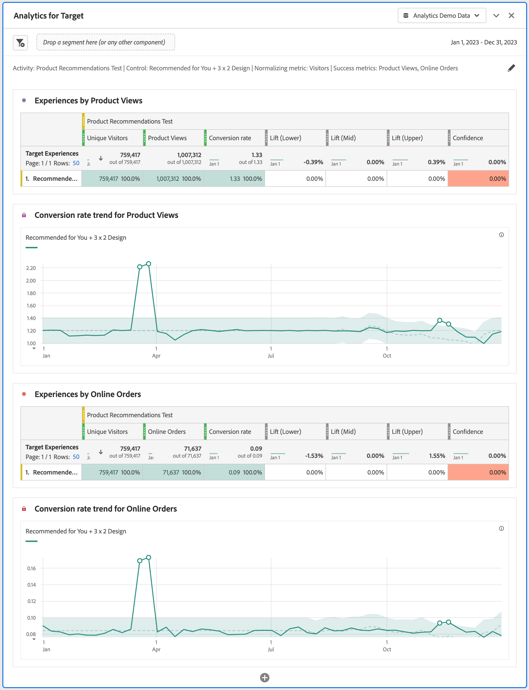

# Analytics for Target パネル {#analyze-for-target-panel}

<!-- markdownlint-disable MD034 -->

>[!CONTEXTUALHELP]
>id="workspace_a4t_button"
>title="Analytics for Target"
>abstract="Analysis Workspace で Target アクティビティとエクスペリエンスを分析します。"

<!-- markdownlint-enable MD034 -->

<!-- markdownlint-disable MD034 -->

>[!CONTEXTUALHELP]
>id="workspace_a4t_panel"
>title="Analytics for Target パネル"
>abstract="Analysis Workspace で Target アクティビティとエクスペリエンスを分析します。  **パラメーター&#x200B;** **Target アクティビティ**：分析対象となる Target アクティビティ。 **エクスペリエンスを制御**：選択した Target アクティビティのエクスペリエンスを制御します。 **指標の標準化**：訪問者数、訪問回数またはインプレッション数。この指標（カウント手法とも呼ばれます）は、上昇率計算の分母になります。また、信頼性計算が適用される前のデータの集計方法に影響します。 **成功指標**：Target アクティビティを分析するための最大 3 つの標準（計算されていない）成功指標。"

<!-- markdownlint-enable MD034 -->

>[!BEGINSHADEBOX]

_この記事では、_  _&#x200B;**Adobe Analytics** の Analytics for Target パネルについて説明します。_ __ _&#x200B;**Customer Journey Analytics** で様々なユーザーエクスペリエンス、マーケティングまたはメッセージングのバリエーションを比較する方法について詳しくは、[実験パネル](https://experienceleague.adobe.com/ja/docs/analytics/analyze/analysis-workspace/panels/a4t-panel)を参照してください。_

>[!ENDSHADEBOX]

Analytics for Target パネルを使用すると、Analysis Workspace で Adobe Target のアクティビティとエクスペリエンスを分析できます。また、パネルでは、最大 3 つの成功指標に対する上昇率と信頼性を確認することもできます。Analytics for Target パネルにアクセスするには、Analytics for Target コンポーネントが有効になっているレポートスイートに移動します。次に、左端のパネルアイコンを選択し、Analytics for Target パネルを Analysis Workspace プロジェクトにドラッグします。

>[!BEGINSHADEBOX]

デモビデオについて詳しくは、 [Analytics for Target パネル](https://video.tv.adobe.com/v/37247?quality=12&learn=on){target="_blank"}を参照してください。

>[!ENDSHADEBOX]

## 使用

**[!UICONTROL Analytics for Target]** パネルを使用するには：

1. **[!UICONTROL Analytics for Target]** パネルを作成します。パネルの作成方法について詳しくは、[パネルの作成](panels.md#create-a-panel)を参照してください。

1. パネルの[入力](#panel-input)を指定します。

1. パネルの[出力](#panel-output)を確認します。

### パネル入力 {#panel-nput}

次の入力設定を使用して、Analytics for Target パネルを設定できます。

| 設定 | 説明 |
|---|---|
| **[!UICONTROL ターゲットアクティビティ]** | ターゲットアクティビティのリストから選択します。リストには、1 回以上のヒットを含む過去 6 か月のアクティビティが入力されます。リストに表示されていないアクティビティは、6 か月を超えている可能性があります。この機能は、最大 18 か月のルックバック期間を持つ左側のパネルから追加できます。 |
| **[!UICONTROL コントロールエクスペリエンス]** | コントロールエクスペリエンスを選択します。 |
| **[!UICONTROL 標準化指標]** | 訪問者数、訪問回数またはインプレッション数を選択します。ほとんどの分析のユースケースでは、[!UICONTROL 訪問者数]を使用することをお勧めします。この指標（カウント手法とも呼ばれます）は、上昇率計算の分母になります。また、信頼性計算が適用される前のデータの集計方法に影響します。 |
| **[!UICONTROL 成功指標]** | ドロップダウンメニューから最大 3 つの標準（非計算）成功イベントを選択するか、コンポーネントパネルの指標から指標をドラッグ&amp;ドロップします。各指標には、レンダリングされたパネルに専用のテーブルとビジュアライゼーションがあります。 |

「**[!UICONTROL 作成]**」を選択して、パネルを作成します。

### パネル出力 {#panel-output}

Analytics for Target パネルは、豊富なデータとビジュアライゼーションのセットを返し、Adobe Target のアクティビティとエクスペリエンスのパフォーマンスをより深く理解できるようにします。パネルの上部に、選択したパネル設定を示す概要行が表示されます。選択した各成功指標に対して、コンバージョン率トレンドを示す 1 つの[フリーフォームテーブル](/help/analyze/analysis-workspace/visualizations/freeform-table/freeform-table.md)と 1 つの[折れ線グラフ](/help/analyze/analysis-workspace/visualizations/line.md)ビジュアライゼーションが表示されます。

各フリーフォームテーブルには、次の指標列が表示されます。

| 指標 | 説明 |
|---|---|
| **[!UICONTROL 標準化指標]** | 入力パネルで選択された標準化指標（ユニーク訪問者数、訪問回数、アクティビティのインプレッション数）。 |
| **[!UICONTROL 成功指標]** | 入力パネルで選択された成功指標。 |
| **[!UICONTROL コンバージョン率]** | 成功指標 / 標準化指標。 |
| **[!UICONTROL 上昇率]** | 各エクスペリエンスのコンバージョン率とコントロールエクスペリエンスを比較します。メモ：上昇率は、ターゲットエクスペリエンスに対して&#x200B;*ロックされた指標*&#x200B;です。分類したり、他のディメンションで使用したりすることはできません。 |
| **[!UICONTROL 上昇率（下限）]** | この値は、95％の信頼区間において、バリアントエクスペリエンスがコントロールに対して持ちうる最低の上昇率を表します。 詳しくは、[統計計算](https://experienceleague.adobe.com/ja/docs/target/using/reports/statistical-methodology/statistical-calculations)および[完全信頼性計算ツール](https://experienceleague.adobe.com/docs/target/assets/complete_confidence_calculator.xlsx)の Excel ファイルを参照してください。 |
| **[!UICONTROL 上昇率（中間点）]** | この値は、95％の信頼区間において、バリアントエクスペリエンスがコントロールに対して持ちうる中間点の上昇率を表します。 詳しくは、[統計計算](https://experienceleague.adobe.com/ja/docs/target/using/reports/statistical-methodology/statistical-calculations)および[完全信頼性計算ツール](https://experienceleague.adobe.com/docs/target/assets/complete_confidence_calculator.xlsx)の Excel ファイルを参照してください。 |
| **[!UICONTROL 上昇率（上限）]** | この値は、95％の信頼区間において、バリアントエクスペリエンスがコントロールに対して持ちうる最高の上昇率を表します。 詳しくは、[統計計算](https://experienceleague.adobe.com/ja/docs/target/using/reports/statistical-methodology/statistical-calculations)および[完全信頼性計算ツール](https://experienceleague.adobe.com/docs/target/assets/complete_confidence_calculator.xlsx)の Excel ファイルを参照してください。 |
| **[!UICONTROL 信頼性]** | 学生 t テストは信頼性レベルを計算します。これは、テストを再度実行した場合に結果が重複する可能性を示しています。75%／85%／95%という固定の条件付き書式が指標に適用されました。この形式設定は、必要に応じて列設定の下でカスタマイズできます。注 ：信頼性は、「ターゲットエクスペリエンス」に対して「ロックされた指標」です。 分類したり、他のディメンションで使用したりすることはできません。 詳しくは、[統計計算](https://experienceleague.adobe.com/ja/docs/target/using/reports/statistical-methodology/statistical-calculations)および[完全信頼性計算ツール](https://experienceleague.adobe.com/docs/target/assets/complete_confidence_calculator.xlsx)の Excel ファイルを参照してください。 |

Analysis Workspace のパネルと同様に、Adobe Target アクティビティの分析に役立つテーブルと[ビジュアライゼーション](https://experienceleague.adobe.com/ja/docs/analytics/analyze/analysis-workspace/visualizations/freeform-analysis-visualizations)を追加して分析を続行できます。セグメントは、パネルレベルでもフリーフォームテーブル内でも適用できます。なお、フリーフォームテーブル内に追加する場合は、上昇率と信頼性の計算を維持するため、テーブル全体にオーバーレイする必要があります。 現時点では、列レベルのセグメントはサポートされていません。

パネルを再設定および再作成するには、 を使用します。

## よくある質問（FAQ） {#FAQ}

| 質問 | 回答 |
|---|---|
| Analytics for Target でサポートされているアクティビティタイプは何ですか？ | サポートされるアクティビティの種類について[詳しく](https://experienceleague.adobe.com/ja/docs/target/using/integrate/a4t/a4t-faq/a4t-faq-activity-setup)ご覧ください。 |
| 計算指標は上昇率と信頼性の計算でサポートされていますか。 | いいえ。上昇率と信頼性で計算指標がサポートされない理由について[詳しく](https://experienceleague.adobe.com/ja/docs/target/using/integrate/a4t/a4t-faq/a4t-faq-lift-and-confidence)ご覧ください。ただし、計算指標は、これらの指標の外部で Analytics for Target レポートで使用できます。 |
| なぜ、Target と Analytics ではユニーク訪問者数が異なるのでしょうか。 | 製品間のユニーク訪問者の相違について詳しくは、[こちら](https://experienceleague.adobe.com/ja/docs/target/using/integrate/a4t/a4t-faq/a4t-faq-viewing-reports)を参照してください。 |
| 分析内の特定の Target アクティビティに対してヒットセグメントを適用すると、無関係なエクスペリエンスが返されるのはなぜですか。 | Analytics for Target ディメンションはリスト変数です。つまり、多数のアクティビティ（およびエクスペリエンス）を一度に含めることができます。[詳細情報](https://experienceleague.adobe.com/ja/docs/target/using/integrate/a4t/a4t-faq/a4t-faq-viewing-reports) |
| 信頼性指標は、極端な注文を考慮しますか。それとも、複数のオファーに対してボンフェローニ補正を適用しますか。 | いいえ。Analytics が信頼性を計算する方法について[詳しく](https://experienceleague.adobe.com/ja/docs/target/using/integrate/a4t/a4t-faq/a4t-faq-lift-and-confidence)ご覧ください。 |
| 上昇率指標と信頼性指標を他のディメンションや分類と共に使用できますか。 | 上昇率と信頼性は、「ターゲットエクスペリエンス」ディメンションに対して「ロックされた指標」です。これは、全体で計算するには、コントロールとバリアントが必要だからです。したがって、分類したり、他のディメンションで使用したりすることはできません。 |
| 上昇率と信頼性はいつ再計算されますか。 | 上昇率と信頼性は、パネルの作成、パネルの日付範囲の変更、パネルまたはテーブルへのセグメントの適用のたびに再計算されます。フリーフォームテーブルにセグメントフィルターを適用する場合、すべての列にセグメントを適用する必要があります。そうしないと、上昇率と信頼性が正しく更新されません。列レベルのセグメントはサポートされていません。 |

Analytics for Target レポートについて詳しくは、[Analytics for Target レポート](https://experienceleague.adobe.com/ja/docs/target/using/integrate/a4t/reporting)を参照してください
