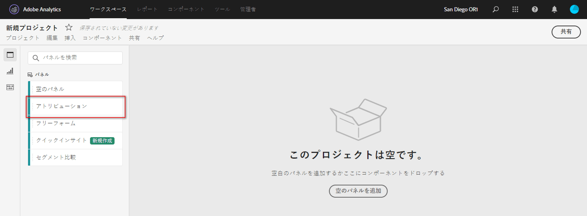
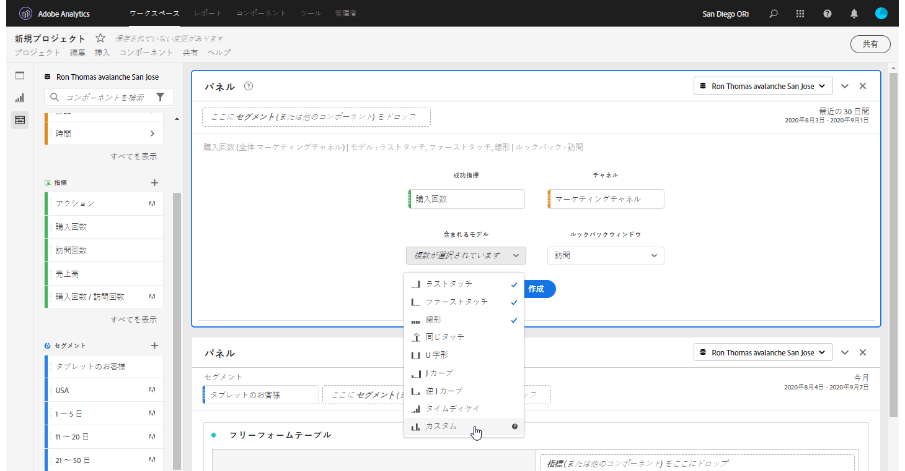
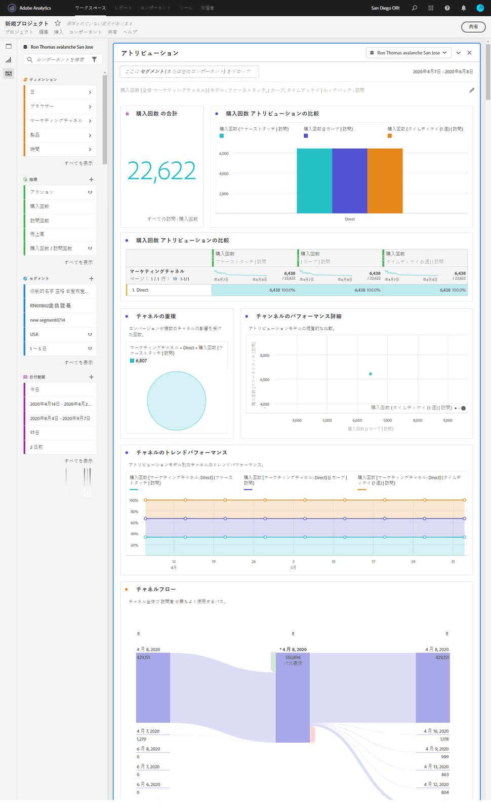

# アトリビューションパネル

アトリビューションパネルを使用すると、各種アトリビューションモデルの比較分析を簡単に作成できます。これは、[Attribution IQ](../attribution/overview.md) の機能で、アトリビューションモデルを使用および比較するための専用のワークスペースを提供します。

## アトリビューションパネルの作成

1. 左端のパネルアイコンをクリックします。
1. アトリビューションパネルを Analysis Workspace プロジェクトにドラッグします。

   

1. 属性を設定する指標を追加し、属性を適用するディメンションを追加します。例としては、マーケティングチャネルや、内部プロモーションなどのカスタムディメンションがあります。

   

1. 比較する[アトリビューションモデルとルックバックウィンドウ](../attribution/models.md)を選択します。

1. アトリビューションパネルは、選択したディメンションと指標のアトリビューションを比較する、豊富なデータセットとビジュアライゼーションのセットを返します。

   

## アトリビューションのビジュアライゼーション

* **っ合計指標**：レポート時間帯で発生したコンバージョンの合計数。これらは、選択したディメンションに関してアトリビューション分析がおこなわれたコンバージョンです。
* **アトリビューション比較バー**:選択したディメンションの各ディメンション項目間で、アトリビュートされたコンバージョンを視覚的に比較します。 各棒の色は、個別のアトリビューションモデルを表します。
* **アトリビューション比較表**:棒グラフと同じデータを表として表示します。 この表で異なる列または行を選択すると、棒グラフに加えて、パネル内の他のビジュアライゼーションの一部がフィルターされます。この表は、Workspace の他のフリーフォームテーブルと同様に機能し、指標、セグメント、分類などのコンポーネントを追加できます。
* **重複図**:上位3つのディメンション項目と、それらがコンバージョンに共同で貢献する頻度を示すベン図です。 例えば、バブルの重複部分のサイズは、両方のディメンション項目に訪問者が接触したときにコンバージョンが発生した頻度を示します。隣接したフリーフォームテーブルで他の行を選択すると、その選択を反映するようにビジュアライゼーションが更新されます。
* **パフォーマンスの詳細**:散布グラフを使用して、最大3つのアトリビューションモデルを視覚的に比較できます。
* **トレンドパフォーマンス**:最上位のディメンション項目の属性付きコンバージョンの傾向を表示します。 隣接したフリーフォームテーブルで他の行を選択すると、その選択を反映するようにビジュアライゼーションが更新されます。
* **フロー**:どのチャネルが最も一般的に行動を起こしているか、どのような順序で訪問者の遍歴を通して行われているかを確認できます。
