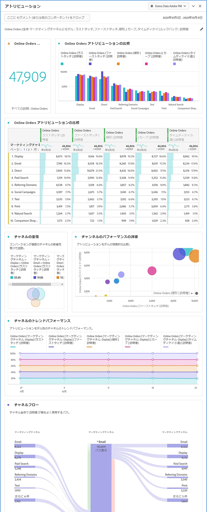

# アトリビューションパネル

アトリビューションパネルを使用すると、各種アトリビューションモデルの比較分析を簡単に作成できます。これは、アトリビューション  IQの機能で、アトリビューションモデルを使用および比較するための専用のワークスペースを提供します。

## アトリビューションパネルの作成

1. 左側のパネルアイコンをクリックします。
1. アトリビューションパネルを Analysis Workspace プロジェクトにドラッグします。

   

1. 属性を設定し、属性に任意のディメンションを追加追加する指標。 例としては、マーケティングチャネルや、内部プロモーションなどのカスタムディメンションがあります。

   

1. 比較する [アトリビューションモデルとルックバックウィンドウ](../attribution/models.md) を選択します。

1. アトリビューションパネルは、選択したディメンションと指標のアトリビューションを比較する、豊富なデータセットとビジュアライゼーションのセットを返します。

   

## アトリビューションのビジュアライゼーション

* **合計指標**: レポート時間枠内に発生した変換の合計数です。 これらは、選択したディメンションに関してアトリビューション分析がおこなわれたコンバージョンです。
* **指標アトリビューション比較バーのグラフ**: 選択したディメンションの各ディメンション項目間で、アトリビュートされたコンバージョンを視覚的に比較します。 各棒の色は、個別のアトリビューションモデルを表します。
* **指標アトリビューションフリーフォームテーブル**: 棒グラフと同じデータを表として表示します。 このテーブルで異なる列または行を選択すると、棒グラフに加えて、パネル内の他のビジュアライゼーションの一部がフィルターされます。 この表は、Workspaceの他のフリーフォームテーブルと同様に機能し、指標、セグメント、分類などのコンポーネントを追加できます。
* **次元の重複グラフ**: 上位3つのディメンション項目と、それらがコンバージョンに共同で貢献する頻度を示すベン図です。 例えば、バブルの重なりのサイズは、訪問者が両方のディメンション項目に公開された場合に、コンバージョンが発生した頻度を示します。 隣接するフリーフォームテーブルで他の行を選択すると、ビジュアライゼーションが更新され、選択内容が反映されます。
* **遍歴ごとのマーケティングタッチポイント**: ルックバックウィンドウで訪問者が持つタッチポイントの数を示すヒストグラムです。 これは、使用しているデータセットでのマルチタッチアトリビューションの効果を確認するのに役立ちます。ほとんどすべての訪問者が1つのタッチポイントしか持っていない場合、異なるアトリビューションモデルに類似したデータが表示される可能性があります。
* **マーケティングチャネルのパフォーマンスの詳細**: 散布グラフを使用して、最大3つのアトリビューションモデルを視覚的に比較できます。
* **マーケティングチャネルのフロー**: どのチャネルが最も一般的に行動を起こしているか、どのような順序で訪問者の遍歴を通して行動しているかを確認できます。
