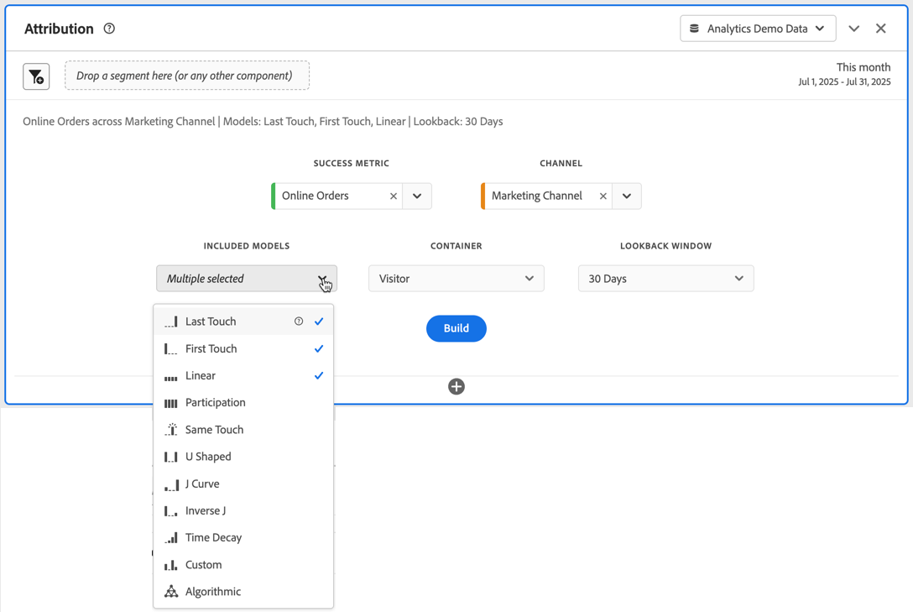

# アトリビューションパネル {#attribution-panel}

<!-- markdownlint-disable MD034 -->

>[!CONTEXTUALHELP]
>id="workspace_attribution_button"
>title="アトリビューション"
>abstract="任意のディメンションとコンバージョン指標を使用して、アトリビューションモデルをすばやく比較および視覚化します。"
>additional-url="https://www.youtube.com/watch?v=Yu0hy2klzA0" text="Attribution IQ パネル"

>[!CONTEXTUALHELP]
>id="workspace_attribution_panel"
>title="アトリビューションパネル"
>abstract="任意のディメンションとコンバージョン指標を使用して、アトリビューションモデルをすばやく比較および視覚化します。  **パラメーター&#x200B;** **チャネル** &#x200B;属性の対象となるディメンション。このディメンションには、マーケティングチャネル、キャンペーン、その他のディメンションを指定できます。 **モデル** ：モデルは、タッチポインへのクレジット割り当て方法を決定します。 **ルックバックウィンドウ** ：この設定により、各コンバージョンに適用されるデータアトリビューションの期間が決まります。"
>additional-url="https://www.youtube.com/watch?v=Yu0hy2klzA0" text="Attribution IQ パネル"

<!-- markdownlint-enable MD034 -->

>[!BEGINSHADEBOX]

_この記事では、_  _&#x200B;**Adobe Analytics** のアトリビューションパネルについて説明します。_ _この記事の_  _&#x200B;**Customer Journey Analytics** バージョンについて詳しくは、[アトリビューションパネル](https://experienceleague.adobe.com/ja/docs/analytics-platform/using/cja-workspace/panels/attribution)を参照してください。_

>[!ENDSHADEBOX]

**[!UICONTROL アトリビューション]**&#x200B;パネルを使用すると、各種アトリビューションモデルの比較分析を簡単に作成できます。パネルには、アトリビューションモデルを使用および比較する専用のワークスペースが用意されています。

Adobe Analytics を使用すると、以下が可能になるので、アトリビューションを強化できます。

* 有料メディアに勝るアトリビューションの定義：マーケティングキャンペーンだけでなくあらゆるディメンション、指標、チャネル、イベントをモデルに適用できます（例：内部検索）。
* 無制限のアトリビューションモデル比較の利用：必要な数のモデルを動的に比較できます。
* 実装の変更の回避：レポート時間処理とコンテキスト対応セッションで、カスタマージャーニーのコンテキストを実行時間に組み込んで適用できます。
* アトリビューションシナリオに最適なセッションの作成。
* アトリビューションのセグメント別分類：すべての重要なセグメントにわたってマーケティングチャネルのパフォーマンスを容易に比較できます（例：新規顧客とリピート顧客、製品 X と製品 Y、忠誠度または CLV）。
* チャネルのクロスオーバー分析およびマルチタッチ分析の調査：ベン図やヒストグラムを使用でき、アトリビューション結果のトレンドを追跡できます。
* 主要なマーケティングシーケンスの視覚的分析：コンバージョンにつながったパスをマルチノードのフローおよびフォールアウトビジュアライゼーションで視覚的に調査できます。
* 計算指標の構築：任意の数のアトリビューション割り当て方法を使用できます。

## 使用

**[!UICONTROL アトリビューション]**&#x200B;パネルを使用するには：

1. **[!UICONTROL アトリビューション]**&#x200B;パネルを作成します。パネルの作成方法について詳しくは、[パネルの作成](panels.md#create-a-panel)を参照してください。

1. パネルの[入力](#panel-input)を指定します。

1. パネルの[出力](#panel-output)を確認します。

### パネル入力

次の入力設定を使用して、アトリビューションパネルを設定できます。

1. 属性を設定する&#x200B;**[!UICONTROL チャネル]**&#x200B;から&#x200B;**[!UICONTROL 成功指標]**&#x200B;とディメンションを追加します。例としては、マーケティングチャネルや、内部プロモーションなどのカスタムディメンションがあります。

   

1. 比較に使用する 1 つ以上の [ アトリビューションモデル ](#attribution-models)**[!UICONTROL 含まれるモデル]**、[ コンテナ ](#container) の **[!UICONTROL コンテナ]**、および [ ルックバックウィンドウ ](#lookback-window) の **[!UICONTROL ルックバックウィンドウ]** を選択します。

1. 「**[!UICONTROL 作成]**」を選択して、パネル内のビジュアライゼーションを作成します。

### パネル出力

**[!UICONTROL アトリビューション]**&#x200B;パネルには、選択したディメンションと指標のアトリビューションを比較するデータとビジュアライゼーションの豊富なセットが返されます。

### アトリビューションのビジュアライゼーション

次のビジュアライゼーションは、パネル出力の一部です。

* **合計指標**：選択したディメンションに起因する、レポート時間枠で発生したコンバージョンの合計数。
* **アトリビューション比較バー**：選択したディメンションの各ディメンションアイテム間で、アトリビューションされたコンバージョンを視覚的に比較します。各棒の色は、個別のアトリビューションモデルを表します。
* **アトリビューション比較テーブル**：棒グラフと同じデータを表形式で表示します。この表で異なる列または行を選択すると、棒グラフに加えて、パネル内の他のビジュアライゼーションの一部がフィルターされます。このテーブルは、Workspace の他のフリーフォームテーブルと同様に機能し、指標、セグメント、分類などのコンポーネントを追加できます。
* **重なり図**：上位 3 つのディメンション項目と、それらが共同でコンバージョンに関わる頻度を示すベン図ビジュアライゼーション。例えば、バブルの重複部分のサイズは、両方のディメンション項目にユーザーが接触したときにコンバージョンが発生した頻度を示します。隣接したフリーフォームテーブルで他の行を選択すると、その選択を反映するようにビジュアライゼーションが更新されます。
* **パフォーマンスの詳細**：最大 3 つのアトリビューションモデルを視覚的に比較する散布図ビジュアライゼーション。
* **トレンドパフォーマンス**：最上位ディメンション項目の属性コンバージョンのトレンドを表示します。 隣接したフリーフォームテーブルで他の行を選択すると、その選択を反映するようにビジュアライゼーションが更新されます。
* **フロー**：ユーザーのジャーニー全体を通して、どのチャネルが最もよく使用されているか、およびその順番を確認できます。

## アトリビューションモデル

{{attribution-models-details}}

## コンテナ

{{attribution-container}}

## ルックバックウィンドウ

{{attribution-lookback-window}}

## 例

{{attribution-example}}

>[!MORELIKETHIS]
>
> [パネルの作成](/help/analyze/analysis-workspace/c-panels/panels.md#create-a-panel)
>

<!--
# Attribution panel

The [!UICONTROL Attribution] panel is an easy way to build an analysis comparing various attribution models. It is a feature in [Attribution](/help/analyze/analysis-workspace/attribution/overview.md) that gives you a dedicated workspace to use and compare attribution models.

>[!VIDEO](https://video.tv.adobe.com/v/23139/?quality=12)

## Create an attribution panel

1. Click the panel icon on the left.
1. Drag the [!UICONTROL Attribution] panel into your Analysis Workspace Project.

   

1. Add a metric that you want to attribute and add any dimension to attribute against. Examples include Marketing Channels or custom dimensions, such as internal promotions.

   

1. Select the [attribution models and lookback window](../attribution/models.md) you want to compare.

1. The Attribution panel returns a rich set of data and visualizations that compare attribution for the selected dimension and metric.

   

## Attribution visualizations

* **Total metric**: The total number of conversions that occurred over the reporting time window. These are the conversions that are attributed across the dimension that you selected.
* **Attribution Comparison Bar**: Visually compares the attributed conversions across each of the dimension items from your selected dimension. Each bar color represents a distinct attribution model.
* **Attribution Comparison Table**: Shows the same data as the bar chart, represented as a table. Selecting different columns or rows in this table filters the bar chart as well as several of the other visualizations in the panel. This table acts similar to any other Freeform Table in Workspace - allowing you to add components such as metrics, segments, or breakdowns.
* **Overlap Diagram**: A Venn Diagram showing the top three dimension items and how often they participate jointly in a conversion. For example, the size of the bubble overlap indicates how often conversions occurred when a visitor was exposed to both dimension items. Selecting other rows in the adjacent Freeform table updates the visualization to reflect your selection.
* **Performance Detail**: Lets you to compare up to three attribution models visually using a scatter plot.
* **Trended Performance**: By default, shows the conversion performance trend by attribution model for the first dimension listed in the adjacent Freeform table. You can select different dimension rows in the Freeform table to show the trend for the selected dimensions (such as Total Revenue for each attribution model for Social Campaigns and Paid Search). Alternately, you can select cells in the columns for any metric and attribution type combinations in the Freeform table to see the trended performance by dimension value for the specified attribution models (such as Total Revenue by Marketing Channel using Last Touch and First Touch attribution).
* **Flow**: Lets you see which channels are interacted with most commonly, and in what order across a visitor's journey.

-->