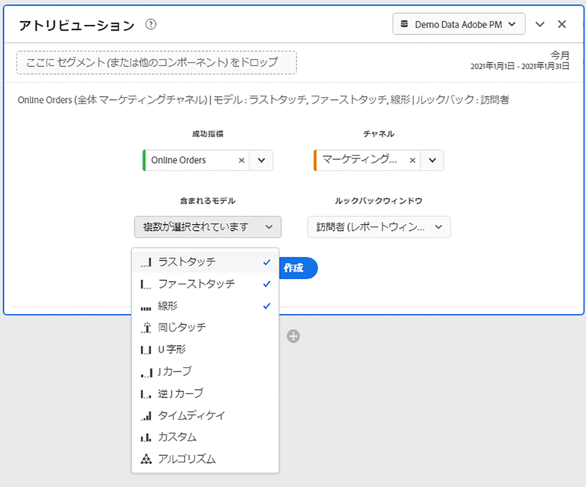

# アトリビューションパネル

[!UICONTROL アトリビューション]パネルを使用すると、様々なアトリビューションモデルを比較した分析を簡単に作成できます。 これは、[Attribution IQ](../attribution/overview.md) の機能で、アトリビューションモデルを使用および比較するための専用のワークスペースを提供します。

## アトリビューションパネルの作成

1. 左端のパネルアイコンをクリックします。
1. [!UICONTROL アトリビューション]パネルをAnalysis Workspaceプロジェクトにドラッグします。

   

1. 属性を設定する指標を追加し、属性を適用するディメンションを追加します。例としては、マーケティングチャネルや、内部プロモーションなどのカスタムディメンションがあります。

   

1. 比較する[アトリビューションモデルとルックバックウィンドウ](../attribution/models.md)を選択します。

1. アトリビューションパネルは、選択したディメンションと指標のアトリビューションを比較する、豊富なデータセットとビジュアライゼーションのセットを返します。

   

## アトリビューションのビジュアライゼーション

* **っ合計指標**：レポート時間帯で発生したコンバージョンの合計数。これらは、選択したディメンションに関してアトリビューション分析がおこなわれたコンバージョンです。
* **アトリビューション比較バー**:選択したディメンションの各ディメンション項目間で、アトリビュートされたコンバージョンを視覚的に比較します。各棒の色は、個別のアトリビューションモデルを表します。
* **アトリビューション比較表**:棒グラフと同じデータを表として表示します。この表で異なる列または行を選択すると、棒グラフに加えて、パネル内の他のビジュアライゼーションの一部がフィルターされます。この表は、Workspaceの他のフリーフォームテーブルと同様に機能し、指標、セグメント、分類などのコンポーネントを追加できます。
* **重複図**:上位3つのディメンション項目と、それらがコンバージョンに共同で貢献する頻度を示すベン図です。例えば、バブルの重複部分のサイズは、両方のディメンション項目に訪問者が接触したときにコンバージョンが発生した頻度を示します。隣接したフリーフォームテーブルで他の行を選択すると、その選択を反映するようにビジュアライゼーションが更新されます。
* **パフォーマンスの詳細**:散布グラフを使用して、最大3つのアトリビューションモデルを視覚的に比較できます。
* **トレンドパフォーマンス**:デフォルトでは、横にあるフリーフォームテーブルに一覧表示された最初のディメンションのアトリビューションモデル別コンバージョンパフォーマンストレンドが表示されます。フリーフォームテーブルで様々なディメンション行を選択して、選択したディメンションのトレンドを表示できます(Socialキャンペーンおよび有料検索の各アトリビューションモデルの合計売上高など)。 または、フリーフォームテーブルの指標と属性タイプの組み合わせの列のセルを選択して、指定した属性モデルのディメンション値別のトレンドパフォーマンス(ラストタッチとファーストタッチを使用したマーケティングチャネル別の合計売上高など)を確認できます。
* **フロー**:どのチャネルが最も一般的に行動を起こしているか、および訪問者のジャーニー全体での行動順序を確認できます。
