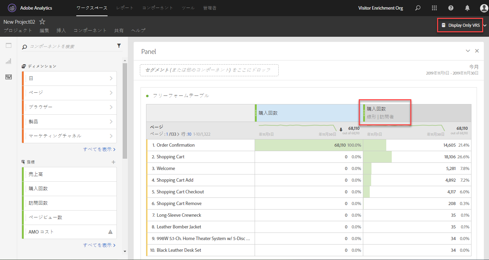

# アトリビューションパネルの概要

>[!IMPORTANT] アトリビューションパネルは、Adobe Analytics Ultimate、Prime、SelectおよびFoundation SKUのすべてのお客様が利用できます。

アトリビューションパネルはアトリビュ [ーションIQ](../../attribution-iq.md) 機能で、フリーフォームテーブル、ビジュアライゼーションおよび計算指標に多くの新しいタイプのアトリビューションモデルを追加できます。 すべてのアトリビューションモデルには以下の 2 つの構成要素があります。

* **** アトリビューションモデル：このモデルは、グループ内のヒットに対するコンバージョンの分布を示します。 例えば、ファーストタッチやラストタッチなどです。
* **** アトリビューションルックバックウィンドウ：「ルックバック」ウィンドウは、各モデルに対して考慮されるヒットのグループを示します。 例えば、visitやvisitorなどです。

## アトリビューションモデル

| UIアイコン | アトリビューションモデル | 定義 | 使用するタイミング |
| --- | --- | --- | --- |
|  | ラストタッチ | コンバージョン前に最も最近発生したタッチポイントに100%のクレジットを与えます。 | 最も基本的で一般的なアトリビューションモデル。 これは、短い考慮サイクルを持つコンバージョンに頻繁に使用されます。 ラストタッチは、一般に、検索マーケティングの管理や内部検索キーワードの分析を担当するチームに使用されます。 |
|  | ファーストタッチ | アトリビューションのルックバックウィンドウで最初に確認されたタッチポイントに100 %のクレジットを与えます。 | ブランド認知度や顧客獲得を促進するマーケティングチャネルの分析に役立つもう1つの共通アトリビューションモデルです。 ディスプレイやソーシャルマーケティングチームによく使用されますが、オンサイトでの商品のレコメンデーションの効果を評価するのにも役立ちます。 |
|  | 同一タッチ | コンバージョンが発生したヒットに100%のクレジットを与えます。 コンバージョンと同じヒットでタッチポイントが発生しない場合、「なし」の下にグループ化されます。 | コンバージョン時に直ちに提示されたコンテンツやユーザーエクスペリエンスを評価する際に役立つモデルです。 製品チームやデザインチームは、多くの場合、このモデルを使用して、コンバージョンが発生するページの効果を評価します。 |
|  | 線形 | コンバージョンにつながるすべてのタッチポイントに対して、同等のクレジットを与えます。 | より頻繁な顧客エンゲージメントを必要とする、より長い考慮サイクルのコンバージョンやユーザーエクスペリエンスに役立ちます。 多くの場合、モバイルアプリの通知の効果を測定するチームや、購読ベースの製品で使用されます。 |
|  | U 字形 | 最初のインタラクションに40%のクレジットを与え、最後のインタラクションに40%のクレジットを与え、残りの20%をその間の任意のタッチポイントに割ります。 単一のタッチポイントを持つコンバージョンの場合、100 %のクレジットが与えられます。 2つのタッチポイントを持つコンバージョンの場合、両方に50 %のクレジットが与えられます。 | コンバージョンを導入または閉じたインタラクションを重視しながら、支援インタラクションを認識したいユーザーにとって優れたモデルです。 U字型アトリビューションは、よりバランスのとれたアプローチをとるが、コンバージョンを見つけたチャネルや閉じたチャネルに対して、より多くのクレジットを与えたいチームで一般的に使用されます。 |
|  | J 字形 | 最後のインタラクションに60 %のクレジットを与え、最初のインタラクションに20 %のクレジットを与え、残りの20 %をその間の任意のタッチポイントに割ります。 単一のタッチポイントを持つコンバージョンの場合、100 %のクレジットが与えられます。 2つのタッチポイントを持つコンバージョンの場合、最後のインタラクションに75 %のクレジットが与えられ、最初のインタラクションに25 %のクレジットが与えられます。 | このモデルは、ファインダーとクローザーに優先順位を付け、終了インタラクションに重点を置くユーザーに最適です。 J字型アトリビューションは、よりバランスのとれたアプローチを取り、コンバージョンを終了したチャネルにより多くのクレジットを与えたいチームによく使用されます。 |
|  | 逆 J 形 | 最初のタッチポイントに60 %のクレジットを与え、最後のタッチポイントに20 %のクレジットを与え、残りの20 %をその間の任意のタッチポイントに除算します。 単一のタッチポイントを持つコンバージョンの場合、100 %のクレジットが与えられます。 2つのタッチポイントを持つコンバージョンの場合、最初のインタラクションに75 %のクレジットが与えられ、最後に25 %のクレジットが与えられます。 | このモデルは、ファインダーとクローザーに優先順位を付け、インタラクションの検索に重点を置く場合に最適です。 逆Jアトリビューションは、よりバランスのとれたアプローチを取り、コンバージョンを開始したチャネルにより多くのクレジットを与えたいチームが使用します。 |
|  | カスタム | ファーストタッチポイント、ラストタッチポイントおよびその間の任意のタッチポイントに与える重みを指定できます。 指定した値は、入力したカスタム数値が100を超えない場合でも、100 %に正規化されます。 単一のタッチポイントを持つコンバージョンの場合、100 %のクレジットが与えられます。 2つのタッチポイントでのインタラクションの場合、中間のパラメーターは無視されます。 ファーストタッチポイントとラストタッチポイントは100%に正規化され、それに応じてクレジットが割り当てられます。 | このモデルは、アトリビューションモデルを完全に制御し、他のアトリビューションモデルが満たさない特定のニーズを持つユーザーに最適です。 |
|  | 時間減衰 | カスタムの半減期パラメーターを使用して指数減衰に従います。デフォルトは7日です。 各チャネルの重みは、タッチポイントの開始から最終的なコンバージョンまでに経過した時間によって異なります。 クレジットの決定に使用され `2``(-t/halflife)`る式は `t` 、です。ここで、は、タッチポイントとコンバージョンの間の時間です。 次に、すべてのタッチポイントが100 %に正規化されます。 | 日付が決まったイベントに対してビデオ広告やマーケティングを定期的に行うチームに最適です。 マーケティングイベント後にコンバージョンが長くなるほど、クレジットが少なくなります。 |
|  | パーティシペーション | すべての固有のタッチポイントに100%のクレジットを与えます。 コンバージョンの合計数は、他のアトリビューションモデルと比較して水増しされます。 パーティシペーションは、複数回閲覧されたチャネルの重複を排除します。 | 顧客が特定のインタラクションにさらされる頻度が高い顧客を把握するのに最適です。 メディア組織は、このモデルを頻繁に使用してコンテンツの速度を計算します。 小売組織は、このモデルを使用して、サイトのどの部分がコンバージョンに重要かを把握することがよくあります。 |

## ルックバックウィンドウ

ルックバックウィンドウは、変換がタッチポイントを含むようにルックバックする時間です。 最初のインタラクションにより多くのクレジットを与えるアトリビューションモデルは、異なるルックバックウィンドウを表示する場合に、より大きな違いを確認できます。

* **** 訪問のルックバックウィンドウ：コンバージョンが発生した訪問の最初にさかのぼります。 訪問のルックバックウィンドウは、訪問の範囲を超えて見えないので、狭くなっています。 訪問のルックバックウィンドウは、仮想レポートスイートの変更された訪問の定義を考慮します。
* **** 訪問者のルックバックウィンドウ：現在の日付範囲の月の1日までのすべての訪問を調べます。 訪問者のルックバックウィンドウは広く、訪問回数が多い場合があります。 例えば、レポートの日付範囲が9月15日～9月30日の場合、訪問者のルックバック日付範囲は9月1日～9月30日です。

## 例

次の例をご覧ください。

1. 9月15日、訪問者が有料検索広告を通じてサイトに訪れ、サイトを出ます。
2. 9月18日に、訪問者は友人から得たソーシャルメディアリンクを通じて再びサイトに来訪します。 買い物かごに複数の品目を追加しますが、何も購入しません。
3. 9月24日に、マーケティングチームから買い物かご内の一部の品目に対するクーポンが記載された電子メールが送信されます。 ユーザーはクーポンを適用しますが、他の複数のサイトを訪問して、利用可能なクーポンがあるかどうかを確認します。 ディスプレイ広告で別の広告を見つけ、最終的に50ドルで購入します。

ルックバックウィンドウとアトリビューションモデルに応じて、チャネルは異なるクレジットを受け取ります。 次に、主な例を示します。

* ファー **ストタッチ** と訪問のル **ックバックウィンドウを使用して**、属性は3回目の訪問のみを調べます。 電子メールと表示の間では、電子メールが最初だったので、50ドルの購入に対して100%のクレジットを受け取ります。
* ファー **ストタッチと訪問者のルッ** クバックウィンドウを使用して ****、アトリビューションは3つの訪問すべてを調べます。 有料検索が最初で、50ドルの購入に対して100%のクレジットを受け取ります。
* 線形検 **索ウィンドウ** と訪問のル **ックバックウィンドウを使用して**、クレジットは電子メールと表示の間で分割されます。 これらのチャネルはどちらも25ドルのクレジットを受け取ります。
* リニア **検索と訪** 問者のルックバックウィンドウを使用して ****、クレジットは有料検索、ソーシャル、電子メールおよび表示に分割されます。 各チャネルは、この購入に対して$12.50のクレジットを受け取ります。
* **J字型と訪問者のルッ** クバックウィンドウを使用して ****、クレジットは有料検索、ソーシャル、電子メール、および表示の間で分割されます。
   * 60%のクレジットが30ドルで表示されます。
   * 20%のクレジットが有料検索に与えられ、$10です。
   * 残りの20%はソーシャルと電子メールの間で分割され、それぞれに$5が与えられます。
* 時間減 **少と訪問者のル** ックバックウィンドウを使用して ****、クレジットは有料検索、ソーシャル、電子メールおよび表示の間で分割されます。 デフォルトの7日間の半減期を使用する場合：
   * 表示タッチポイントとコンバージョンの間の0日の間隔。 `2``(-0/7)` `= 1`
   * 電子メールのタッチポイントとコンバージョンの間の0日間のギャップ。 `2``(-0/7)` `= 1`
   * ソーシャルタッチポイントとコンバージョンの間の6日間の差。 `2``(-6/7)` `= 0.552`
   * 有料検索のタッチポイントとコンバージョンの間の9日間の差。 `2``(-9/7)` `= 0.41`
   * これらの値を標準化すると、次の結果になります。
      * 表示：33.8%、$16.88
      * 電子メール：33.8%、$16.88
      * ソーシャル：18.6%、$9.32
      * 有料検索：13.8%、$6.92

> [!TIP] 注文やカスタムイベントなどの他のコンバージョンイベントも、クレジットが複数のチャネルに属する場合は分割されます。 例えば、2つのチャネルが線形アトリビューションモデルを使用してカスタムイベントに貢献する場合、両方のチャネルはカスタムイベントの0.5を取得します。 これらのイベントの分数は、すべての訪問で合計され、レポートのために最も近い整数に丸められます。

## マーケティングチャネルでのアトリビューションの使用

マーケティングチャネルが初めて導入されたとき、ファーストタッチとラストタッチのディメンションのみが導入されました。 これらの追加のアトリビューションモデルを使用すると、ファーストタッチディメンションとラストタッチディメンションを明示的に指定する必要がなくなります。 アドビは汎用のマーケテ **ィングチャネルディメンション** を提供し、選択したアトリビューションモデルで使用できるようにします。 これらの汎用マーケティングチャネルディメンションは、ラストタッチチャネルディメンションと同じように動作しますが、異なるアトリビューションモデルでマーケティングチャネルを使用する場合の混乱を防ぐために、異なるラベルが付けられます。

マーケティングチャネルのディメンションは、（処理ルールで定義された）従来の訪問の定義に依存するので、仮想レポートスイートを使用して訪問の定義を変更することはできません。

## 複数値変数でのアトリビューションの使用

Analyticsのディメンションには、1回のヒットで複数の値を含めることができるものもあります。 一般的な例としては、list Varsやproducts変数があります。

複数の値を持つヒットにアトリビューションを適用すると、同じヒットのすべての値に同じクレジットが付与されます。 このクレジットを受け取る値は多いので、個々の行項目を合計した場合とはレポートの合計が異なる場合があります。 レポートの合計は重複が排除され、各ディメンションの値には適切なクレジットが付与されます。

## セグメントでのアトリビューションの使用

アトリビューションは常にセグメント化の前に実行され、セグメント化はレポートフィルターの適用前に実行されます。 この概念は、セグメントを使用する仮想レポートスイートにも適用されます。

例えば、「ヒットを表示」セグメントを適用したVRSを作成すると、一部のアトリビューションモデルを使用して、表内の他のチャネルを表示できます。

