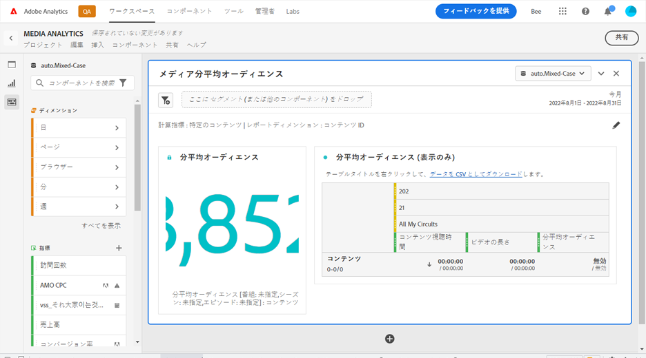
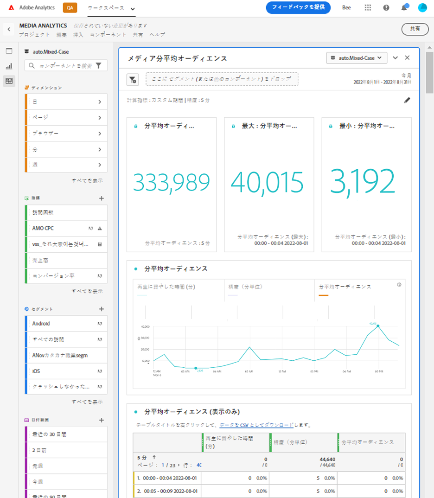

# メディア分平均オーディエンスパネル

Media Analytics のお客様は、分平均オーディエンスパネルを使用すると、コンテンツの平均消費量をより詳細に把握できます。分平均オーディエンスを使用すると、任意の長さやジャンルのプログラミングを比較できます。さらに、お客様はこのデジタル分平均オーディエンスを線形 TV 分平均指標と比較または線形 TV 分平均指標に追加できます。このパネルでは、カスタム期間の平均オーディエンスをより柔軟に測定できるほか、期間の分類が事後に更新された場合にも測定できます。現在の分平均オーディエンス指標は、処理時に期間が使用可能な場合にのみ機能します。

Analysis Workspace での分平均オーディエンスは、メディアストリームを視聴した時間をコンテンツの期間（または選択した期間や精度の合計値）で割った値です。

メディア分平均オーディエンスパネルでは、分類を使用して期間が使用可能になっている場合に選択した特定のコンテンツによる分平均オーディエンス分析を提供します。
分平均オーディエンスパネルでは、分類を使用して期間を指定できるかどうかに関わらず、特定のコンテンツでフィルタリング可能な、選択した期間中の分析も提供します。メディア分平均オーディエンスパネルにアクセスするには、Media Analytics コンポーネントが有効になっているレポートスイートに移動します。次に、左端のパネルアイコンをクリックし、 パネルを Analysis Workspace プロジェクトにドラッグします。

<!-- For more information, see the Media Average Minute Audience introduction video:
<< replace with AMA video when available from Doug >> -->

<!-- >[!VIDEO](https://video.tv.adobe.com/v/330177/?quality=12) -->

## パネル入力 {#Input}

次の入力設定を使用して、メディア分平均オーディエンスパネルを設定できます。

| 設定 | 説明 |
|---------|------------|
| パネルの日付範囲 | パネルの日付範囲のデフォルトは「今日」です。一度に 1 日または複数の月を表示するように編集できます。  このビジュアライゼーションは、1440 行のデータ（例えば、分単位の精度で 24 時間）に制限されています。日付範囲と精度の組み合わせの結果が 1440 行を超える場合、精度は日付範囲全体に対応するように自動的に更新されます。 |
| ここにセグメント (または他のコンポーネント) をドロップ | 他のパネルと同様に、この設定では、作成したセグメントに基づいて選択内容がフィルタリングされます。 これは、特定のプラットフォーム、ライブストリームまたはその他の一般的なメディアセグメントを調べる優れた方法です。 |
| 指標の計算対象 | この設定では、*特定のコンテンツ*&#x200B;を選択して特定のコンテンツの分平均オーディエンスを表示するか、*カスタム期間*&#x200B;を選択して特定の期間の分平均オーディエンスを表示するかを選択できます。  特定のコンテンツは、期間が分類を使用して更新された場合にのみ機能します。使用できる期間がない場合や、複数のコンテンツまたは特定の期間（ライブストリーム中やイベント中など）が割り当てられていないコンテンツを含む時系列の分平均オーディエンスを表示する場合は、カスタム期間を選択する必要があります。この設定により、ワークフローとレポートの出力が変更されます。 |

### 特定のコンテンツ

| 設定 | 説明 |
|---------|------------|
| レポートディメンション | 特定のコンテンツを選択する場合、レポート出力を選択して、ビデオ名またはコンテンツ ID フィールドを使用し、選択した期間に対するコンテンツとそれに関連する分平均オーディエンスを表示できます。 |
| コンテンツのフィルター基準 (オプション) | 目的とする表示やデータの構造によって特定のコンテンツをフィルタリングできます。 |
| 番組、シーズン、エピソード | 「表示、シーズン、エピソード」を選択すると、使用可能な番組がドロップダウンに表示され、検索を使用してフィルタリングできます（または、左の列から番組名をドラッグ&amp;ドロップします）。 そこで選択を終了して、番組のすべてのシーズンを表示するか、個々のシーズン、次に個々のエピソードでフィルタリングできます。この設定では、選択した期間の番組、シーズンまたはエピソードのデータを表示します。 |
| カスタムディメンション | 番組名がカスタムディメンションの下にある場合は、ディメンション（任意）ドロップダウンで検索するか、左列の検索を使用して見つけることができます。ディメンション項目は、その選択に基づいて自動的に入力され、エピソードとして扱われます。 |
| なし | 次を選択できます。 *なし* 選択した項目の 1 分平均オーディエンスデータを持つすべてのビデオ名を表示します。 |

### 特定のコンテンツの詳細設定

| 設定 | 説明 |
|---------|------------|
| テーブル設定 | デフォルト設定では、テーブル内の計算値が表示され、分平均オーディエンスの分子と分母がテーブルの前の列として表示されます。このオプションの選択を解除すると、2 つの列が削除され、ビデオ名またはコンテンツ ID の横の分平均オーディエンスのみが残ります。 |
| 滞在時間指標 | デフォルトのコンテンツ視聴時間（コンテンツ視聴時間のみを含む）を選択するか、メディア視聴時間（コンテンツ時間と広告時間を含む）を分平均オーディエンスの分子の計算に使用することを選択できます。 |

### カスタム期間

| 設定 | 説明 |
|---------|------------|
| 精度 | デフォルトの精度は 5 分ですが、カレンダーの選択時に選択された期間の範囲内で、時系列の分母として使用される任意の精度を選択できます。例えば、精度を 5 分にして午後 12:00～12:30 に設定した場合、30 分間全体の分平均オーディエンスと、5 分間ごとの分平均オーディエンスを含んだ 6 つの行が返されます。これらの行は、時系列グラフのデータポイントとして使用されます。 |
| コンテンツのフィルター基準 (オプション) | 目的とする表示やデータの構造によって特定のコンテンツをフィルタリングできます。 |
| 番組、シーズン、エピソード | 選択 *表示、シーズン、エピソード* 使用可能な番組がドロップダウンに表示され、検索でフィルタリングできます（または、左の列から番組名をドラッグ&amp;ドロップします）。 そこで選択を終了して、番組のすべてのシーズンを表示するか、個々のシーズン、次に個々のエピソードでフィルタリングできます。この設定では、選択した期間の番組、シーズンまたはエピソードのデータを表示します。 |
| カスタムディメンション | 番組名がカスタムディメンションの下にある場合は、ディメンション（任意）ドロップダウンで検索するか、左列の検索を使用して見つけることができます。ディメンション項目は、その選択に基づいて自動的に入力され、エピソードとして扱われます。 |
| なし | 次を選択できます。 *なし* 選択した期間のすべてのビデオ名を表示します。 |

### カスタム期間の詳細設定

| 設定 | 説明 |
|---------|------------|
| テーブル設定 | デフォルト設定では、テーブル内の計算値が表示され、分平均オーディエンスの分子と分母がテーブルの前の列として表示されます。このオプションの選択を解除すると、2 つの列が削除され、期間の横の分平均オーディエンスのみが残ります。 |

## 特定のコンテンツのパネル出力

メディア分平均オーディエンスパネルは、次の値を返します。

* 選択期間全体の合計分平均オーディエンス
* テーブルに表示される個々のビデオのフィルターおよび分平均オーディエンス
* 詳細設定が選択されている場合は、コンテンツ視聴時間とビデオの長さ（期間）

パネルを編集および再構築するには、右上の編集鉛筆をクリックします。

### 特定のコンテンツのデータソース

このパネルで使用できる指標は「分平均オーディエンス」のみです。

| 指標 | 説明 |
|--------|-------------|
| 分平均オーディエンス | メディアストリームの視聴に費やした時間を、分類で提供されたビデオの長さ（期間）で割った値です。 |

## カスタム期間のパネル出力 {#custom-time-period-output}

メディア分平均オーディエンスパネルは、選択期間全体の分平均オーディエンス、最大分平均オーディエンスと最小分平均オーディエンス、および選択期間全体の分平均オーディエンスを示す線系列グラフを返します。次の表に、精度のフィルターと分平均オーディエンス、およびその詳細設定が選択された場合の期間ごとのコンテンツ視聴時間と精度を示します。

パネルを編集および再構築するには、右上の編集鉛筆をクリックします。

### カスタム期間のデータソース

このパネルで使用できる指標は「分平均オーディエンス」のみです。

| 指標 | 説明 |
|---|---|
| 分平均オーディエンス | メディアストリームの視聴に費やした時間を、選択期間全体または選択した精度（分単位）で割った値です。 |

<!-- For more information about Media Average Minute Audience, visit [MA doc page]( https://url). -->
