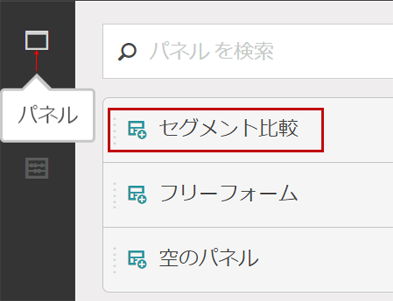
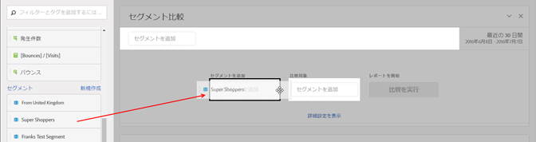
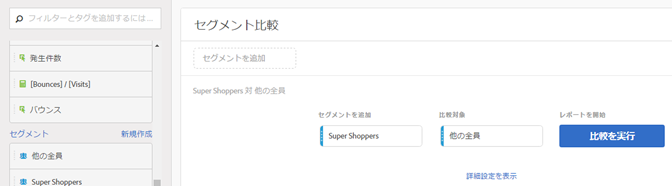
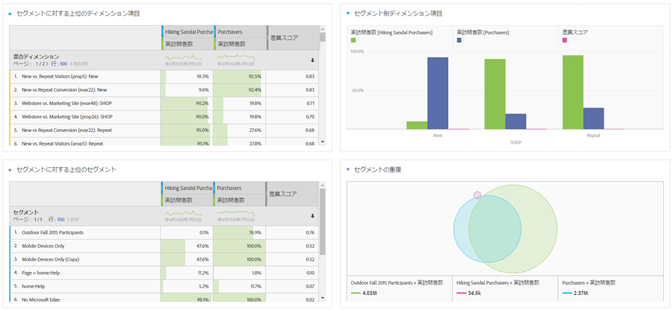
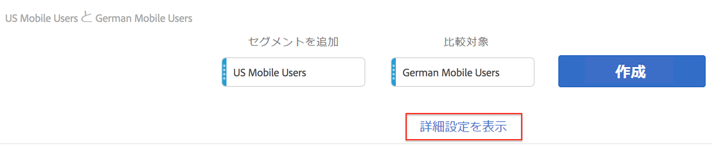
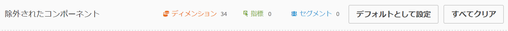
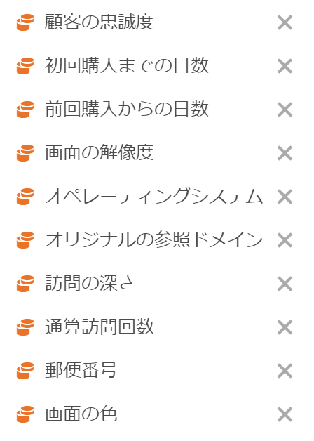

# セグメントの比較

Analysis Workspace でセグメントを比較する方法を説明します。

>[!NOTE]
>
>[フォールアウト分析内のセグメントを比較](../../../../analyze/analysis-workspace/visualizations/fallout/compare-segments-fallout.md#section_E0B761A69B1545908B52E05379277B56)することもできます。

## Compare segments {#section_8F2BFC45131C49B4A2E08A063CD7A91F}

1. **[!UICONTROL Analytics]** / **[!UICONTROL Workspace]** に移動し、プロジェクトを開きます。

1. 左側の&#x200B;**[!UICONTROL パネル]**&#x200B;レールから、**セグメント比較]を選択して、新しい、または既存のプロジェクトにドラッグします。[!UICONTROL **

   

1. 比較日付範囲が適切に設定されていることを確認します。
1. 比較するセグメントを選択して、パネルにドロップします。例えば、「上級買い物客」セグメントがあるとします。

   

   セグメントをパネルにドラッグすると、Analytics は、選択したセグメントに含まれない全員が含まれる、**[!UICONTROL 他の全員]セグメントを自動的に作成します（この場合、すべての「非上級買い物客」）。**&#x200B;これにより、このセグメントを作成する手間を省きます。「その他全員」は、パネルの「**[!UICONTROL 比較対象]」フィールドに自動的に追加されます。**&#x200B;これを削除したり、「上級買い物客」を選択した他のセグメントと比較したりするのは自由です。

   

1. 「**[!UICONTROL 詳細設定を表示]」をクリックして、セグメント比較分析からコンポーネント（ディメンション、指標またはセグメント）を除外します。**&#x200B;詳しくは、[コンポーネントの比較からの除外](../../../../analyze/analysis-workspace/c-panels/c-segment-comparison/compare-segments.md#section_5E98FFA0744140C08D83700E3F025937)を参照してください。

1. After you've selected the right "Compare Against" segment, click **[!UICONTROL Build]**.

   この操作により、すべてのディメンション、指標および他のセグメントを調査するバックエンド処理を開始して、セグメント間の統計的差異を探します。ツールの上部に、重要な差異に関してすべての指標およびディメンションをスキャンするまでの残り時間を示すプログレスバーが表示されます。さらに、最も頻繁に使用される指標、ディメンションおよびセグメントに対して最初に実行する優先順位を設定するので、最も関連性の高い結果を可能な限り早く提示できます。

   バックエンド処理がスキャンを完了すると、多くの新しいビジュアルで表示されます。

   

   

1. セグメント比較の結果を[新しいビジュアライゼーション、テーブルおよび概要](../../../../analyze/analysis-workspace/c-panels/c-segment-comparison/segment-comparison.md#concept_74FAC1C6D0204F9190A110B0D9005793)をレビューすることで、セグメント比較の結果を解釈します。

## Exclude components from comparison {#section_5E98FFA0744140C08D83700E3F025937}

場合によっては、一部のディメンション、指標またはセグメントをセグメント比較から除外したほうがよい場合があります。例えば、米国のモバイルユーザーセグメントをドイツのモバイルユーザーと比較したいとします。それら 2 つのセグメント間の場所には明らかな違いがあるので、地域に関連したディメンションを含めても意味がありません。これらは除外できます。その方法を次に示します。

1. 比較したいセグメントをパネルにドラッグしたら、「**[!UICONTROL 詳細設定を表示]」をクリックして、セグメント比較分析からコンポーネント（ディメンション、指標またはセグメント）を除外します。**

   

1. 除外したいコンポーネントを&#x200B;**[!UICONTROL 除外されたコンポーネント]パネルの任意の場所にドラッグ＆ドロップします**（除外するコンポーネントの「ブラックリスト」としてこれを確認できます）。これらのコンポーネントをデフォルトとして設定したり、「**[!UICONTROL すべてクリア]」して最初からやり直したりできます。**

   

1. 「**[!UICONTROL デフォルトとして設定]**」をクリックして、これらのコンポーネントをすべてのセグメント比較から除外します。****

1. 除外されたコンポーネントのリストを変更する必要がある場合はいつでも、（例えばディメンションを）ダブルクリックすると、除外されたディメンションのリストが表示されます。

   

1. Just delete any unwanted dimensions by clicking the x next to them, then save the list by clicking **[!UICONTROL Set as Default]**.

