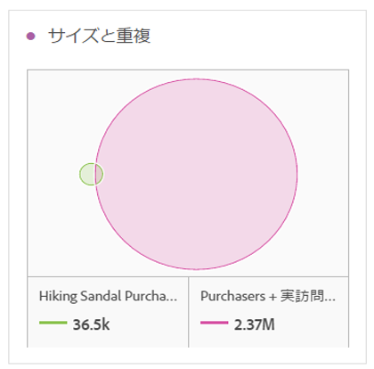
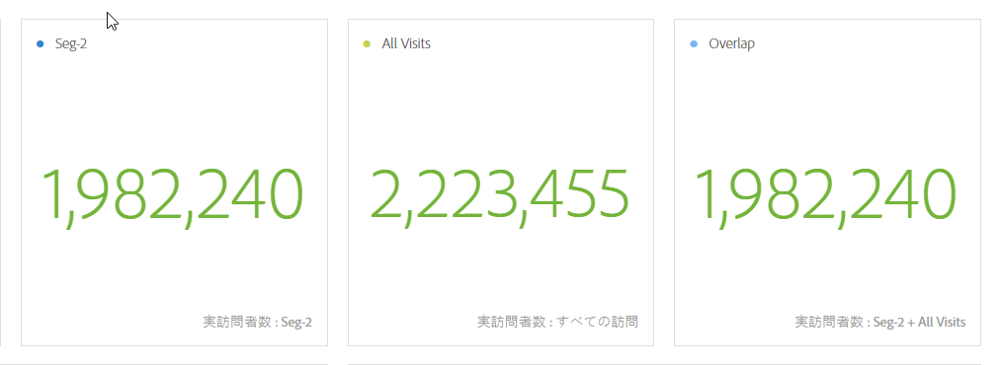
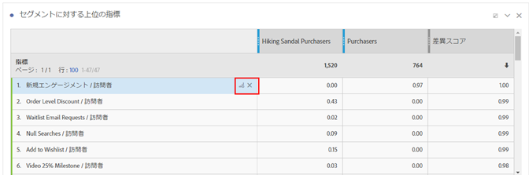
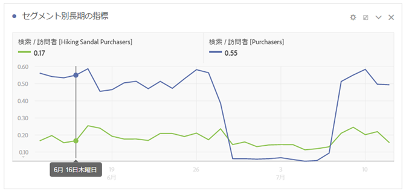
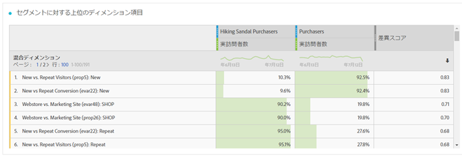
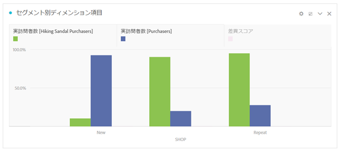
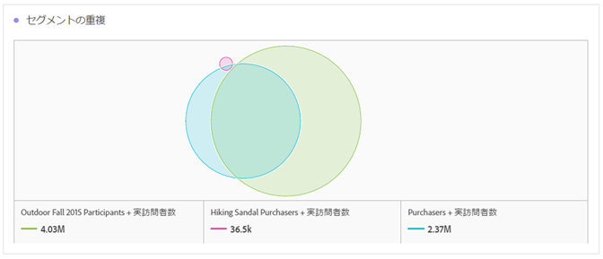

# セグメントIQの概要

セグメント比較 (セグメント IQ) ツールは、アクセス権のあるすべての単一の指標およびディメンションを自動分析することで、無数のセグメント間の最も大きな統計的差異を見つけます。会社の KPI を推進するオーディエンスセグメントの主要な特性を自動的に発見し、セグメントがどの程度重なっているかを確認できます。

アナリストは、多くの時間または日数をかけて、セグメント間の関連性のある差異について、会社の指標およびディメンションを広範囲に検索できます。この分析は、退屈で時間のかかる作業であるだけでなく、ターゲット化されたマーケティング活動に対して大きな影響を与えるセグメントに関する主な差異のインサイトを逃さないという確証が得られません。

[YouTubeでのセグメント比較](https://www.youtube.com/watch?v=fO3PNB93U_w&list=PL2tCx83mn7GuNnQdYGOtlyCu0V5mEZ8sS&index=38) （4:46）

セグメント比較ツールで導入された、いくつかの主要な新しい概念、ビジュアライゼーション、テーブルを次に示します。

## “Everyone else” segment {#section_30AEE8181E5D46D9AB27F7CA3815D0CD}

便宜上、手動で作成する必要がないように「他の全員」セグメントを追加しました。例えば、購入者のオーディエンスを取得します。「他の全員」セグメントに既に含まれているので、非購入者セグメントを作成する必要はありません。比較用に別のセグメントを追加することで、すばやく削除できます。

## Size and overlap {#section_885A71EE458C43189A77B8F552CA346A}

サイズと重複ビジュアライゼーションは、選択した各セグメントの相対的なサイズとお互いに重複している量を示します。ビジュアルの上にマウスポインターを置くと、重複している、または重複していない各セクションの訪問者数を確認できます。また、重複を右クリックすると、将来の分析用の新しいセグメントを作成できます。2つのセグメントが重複しない場合（例えば、「他の全員」セグメントを使用している場合）、このビジュアルに反映されます。

## Population summaries {#section_21F2B66C60184A71B89E2982A6FB945D}

セグメント比較ツールでは、サイズと重複ビジュアルの右側に、各セグメントと重複した母集団の個別訪問者数の合計が表示されます。

## Top metrics {#section_E4A38516424949B79A559DC8793071F2}

>[!NOTE]
>
>セグメント比較の完了後に適用される行項目は、差異スコアを受け取りません。この表は、比較対象の2つのセグメントの指標データのみをロードします

トップの指標のテーブルには、選択した 2 つのセグメント間の統計的に最も大きな差異のある指標が表示されます。このテーブルの各行は、差異のある指標を、各セグメント間での違いに応じてランク付けして示します。また、指標は訪問者ごとに表示されます。つまり、テーブルに「訪問回数」が表示される場合、テーブルの対応する数は、各セグメントの訪問者ごとの平均訪問回数を表します。また、これら 2 つのセグメント間でこの指標がどれくらい違うかを示す差異スコアも表示されます。スコア 1 は、大きな統計的差異を表すのに対して、スコア 0 は、統計的差異がないことを表します。

各テーブルの差異スコアの計算方法について詳しくは、 [セグメント比較で使用される統計テスト](../../../../analyze/analysis-workspace/c-panels/c-segment-comparison/statistical-test.md#concept_0B6AC754EAED460283D4626983F838F4).

トップの指標のテーブルは、Analysis Workspace で使用する他のテーブルと同様です。興味のある任意の指標をテーブルにドラッグして、比較方法を表すことができます。

テーブルは好きなようにカスタマイズできます。また、テーブルの各行には、新しいビジュアルを作成アイコンが追加されました。トップの指標のテーブルを煩雑にしたくない場合は、このアイコンをクリックすれば、セグメント比較ツールの上に新しいテーブルとビジュアルを作成して、新しいテーブルでより深い分析を続行できます。この指標に関連性がない場合は、「X」をクリックしてテーブルから完全に削除できます。さらに、デフォルトで表示される 5 行よりも多くの項目を表示したい場合は、他のフリーフォームテーブルと同じように、表示された指標のリストをページネーションしたり、トップ 10、20、50 などを表示したりできます。

指標のテーブルの右側は、リンクされたビジュアライゼーションです。デフォルトでは、セグメント比較ツールには、各セグメントに関する過去 30 日間のテーブルのトップ指標が表示されます。トップの指標のテーブルにある別の指標をビジュアライズしたい場合は、右側のビジュアライゼーションをクリックして選択すると、選択した指標を更新して表示します。

## Top dimension items {#section_439C1782B153427CB4FB85E177146EC0}

>[!NOTE]
>
>セグメント比較の完了後に適用される行項目は、差異スコアを受け取りません。この表は、比較対象の2つのセグメントの指標データのみをロードします

トップの指標のテーブルと同様、セグメント比較ツールは、すべてのディメンションにわたる最も差異の大きなディメンション項目を示す、上位のディメンション項目のテーブルを提供します。各行には、このディメンション項目を示す各セグメントの割合が表示されます。

例えば、「セグメント A」を「セグメント B」と比較する場合、上位のディメンション項目のテーブルによって、「セグメント A」の訪問者の 100 ％にディメンション項目「ブラウザータイプ：Google」があるのに対して、「セグメント B」でこのディメンション項目があるのはわずか 19.6 ％であることがわかります。

セグメント比較ツールでは、比較のために、上位のディメンション項目のテーブルの右側に、そのディメンションから他の上位のディメンション項目と共に選択した上位のディメンション項目がハイライトされます。

## Top segments table {#section_6A0C39F930564240AF7A157005C7A80B}

>[!NOTE]
>
>セグメント比較の完了後に適用される行項目は、差異スコアを受け取りません。この表は、比較対象の2つのセグメントの指標データのみをロードします

上位のセグメントのテーブルは、重複している（比較用に選択した 2 つのセグメント以外の）セグメントが 2 つの選択したセグメント間で大きく異なっているのはどれかを示す便利なテーブルです。例えば、セグメント A をセグメント B と比較する場合、上位のセグメントのテーブルは、第 3 のセグメント「リピーターの訪問者」がセグメント A と非常に重複しているが、セグメント B とは重複していないことを示します。

さらに、区別する上位の追加セグメントがテーブルの右側に重なって表示されます。

重なったビジュアルは、3 つすべてのセグメントでの重複の違いをグラフィックで示し、他のリンクされたビジュアルと同様、テーブルの各追加セグメントをクリックすると、選択したセグメントに対応してビジュアルが更新されます。

ここをクリックすると、セグメントの比較で使用される[統計テスト](../../../../analyze/analysis-workspace/c-panels/c-segment-comparison/statistical-test.md#concept_0B6AC754EAED460283D4626983F838F4)に関する情報が表示されます。
