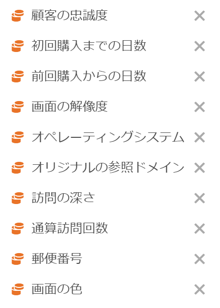

# セグメント比較パネルの概要

セグメント比較パネルは、[Segment IQ](../../segment-iq.md) のツールの一部で、無制限数のセグメント間で最も統計的に有意な違いを見つけます。この機能は、アクセス権を持つすべてのディメンションと指標の自動分析を繰り返し実行します。会社の KPI を推進するオーディエンスセグメントの主要な特性を自動的に発見し、セグメントがどの程度重なっているかを確認できます。

## セグメント比較パネルの作成

1. Adobe ID の資格情報を使用して [experiencecloud.adobe.com](https://experiencecloud.adobe.com) にログインします。
1. 右上の 9 つの正方形のアイコン、色付きの Analytics ロゴの順にクリックします。
1. 上部ナビゲーションバーで、「Workspace」をクリックします。
1. 「新規プロジェクトを作成」ボタンをクリックします。
1. モーダルポップアップで「空白のプロジェクト」が選択されていることを確認し、「作成」をクリックします。
1. 左側の「パネル」ボタンをクリックし、自動的に作成されたフリーフォームテーブルパネルの上または下に、セグメント比較パネルをドラッグします。

   

1. 比較するセグメントを選択して、パネルにドロップします。

   

   セグメントをパネルにドラッグすると、選択したセグメントに含まれないすべての人を含む「[!UICONTROL 他の全員]」セグメントが Analytics によって自動的に作成されます。これは比較パネルで頻繁に使用されるセグメントですが、このセグメントを削除し、別のセグメントを選択して比較することもできます。

   

1. 比較する 2 つのセグメントを決定したら、「[!UICONTROL ビルド]」をクリックします。

   このアクションは、選択した 2 つのセグメントと、すべてのディメンション、指標、その他のセグメントとの間の統計的な違いを探すバックエンドプロセスを開始します。パネルの上部にある進行状況バーは、各指標とディメンションが分析されるまでの残り時間を示します。最も頻繁に使用される指標、ディメンションおよびセグメントは、最初に実行されるように優先順位付けされ、最も関連性の高い結果がタイムリーに返されます。

## コンポーネントの比較からの除外

一部のディメンション、指標またはセグメントをセグメント比較から除外する必要が生じる場合があります。例えば、「米国のモバイルユーザー」と「ドイツのモバイルユーザー」のセグメントを比較するとします。これらのセグメントは既に地域的な違いを意味しているので、地域関連のディメンションを含めても意味がありません。

1. 目的の 2 つのセグメントをパネルに表示したら、「[!UICONTROL アドバンスオプションを表示する]」をクリックします。
1. 除外したいコンポーネントを[!UICONTROL 除外されたコンポーネント]パネルにドラッグ＆ドロップします。

   

「[!UICONTROL デフォルトとして設定]」をクリックすると、今後のすべてのセグメント比較で現在のコンポーネントが自動的に除外されます。除外されたコンポーネントを編集する場合は、コンポーネントのタイプをクリックし、コンポーネントの横の「X」をクリックして、分析に再度含めます。セグメント比較にすべてのコンポーネントを再度含めるには、「すべてクリア」をクリックします。

## セグメント比較レポートの表示

アドビが目的のセグメント 2 つの分析を完了すると、いくつかのビジュアライゼーションを通じて結果が表示されます。

### サイズと重複

ベン図を使用して、選択した各セグメントの比較サイズと、互いにどの程度重複しているかを示します。ビジュアルの上にマウスポインターを置くと、重複している、または重複していない各セクションの訪問者数を確認できます。また、重複を右クリックすると、将来の分析用の新しいセグメントを作成できます。2 つのセグメントが相互に排他的な場合、2 つの円の間の重なり合う部分は表示されません（通常、ヒットコンテナを使用するセグメントで表示されます）。

### 母集団の概要

サイズと重複ビジュアライゼーションの右側に、各セグメントと重複の個別訪問者の合計数が表示されます。

### 上位指標

2 つのセグメント間で最も統計的に有意な指標を表示します。このテーブルの各行は、差異のある指標を、各セグメント間での違いに応じてランク付けして示します。差異スコアが 1 の場合は統計的優位差があることを示し、0 の場合は統計的優位差がないことを示します。

このビジュアライゼーションは、Analysis Workspace のフリーフォームテーブルに似ています。特定の指標に関するより深い分析が必要な場合は、行項目の上にカーソルを置き、「ビジュアルを作成」をクリックします。新しいテーブルが作成され、その特定の指標を分析します。指標が分析と無関係な場合は、行項目の上にカーソルを置き、「X」をクリックして削除します。

>[!NOTE]
>
>指標比較の終了後にこのテーブルに追加されたセグメントには、差異スコアは適用されません。

### セグメント別の経時的な指標

指標のテーブルの右側は、リンクされたビジュアライゼーションです。左側のテーブルの行項目をクリックすると、このビジュアライゼーションが更新され、経時的な指標のトレンドが表示されます。

### 上位ディメンション

すべてのディメンションで、統計的に最も有意なディメンション項目を表示します。各行には、このディメンション項目を示す各セグメントの割合が表示されます。例えば、次のテーブルでは、「セグメント A」の訪問者の 100％にディメンション項目「ブラウザータイプ：Google」がある一方、「セグメント B」でこのディメンション項目を持っていたのは 19.6％のみでした。差異スコアが 1 の場合は統計的優位差があることを示し、0 の場合は統計的優位差がないことを示します。

このビジュアライゼーションは、Analysis Workspace のフリーフォームテーブルに似ています。特定のディメンション項目に関するより深い分析が必要な場合は、行項目の上にカーソルを置き、「ビジュアルを作成」をクリックします。新しいテーブルが作成され、その特定のディメンション項目を分析します。ディメンション項目が分析と無関係な場合は、行項目の上にカーソルを置き、「X」をクリックして削除します。

>[!NOTE]
>
>ディメンション項目比較の終了後にこのテーブルに追加されたセグメントには、差異スコアは適用されません。

### セグメント別のディメンション項目

ディメンションテーブルの右側には、リンクされた棒グラフビジュアライゼーションが表示されます。棒グラフに表示されたすべてのディメンション項目が表示されます。左側のテーブルの行項目をクリックすると、右側のビジュアライゼーションが更新されます。

### 上位セグメント

統計的に有意な他のセグメント（比較用に選択した 2 つのセグメント以外）がどれかを示します。例えば、このテーブルでは、3 番目のセグメント「再訪問者」が「セグメント A」とは大きく重なり、「セグメント B」とは重なっていないことを示すことができます。差異スコアが 1 の場合は統計的優位差があることを示し、0 の場合は統計的優位差がないことを示します。

このビジュアライゼーションは、Analysis Workspace のフリーフォームテーブルに似ています。特定のセグメントに関するより深い分析が必要な場合は、行項目の上にカーソルを置き、「ビジュアルを作成」をクリックします。新しいテーブルが作成され、その特定のセグメントを分析します。セグメントが分析と無関係な場合は、行項目の上にカーソルを置き、「X」をクリックして削除します。

>[!NOTE]
>
>セグメント比較の終了後にこのテーブルに追加されたセグメントには、差異スコアは適用されません。

### セグメントの重複

セグメントテーブルの右側には、リンクされたベン図ビジュアライゼーションが表示されます。比較したセグメントに適用された、統計的に最も有意なセグメントが表示されます（例えば、「セグメント A」+「統計的優位差のあるセグメント」対「セグメント B」+「統計的優位差のあるセグメント」）。左側のテーブルでセグメント行項目をクリックすると、右側のベン図が更新されます。

