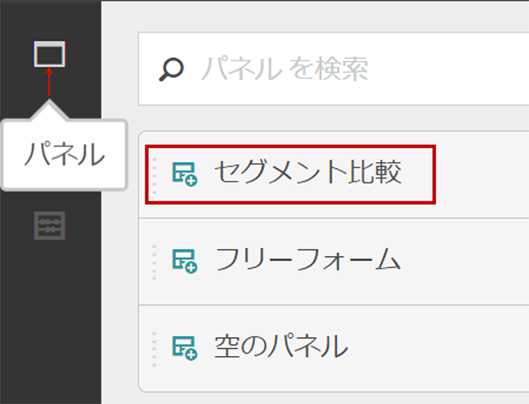
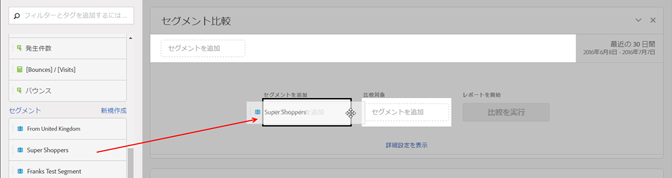
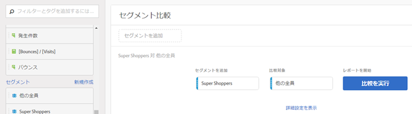
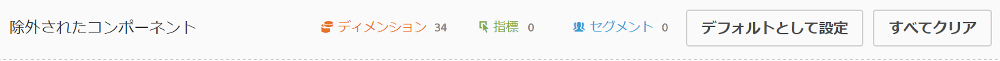
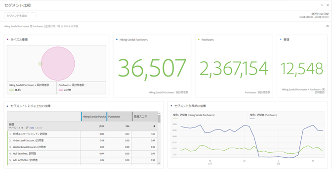
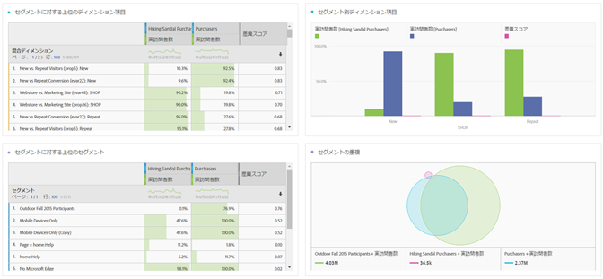

# セグメント比較パネルの概要

セグメント比較パネルは、セグメント [IQのツールの一部で](../../segment-iq.md) 、無制限数のセグメント間で最も統計的に有意な違いを見つけます。 この機能は、アクセス権を持つすべてのディメンションと指標の自動分析を繰り返し実行します。 会社のKPIを推進するオーディエンスセグメントの主な特性を自動的に明らかにし、どのセグメントが重なっているかを確認できます。

## セグメント比較パネルの作成

1. Adobe IDの資格情報 [を使用してExperiencecloud.adobe.com](https://experiencecloud.adobe.com) にログインします。
1. 右上の9つの正方形のアイコンをクリックし、色付きのAnalyticsロゴをクリックします。
1. 上部ナビゲーションバーで、「ワークスペース」をクリックします。
1. [新しいプロジェクトの作成]ボタンをクリックします。
1. モーダルポップアップで「空白のプロジェクト」が選択されていることを確認し、「作成」をクリックします。
1. 左側の「パネル」ボタンをクリックし、セグメント比較パネルを自動的に作成されたフリーフォームテーブルパネルの上または下にドラッグします。

   

1. 比較するセグメントを選択して、パネルにドロップします。

   

   セグメントをパネルにドラッグすると、選択したセグメントに含まれな [!UICONTROL い全員を含む「その他全員] 」セグメントがAnalyticsによって自動的に作成されます。 比較パネルで頻繁に使用されるセグメントですが、このセグメントを削除して、選択した別のセグメントを比較することもできます。

   

1. 比較する2つのセグメントを決定したら、「ビルド」をクリッ [!UICONTROL クします]。

   このアクションは、選択した2つのセグメントと、すべてのディメンション、指標、その他のセグメントとの間の統計的な違いを探すバックエンドプロセスを開始します。 パネルの上部にあるプログレスバーは、各指標とディメンションが分析されるまでの残り時間を示します。 最も頻繁に使用される指標、ディメンションおよびセグメントは、最初に実行されるように優先順位付けされ、最も関連性の高い結果がタイムリーに返されます。

## 比較からのコンポーネントの除外

一部のディメンション、指標またはセグメントをセグメント比較から除外することが必要な場合があります。 例えば、「米国のモバイルユーザー」と「ドイツのモバイルユーザー」のセグメントを比較するとします。 地域関連のディメンションを含めると、これらのセグメントは既にその違いを意味するので、意味がありません。

1. 目的の2つのセグメントをパネルに表示したら、「アドバンスオプ [!UICONTROL ションを表示」をクリックしま]す。
1. Drag and drop components you want to exclude into the [!UICONTROL Excluded Components] panel.

   

「デフォ [!UICONTROL ルトとして設定」をクリックすると] 、今後のすべてのセグメント比較で現在のコンポーネントが自動的に除外されます。 除外されたコンポーネントを編集する場合は、コンポーネントのタイプをクリックし、コンポーネントの横の「X」をクリックして、分析に再度含めます。 セグメント比較にすべてのコンポーネントを再度含めるには、[すべてクリア]をクリックします。

## セグメント比較レポートの表示

アドビが2つの目的のセグメントの分析を完了すると、いくつかのビジュアライゼーションを通じて結果が表示されます。

### サイズと重複

選択した各セグメントの比較サイズと、ベン図を使用して重なり合う量を示します。 ビジュアルの上にマウスポインターを置くと、重複している、または重複していない各セクションの訪問者数を確認できます。また、重複を右クリックすると、将来の分析用の新しいセグメントを作成できます。2つのセグメントが相互に排他的な場合、2つの円の間に重なり合う部分は表示されません（通常、ヒットコンテナを使用するセグメントで表示されます）。

### 母集団の概要

サイズと重複ビジュアライゼーションの右側に、各セグメントと重複の個別訪問者の合計数が表示されます。

### トップの指標

2つのセグメント間で最も統計的に有意な指標を表示します。 このテーブルの各行は、差異のある指標を、各セグメント間での違いに応じてランク付けして示します。差異スコアが1の場合は統計的有意性を示し、0の場合は統計的有意性を示しません。

このビジュアライゼーションは、Analysis Workspaceのフリーフォームテーブルに似ています。 特定の指標に関するより深い分析が必要な場合は、行項目の上にカーソルを置き、「ビジュアルを作成」をクリックします。 新しいテーブルが作成され、特定の指標を分析します。 指標が分析と無関係な場合は、行項目の上にカーソルを置き、「X」をクリックして削除します。

> [!NOTE] セグメント比較の終了後にこの表に追加された指標は、差異スコアを受け取りません。

### セグメント別の経時的な指標

指標のテーブルの右側は、リンクされたビジュアライゼーションです。左側のテーブルの行項目をクリックすると、このビジュアライゼーションが更新され、経時的な指標のトレンドが表示されます。

### 上位のディメンション

すべてのディメンションで、最も統計的に有意なディメンション値を表示します。 各行には、このディメンション値を示す各セグメントの割合が表示されます。 例えば、次の表では、「セグメントA」の訪問者の100%がディメンション項目「ブラウザータイプ：一方、「セグメントB」の19.6%のみがこのディメンション項目を持っていました。 差異スコアが1の場合は統計的有意性を示し、0の場合は統計的有意性を示しません。

このビジュアライゼーションは、Analysis Workspaceのフリーフォームテーブルに似ています。 特定のディメンション値に関するより深い分析が必要な場合は、行項目の上にマウスポインターを置いて、「ビジュアルを作成」をクリックします。 新しいテーブルが作成され、特定のディメンション値が分析されます。 分析とは無関係なディメンション値の場合は、行項目の上にカーソルを置き、「X」をクリックして削除します。

> [!NOTE] セグメント比較の終了後にこのテーブルに追加されたディメンション値には、差異スコアが適用されません。

### セグメント別のディメンション項目

ディメンションテーブルの右側には、棒グラフのリンクビジュアライゼーションが表示されます。 棒グラフに表示されたすべてのディメンション値が表示されます。 左側のテーブルの行項目をクリックすると、右側のビジュアライゼーションが更新されます。

### 上位のセグメント

統計的に有意な他のセグメント（比較用に選択した2つのセグメント以外）がどれかを示します。 例えば、この表では、3番目のセグメント「再訪問者」が「セグメントA」と高く重なっているが、「セグメントB」と重なっていないことを示すことができます。 差異スコアが1の場合は統計的有意性を示し、0の場合は統計的有意性を示しません。

このビジュアライゼーションは、Analysis Workspaceのフリーフォームテーブルに似ています。 特定のセグメントに関するより深い分析が必要な場合は、行項目の上にカーソルを置き、「ビジュアルを作成」をクリックします。 新しいテーブルが作成され、その特定のセグメントが分析されます。 セグメントが分析と無関係な場合は、行項目の上にカーソルを置き、「X」をクリックして削除します。

> [!NOTE] セグメント比較の終了後にこの表に追加されたセグメントには、差異スコアは適用されません。

### セグメントの重複

セグメントテーブルの右側には、リンクされたベン図のビジュアライゼーションが表示されます。 比較したセグメントに適用された最も統計的に有意なセグメントが表示されます。 例えば、「セグメントA」+「統計的有意性のあるセグメント」と「セグメントB」と「統計的に有意なセグメント」。 左側の表でセグメント行項目をクリックすると、右側のベン図が更新されます。

