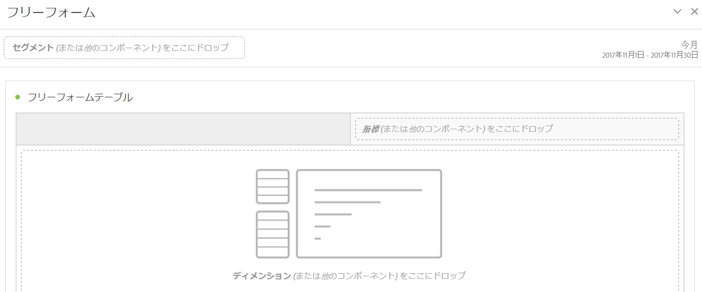

# フリーフォームパネル

>[!BEGINSHADEBOX]

_この記事では、_&#x200B;のフリーフォームパネルについて説明します。_&#x200B;**Adobe Analytics**。_ _この記事の_&#x200B;件の_&#x200B;**Customer Journey Analytics**&#x200B;版については、[&#x200B; フリーフォームパネル &#x200B;](/help/analyze/analysis-workspace/c-panels/freeform-panel.md)を参照してください。_

>[!ENDSHADEBOX]

**[!UICONTROL フリーフォームパネル]**&#x200B;は、デフォルトの開始状態として[フリーフォームテーブル](/help/analyze/analysis-workspace/visualizations/freeform-table/freeform-table.md)ビジュアライゼーションが含まれている空白のパネルです。

## 使用

**[!UICONTROL フリーフォームパネル]**&#x200B;を使用するには：

1. **[!UICONTROL フリーフォームパネル]**&#x200B;を作成します。 パネルの作成方法について詳しくは、[パネルの作成](panels.md#create-a-panel)を参照してください。

   

1. フリーフォームパネルと[フリーフォームテーブル](/help/analyze/analysis-workspace/visualizations/freeform-table/freeform-table.md)ビジュアライゼーションにコンポーネントを追加する方法について詳しくは、[Analytics コンポーネントガイド](/help/components/home.md)を参照してください。

>[!MORELIKETHIS]
>
>[&#x200B; パネルを作成](/help/analyze/analysis-workspace/c-panels/panels.md#create-a-panel)
>[Analytics コンポーネントガイド](/help/components/home.md)
>[フリーフォームテーブルビジュアライゼーション](/help/analyze/analysis-workspace/visualizations/freeform-table/freeform-table.md)
>
