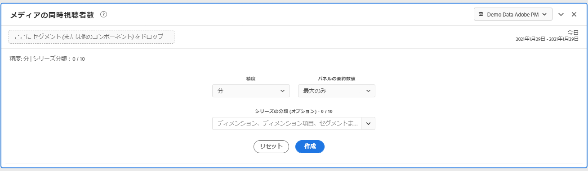
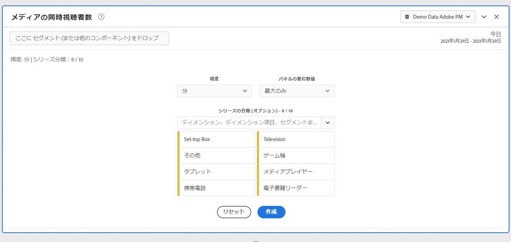
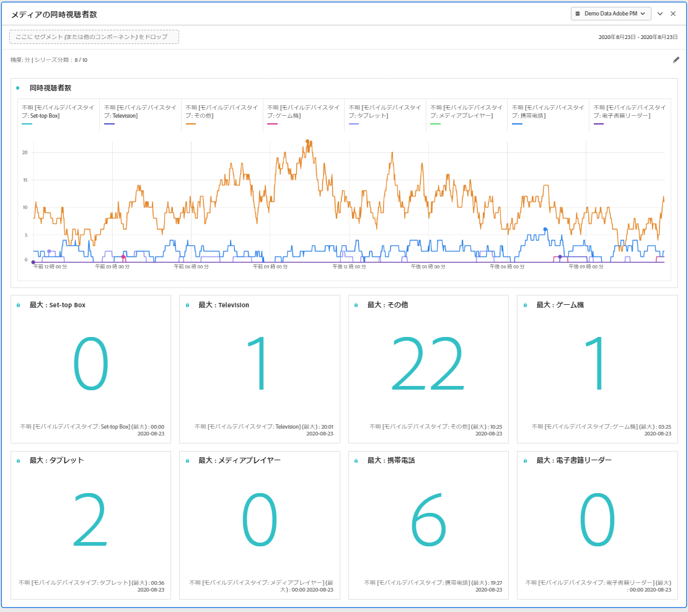
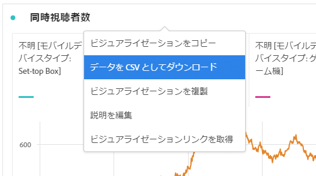

# メディアの同時視聴者パネル

Media Analytics のお客様は、同時ビューアを分析して、同時実行のピークが発生した場所や離脱が発生した場所を理解し、コンテンツの品質と視聴者のエンゲージメントに関する貴重なインサイトを提供して、ボリュームや規模のトラブルシューティングや計画に役立てることができます。

Analysis Workspace では、同時視聴者数は、セッション数にかかわらず、特定の時点におけるメディアストリームを視聴するユニーク訪問者数です。

メディア同時ビューアパネルを使用すると、同時実行性のピークに関する詳細や、分類機能と比較機能を使用して、時系列の同時ビューアを分析できます。  メディア同時ビューアパネルにアクセスするには、Media Analytics コンポーネントが有効になっているレポートスイートに移動します。 次に、左端のパネルアイコンをクリックし、 パネルを Analysis Workspace プロジェクトにドラッグします。

## パネル入力 {#Input}

次の入力設定を使用して、メディア同時ビューアパネルを設定できます。

| 設定 | 説明 |
|---|---|
| パネルの日付範囲 | パネルの日付範囲のデフォルトは「今日」です。  一度に 1 日または複数の月を表示するように編集できます。   この視覚化は、1440 行のデータに制限されています（たとえば、分レベルの粒度で 24 時間）。日付範囲と精度の組み合わせの結果が 1440 行を超える場合、精度は自動的に更新され、日付範囲全体に対応します。 |
| 精度 | 精度のデフォルトは「分」です。   この視覚化は、1440 行のデータに制限されています（たとえば、分レベルの粒度で 24 時間）。日付範囲と精度の組み合わせの結果が 1440 行を超える場合、精度は自動的に更新され、日付範囲全体に対応します。 |
| パネルの要約数値 | 同時ビューアの日時の詳細を表示するには、概要番号を使用できます。 最大値は、ピーク同時実行性の詳細を示します。 最小値は、トラフの詳細を示します。  パネルのデフォルトでは「最大値」のみが表示されますが、「最小値」に変更するか、「最大値」と「最小値」の両方を表示するように変更できます。  内訳を使用している場合は、それぞれの概要番号が表示されます。 |
| シリーズの分類 | オプションとして、セグメント、ディメンション、ディメンション項目または日付範囲でビジュアライゼーションを分類できます。    - 一度に 10 行まで表示できます。 分類は 1 つのレベルに制限されます。   - ディメンションをドラッグすると、選択したパネルの日付範囲に基づいて、上位のディメンション項目が自動的に選択されます。   - 日付範囲を比較するには、2 つ以上の日付範囲をシリーズ分類フィルターにドラッグします。 |

### デフォルトのビュー

### シリーズの分類表示

## パネル出力 {#Output}

メディア同時ビューアパネルは、最大および／または最小の同時ビューアの詳細を含む折れ線グラフと概要番号を返します。  パネルの上部に、選択したパネル設定を示す概要行が表示されます。

右上の編集鉛筆アイコンをクリックすると、いつでもパネルを編集および再構築できます。

シリーズの分類を選択した場合は、折れ線グラフに線と次の各項目の概要番号が表示されます。

### データソース

このパネルで使用できる唯一の指標は「同時ビューア」です。

| 指標 | 説明 |
|---|---|
| 同時視聴者数 | セッション数に関係なく、特定の時点でメディアストリームを閲覧しているユニーク訪問者の数。  これは、同時アクティブセッションを使用する、「レポート」セクションの「同時ビューア」レポートとは異なります。  ユニーク訪問者を使用すると、（セッションの終了と開始が同時に行われる）ショーの境界で不要な「スパイク」が削除されます。 |

このビューでは、フリーフォームテーブルは使用できません。  データソースを表示するには、折れ線グラフを右クリックし、.csv ファイルとしてダウンロードします。  シリーズの分類が含まれます。

## よくある質問（FAQ） {#FAQ}

| 質問 | 回答 |
|---|---|
| フリーフォームテーブルはどこにありますか？ データソースの確認方法を教えてください。 | このビューでは、フリーフォームテーブルは使用できません。  折れ線グラフを右クリックして、CSV ファイルをダウンロードすると、データソースをダウンロードできます。 |
| 精度が変更されたのはなぜですか？ | この視覚化は、1440 行のデータに制限されています（たとえば、分レベルの粒度で 24 時間）。日付範囲と精度の組み合わせの結果が 1440 行を超える場合、精度は日付範囲全体に対応するように自動的に更新されます。  大きい日付範囲から小さい日付範囲に変更する場合、日付範囲が変更されると、精度は許容できる最小の詳細に更新されます。 より高い精度を表示するには、パネルを編集して再構築します。 |
| ビデオ名、セグメント、コンテンツタイプなどの比較方法を教えてください。 | 単一のビジュアライゼーション内でこれらを比較するには、セグメント、ディメンションまたはシリーズ分類フィルター内の特定のディメンション項目をドラッグします。  ビューの分類は 10 個に制限されています。  10 を超える表示をおこなうには、複数のパネルを使用する必要があります。 |
| 日付範囲の比較方法を教えてください。 | 単一のビジュアライゼーション内の日付範囲を比較するには、2 つ以上の日付範囲をドラッグして、シリーズの分類を使用します。  これらの日付範囲は、パネルの日付範囲より優先されます。 |
| ビジュアライゼーションのタイプを変更する方法を教えてください。 | このパネルでは、時系列の線のビジュアライゼーションのみが可能です。 |
| 異常値検出を実行できますか？ | いいえ。このパネルでは異常値検出は利用できません。 |
| アクティブセッションではなく、ユニーク訪問者を使用する理由。 | ユニーク訪問者を使用すると、（セッションの終了と開始が同時に行われる）ショーの境界で不要なスパイクを削除できます。 |
| 同時ビューアの精度を分単位よりも細かくするとはどういう意味ですか？ | 精度が 1 分を超える場合、同時ビューアはその時間範囲内のすべての分におけるユニーク同時ビューアの合計です。  例えば、時間レベルの精度の同時ビューアは、その時間内のすべての分のユニーク同時ビューアの合計です。 |
| 分レベルの精度で 1 日以上を表示したい場合はどうすればよいですか？ | 一度に最大 1 か月間、分レベルの精度でデータにアクセスする場合は、Analytics 2.0 API を使用できます。 詳しくは、 [Analytics 2.0 API を使用した同時ビューアの JSON レポートデータの取得](https://experienceleague.adobe.com/docs/media-analytics/using/media-reports/media-default-reports/get-concurrent-json20.html)を参照してください。 |
| Workspace パネルには、同時ビューアレポートと同じ情報が表示されますか？ | いいえ。Analysis Workspace では、同時ビューアは、セッション数に関係なく、特定の時点におけるメディアストリームを閲覧しているユニーク訪問者数として定義されます。  これは、「同時アクティブセッション」を使用する「レポート」セクションの「同時ビューア」レポートとは異なります。  ユニーク訪問者を使用すると、セッションの終了と開始が同時に発生するショーの境界で、不要なスパイクを取り除くことができます。 |

<!-- For more information about Media Concurrent Viewers, visit [MA doc page]( https://url). -->
