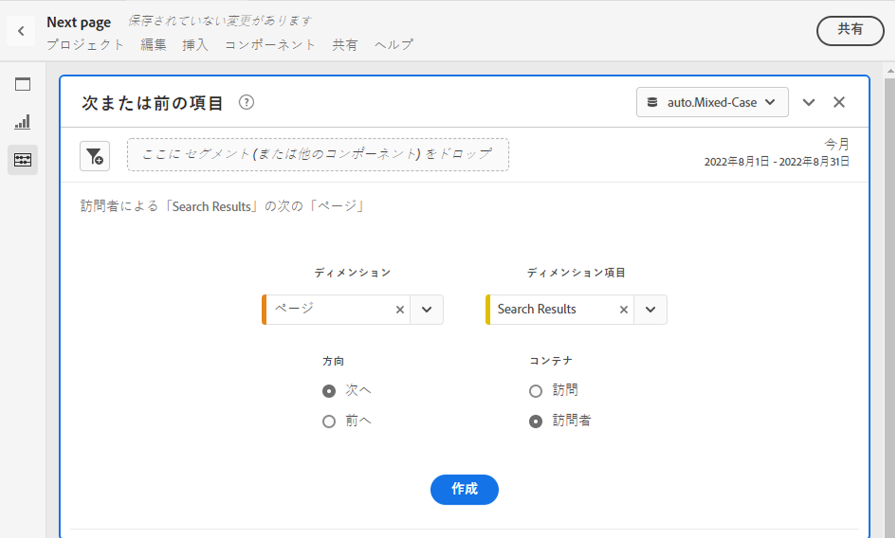
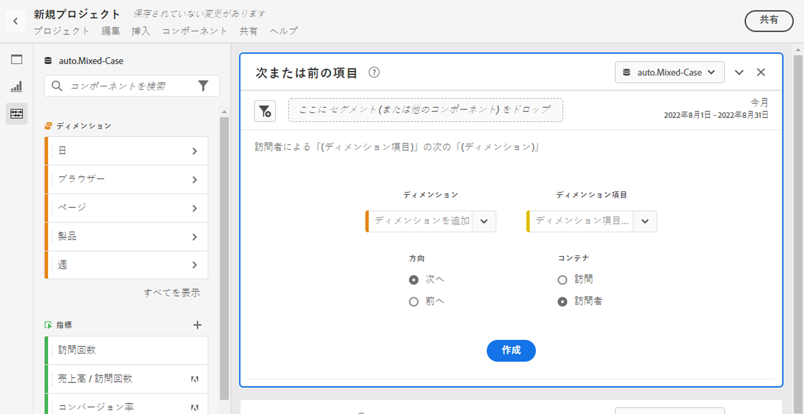
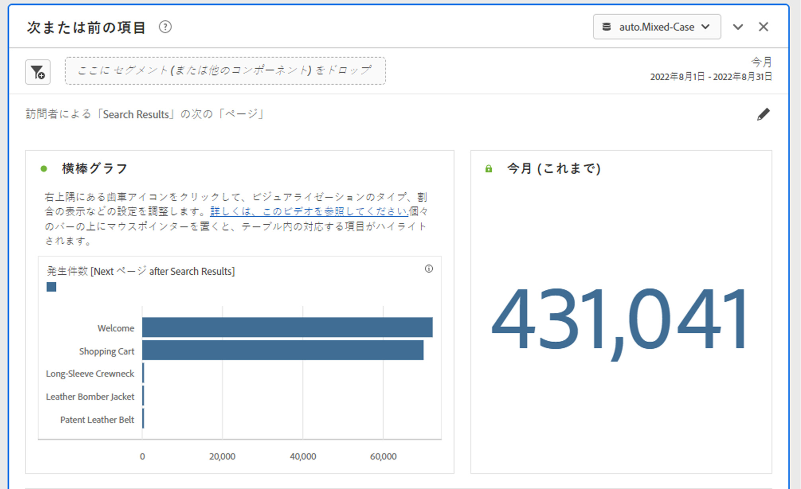
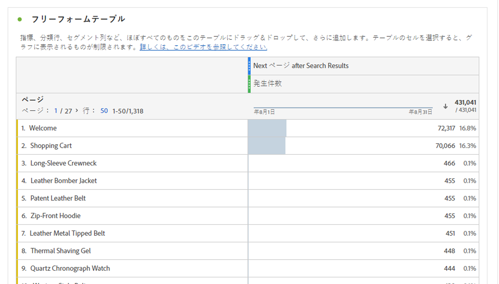

# 次または前の項目パネル

この [!UICONTROL 次または前の項目] パネルは、Reports &amp; Analytics のレポートとして、 [!UICONTROL レポート] > [!UICONTROL 最頻使用] > [!UICONTROL 次のページ/前のページ]. この Workspace パネルには、特定のディメンションの次または前のディメンション項目を簡単に識別できる、多数のテーブルとビジュアライゼーションが含まれています。 例えば、 
        

## パネルへのアクセス

パネルには、内からアクセスできます [!UICONTROL レポート] または [!UICONTROL Workspace].

| アクセスポイント | 説明 |
| --- | --- |
| [!UICONTROL レポート] | <ul><li>パネルは既にプロジェクトにドロップされています。</li><li>左側のレールが折りたたまれます。</li><li>選択した場合 [!UICONTROL 次のページ]の場合、デフォルト設定は既に適用されています ( 例： [!UICONTROL ページ] 対象 [!UICONTROL Dimension]、および [!UICONTROL Dimension項目], [!UICONTROL 次へ] 対象 [!UICONTROL 方向] および [!UICONTROL 訪問] 対象 [!UICONTROL コンテナ]. これらの設定はすべて変更できます。</li></ul> |
| Workspace | 新しいプロジェクトを作成し、左側のパネルでパネルアイコンを選択します。 次に、 [!UICONTROL 次または前の項目] パネルを使用して、フリーフォームテーブルの上に表示できます。 この [!UICONTROL Dimension] および [!UICONTROL Dimension項目] フィールドは空白のままです。 ドロップダウンからディメンションを選択します。 [!UICONTROL Dimension項目] が [!UICONTROL ディメンション] 君が選んだ。 上位のディメンション項目が追加されますが、別の項目を選択できます。
 |

## パネル入力 {#Input}

次の項目を設定できます。 [!UICONTROL 次または前の項目] パネルパネルで次の入力設定を使用できます。

| 設定 | 説明 |
| --- | --- |
| セグメント（または他のコンポーネント）ドロップゾーン | セグメントや他のコンポーネントをドラッグ&amp;ドロップして、パネル結果をさらにフィルタリングできます。 |
| ディメンション | 次または前の項目を調査するディメンション。 |
| ディメンション項目 | 項目 |
| 方向 | を探しているかどうかを指定します [!UICONTROL 次へ] または [!UICONTROL 前へ] ディメンション項目。 |
| コンテナ | [!UICONTROL 訪問] または [!UICONTROL 訪問者] （デフォルト）お問い合わせの範囲を決定します。 |

クリック **[!UICONTROL ビルド]** をクリックして、パネルを構築します。

## パネル出力 {#output}

この [!UICONTROL 次または前の項目] パネルは、特定のディメンション項目に続く、または特定のディメンション項目に先行する発生件数をより深く理解できるように、豊富なデータとビジュアライゼーションのセットを返します。

