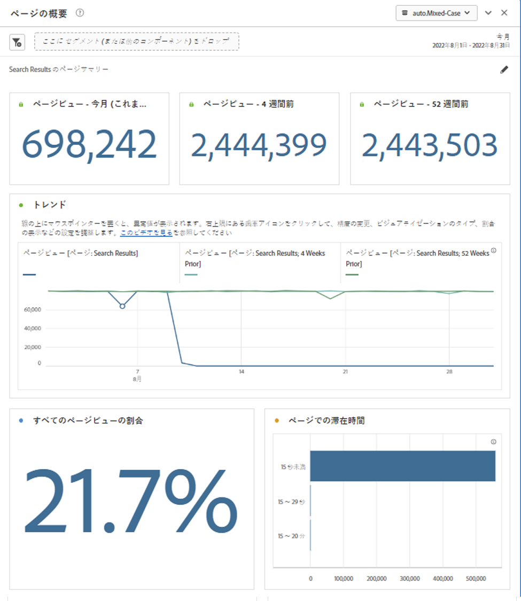

# ページの概要パネル {#page-summary}

<!-- markdownlint-disable MD034 -->

>[!CONTEXTUALHELP]
>id="workspace_pagesummary_button"
>title="ページの概要"
>abstract="いくつかの大まかな指標に加え、特定のページとの間の移動も簡単に確認します。"

<!-- markdownlint-enable MD034 -->

<!-- markdownlint-disable MD034 -->

>[!CONTEXTUALHELP]
>id="workspace_pagesummary_panel"
>title="ページの概要パネル"
>abstract="いくつかの大まかな指標に加え、特定のページとの間の移動も簡単に確認します。  **パラメーター&#x200B;** **ページディメンション項目を追加**：コンポーネントパネルを開き、ページディメンションを見つけて、キャレットをクリックして展開し、ディメンション項目を表示します。 次に、詳しく知りたい特定のページをビルダーにドラッグ&amp;ドロップします。 ディメンション項目をドラッグ&amp;ドロップすると、レポートには、ページに関する主要な情報が自動的に入力されます。"

<!-- markdownlint-enable MD034 -->

このパネルを使用すると、特定のページに関する主要な統計を簡単に調べることができます。

## パネルへのアクセス

パネルには、{Reports[!UICONTROL  内または ]2}Workspace] 内からアクセスできます。[!UICONTROL 

| アクセスポイント | 説明 |
| --- | --- |
| [!UICONTROL レポート] | <ul><li>パネルは既にプロジェクトにドロップされています。</li><li>左側のレールが折りたたまれている。</li><li>ページディメンションのみがサポートされます。</li><li>デフォルト設定は既に適用されています。この場合、[!UICONTROL Page] ディメンションで最もアクセス頻度の高いページが表示されます。 この設定は変更できます。</li></ul> |
| Workspace | 新しいプロジェクトを作成し、左パネルのパネル アイコンを選択します。 [!UICONTROL  ページの概要 ] パネルをフリーフォームテーブルの上にドラッグします。 「[!UICONTROL Dimension項目 ] ページ」フィールドは空白のままです。 ドロップダウンリストからディメンション項目を選択します。 |

## パネル入力 {#Input}

[!UICONTROL  ページの概要 ] パネルは、次の入力設定を使用して設定できます。

| 設定 | 説明 |
| --- | --- |
| セグメント（または他のコンポーネント）ドロップゾーン | セグメントや他のコンポーネントをドラッグ&amp;ドロップして、パネル結果をさらにフィルタリングできます。 |
| ページディメンション項目 | ドロップダウンリストから、キー統計を調べるページディメンション項目を選択します。 |

{style="table-layout:auto"}

**[!UICONTROL ビルド]** をクリックして、パネルをビルドします。

## パネル出力 {#output}

[!UICONTROL  ページの概要 ] パネルは、特定のページに関する統計をより深く理解するのに役立つ指標データとビジュアライゼーションの豊富なセットを返します。

| 指標/ビジュアライゼーション | 説明 |
| --- | --- |
| [!UICONTROL  ページビュー ] – 今月（これまで） | 今月のこのページのページビュー数。 |
| [!UICONTROL  ページビュー ] - 4 週間前 | 先月のこのページのページビュー数。 |
| [!UICONTROL  ページビュー ] - 52 週間前 | 昨年のこのページのページビュー数。 |
| [!UICONTROL トレンド] | 今月、4 週間前、および 52 週間前のトレンド ページ ビューグラフ。 |
| [!UICONTROL  すべてのページビューの割合 ] | このページに送信されたすべてのページビューの割合を示す概要番号。 |
| [!UICONTROL ページでの滞在時間] | このページでの滞在時間をリストする横棒グラフ。 |
| [!UICONTROL 単一ページ訪問] | これが唯一の訪問ページだったページビュー数をリストする概要番号。 |
| [!UICONTROL リロード回数] | [!UICONTROL  リロード ] 指標は、リロード中にディメンション項目が存在した回数を示します。 訪問者によるブラウザーの更新は、再読み込みをトリガーする最も一般的な方法です。 |
| [!UICONTROL 入口] | [!UICONTROL  エントリ ] 指標は、特定のディメンション項目が訪問の最初の値として取得された回数を示します。 |
| [!UICONTROL 出口] | [!UICONTROL  離脱 ] 指標は、特定のディメンション項目が訪問の最後の値として取得された回数を示します。 |
| [!UICONTROL フロー] | 選択したページをフォーカルポイントとするフロー図 任意の [ フロー図 ](/help/analyze/analysis-workspace/visualizations/c-flow/create-flow.md) と同様に、データをさらに詳しく調べることができます。 |

{style="table-layout:auto"}

