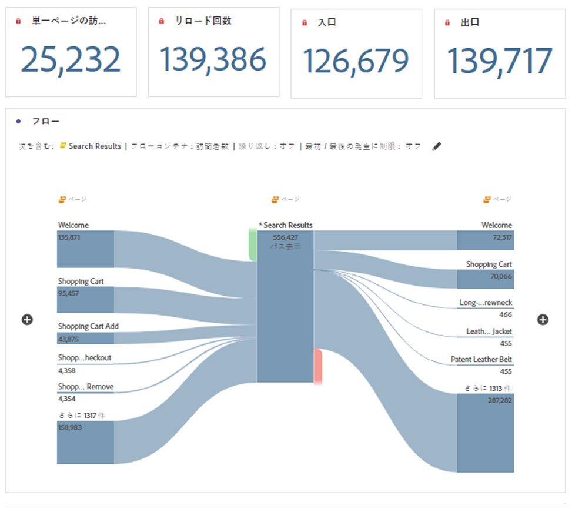

# ページの概要パネル

この [!UICONTROL ページサマリ] パネルは、Reports &amp; Analytics のレポートとして、レポート/エンゲージメント/ページ分析/ページサマリから始まりました。 現在は、Workspace パネルになっています。 このパネルを使用すると、特定のページに関する主要な統計を簡単に参照できます。

## パネルへのアクセス

パネルには、内からアクセスできます [!UICONTROL レポート] または [!UICONTROL Workspace].

| アクセスポイント | 説明 |
| --- | --- |
| [!UICONTROL レポート] | <ul><li>パネルは既にプロジェクトにドロップされています。</li><li>左側のレールが折りたたまれます。</li><li>ページディメンションのみがサポートされます。</li><li>デフォルト設定が既に適用されています。この場合、[!UICONTROL ページ] ディメンション。 この設定は変更できます。</li></ul> |
| Workspace | 新しいプロジェクトを作成し、左側のパネルでパネルアイコンを選択します。 次をドラッグ： [!UICONTROL ページサマリ] パネルを使用して、フリーフォームテーブルの上に表示できます。 ページ [!UICONTROL Dimension項目] フィールドが空白のままです。 ドロップダウンリストからディメンション項目を選択します。 |

## パネル入力 {#Input}

次の項目を設定できます。 [!UICONTROL ページサマリ] パネルで次の入力設定を使用します。

| 設定 | 説明 |
| --- | --- |
| セグメント（または他のコンポーネント）ドロップゾーン | セグメントや他のコンポーネントをドラッグ&amp;ドロップして、パネル結果をさらにフィルタリングできます。 |
| ページディメンション項目 | ドロップダウンリストで、キー統計を調査するページディメンション項目を選択します。 |

{style=&quot;table-layout:auto&quot;}

クリック **[!UICONTROL ビルド]** をクリックして、パネルを構築します。

## パネル出力 {#output}

この [!UICONTROL ページサマリ] パネルは、特定のページに関する統計をより深く理解できるように、豊富な指標データとビジュアライゼーションのセットを返します。

| 指標/ビジュアライゼーション | 説明 |
| --- | --- |
| [!UICONTROL ページビュー数]  — 今月（これまで） | 当月のこのページのページ表示数。 |
| [!UICONTROL ページビュー数] - 4 週間前 | 過去 1 か月のこのページのページ表示数。 |
| [!UICONTROL ページビュー数] - 52 週間前 | 過去 1 年間のこのページのページ表示数。 |
| [!UICONTROL トレンド] | 今月、4 週間前および 52 週間前のトレンドページ表示グラフ。 |
| [!UICONTROL すべてのページビューの割合] | このページにアクセスしたすべてのページビューの割合の概要番号。 |
| [!UICONTROL ページでの滞在時間] | このページの滞在時間を示す横棒グラフ。 |
| [!UICONTROL 単一ページ訪問] | このページが唯一の訪問ページビュー数を示す概要番号。 |
| [!UICONTROL リロード回数] | この [!UICONTROL リロード回数] 指標は、再読み込み中にディメンション項目が存在した回数を示します。 訪問者によるブラウザーの更新は、再読み込みをトリガーする最も一般的な方法です。 |
| [!UICONTROL 入口] | この [!UICONTROL 入口] 指標は、訪問の最初の値として特定のディメンション項目が取得された回数を示します。 |
| [!UICONTROL 出口] | この [!UICONTROL 出口] 指標は、訪問の最後の値として特定のディメンション項目が取り込まれた回数を示します。 |
| [!UICONTROL フロー] | 選択したページを焦点とするフロー図です。 任意の [フロー図](/help/analyze/analysis-workspace/visualizations/c-flow/create-flow.md). |

{style=&quot;table-layout:auto&quot;}

