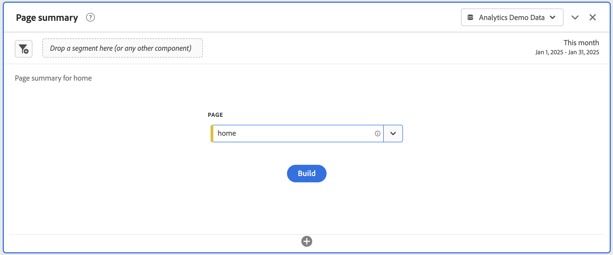

# ページの概要パネル {#page-summary}

<!-- markdownlint-disable MD034 -->

>[!CONTEXTUALHELP]
>id="workspace_pagesummary_button"
>title="ページの概要"
>abstract="いくつかの高レベルの指標と、特定のページ間の移動をすばやく確認します。"

<!-- markdownlint-enable MD034 -->

<!-- markdownlint-disable MD034 -->

>[!CONTEXTUALHELP]
>id="workspace_pagesummary_panel"
>title="ページの概要パネル"
>abstract="いくつかの高レベルの指標と、特定のページ間の移動をすばやく確認します。  **パラメーター&#x200B;** **ページディメンション項目を追加**：コンポーネントパネルを開き、ページディメンションを見つけて、キャレットをクリックして展開し、ディメンション項目を表示します。  次に、詳しく知りたい特定のページをビルダーにドラッグ＆ドロップします。ディメンション項目をドラッグ＆ドロップすると、ページに関する主要な情報がレポートに自動的に入力されます。"

<!-- markdownlint-enable MD034 -->

>[!BEGINSHADEBOX]

_この記事では、_ _**Adobe Analytics** のページの概要パネルについて説明します。_ __ _**Customer Journey Analytics** には同等のパネルはありません。_

>[!ENDSHADEBOX]

**[!UICONTROL ページの概要]**&#x200B;パネルでは、特定のページに関する主要な統計を探索できます。

## 使用

**[!UICONTROL ページの概要]**&#x200B;パネルを使用するには：

1. **[!UICONTROL ページの概要]**&#x200B;パネルを作成します。パネルの作成方法について詳しくは、[パネルの作成](panels.md#create-a-panel)を参照してください。

1. パネルの[入力](#panel-input)を指定します。

1. パネルの[出力](#panel-output)を確認します。

[!UICONTROL レポート]内または [!UICONTROL Workspace] 内からパネルにアクセスできます。

| アクセスポイント | 説明 |
| --- | --- |
| [!UICONTROL レポート] | <ul><li>パネルは既にプロジェクトにドロップされています。</li><li>左側のパネルが折りたたまれています。</li><li>ページディメンションのみがサポートされています。</li><li>デフォルト設定は既に適用されており、この場合は、[!UICONTROL ページ]ディメンションで最も多く訪問されたページです。この設定は変更できます。</li></ul> |
| Workspace | 新しいプロジェクトを作成し、左側のパネルのパネルアイコンを選択します。[!UICONTROL ページの概要]パネルをフリーフォームテーブルの上にドラッグします。ページの「[!UICONTROL ディメンション項目]」フィールドは空のままです。ドロップダウンリストからディメンション項目を選択します。 |

### パネル入力 {#panel-input}

次の入力設定を使用して、[!UICONTROL ページの概要]パネルを設定できます。

| 入力 | 説明 |
| --- | --- |
| **[!UICONTROL ページ]** | 主要統計を調べるページのページディメンションを選択します。 例えば、**[!UICONTROL home]** を指定して、ホームページの統計情報を調べます。 ドロップダウンメニューを使用してページを選択するか、（例：`home`）と入力してページをすばやく検索します。 |

{style="table-layout:auto"}

「**[!UICONTROL 作成]**」を選択して、パネルを作成します。

### パネル出力 {#panel-output}

[!UICONTROL ページの概要]パネルには、特定のページに関する統計をより深く理解するのに役立つ、指標データとビジュアライゼーションの豊富なセットが返されます。

| ビジュアライゼーション | 説明 |
| --- | --- |
| **[!UICONTROL ページビュー] - 今月（これまで）** | 今月のこのページのページビュー数を示す[数値の概要](/help/analyze/analysis-workspace/visualizations/summary-number-change.md)ビジュアライゼーション。 |
| **[!UICONTROL ページビュー] - 4 週間前** | 先月のこのページのページビュー数を示す[数値の概要](/help/analyze/analysis-workspace/visualizations/summary-number-change.md)ビジュアライゼーション。 |
| **[!UICONTROL ページビュー] - 52 週間前** | 過去 1 年間のこのページのページビュー数を示す[数値の概要](/help/analyze/analysis-workspace/visualizations/summary-number-change.md)ビジュアライゼーション。 |
| **[!UICONTROL トレンド]** | 今月、4 週間前、52 週間前のページビューのトレンド[折れ線グラフ](/help/analyze/analysis-workspace/visualizations/line.md)ビジュアライゼーション。 |
| **[!UICONTROL すべてのページビューの割合]** | このページに送信されたすべてのページビューの割合を示す数値の概要。 |
| **[!UICONTROL ページでの滞在時間]** | このページでの滞在時間を示す[横棒グラフ](/help/analyze/analysis-workspace/visualizations/horizontal-bar.md)ビジュアライゼーション。 |
| **[!UICONTROL 単一ページ訪問]** | このページが唯一の訪問ページだったページビューの数を示す[数値の概要](/help/analyze/analysis-workspace/visualizations/summary-number-change.md)。 |
| **[!UICONTROL リロード回数]** | 再読み込み中にディメンション項目が存在した回数を示す[数値の概要](/help/analyze/analysis-workspace/visualizations/summary-number-change.md)。訪問者によるブラウザーの更新は、再読み込みをトリガーする最も一般的な方法です。 |
| **[!UICONTROL 入口]** | 訪問の最初の値として特定のディメンション項目が取得された回数を示す[数値の概要](/help/analyze/analysis-workspace/visualizations/summary-number-change.md)。 |
| **[!UICONTROL 出口]** | 訪問の最後の値として特定のディメンション項目が取得された回数を示す[数値の概要](/help/analyze/analysis-workspace/visualizations/summary-number-change.md)。 |
| **[!UICONTROL フロー]** | 選択したページをフォーカルポイントとする[フロー](/help/analyze/analysis-workspace/visualizations/c-flow/flow.md)ビジュアライゼーション。[フロー](/help/analyze/analysis-workspace/visualizations/c-flow/create-flow.md)ビジュアライゼーションと同様に、データをさらに詳しく調べることができます。 |

{style="table-layout:auto"}

パネルを再設定および再作成するには、 を使用します。
