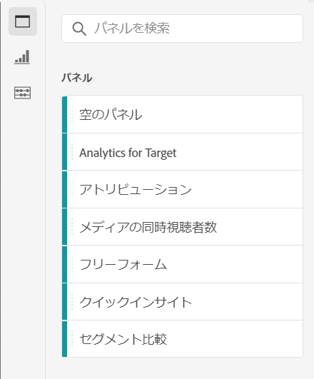
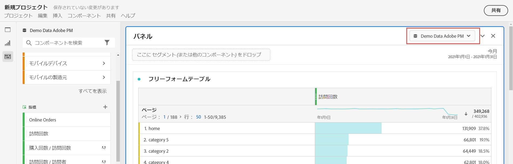
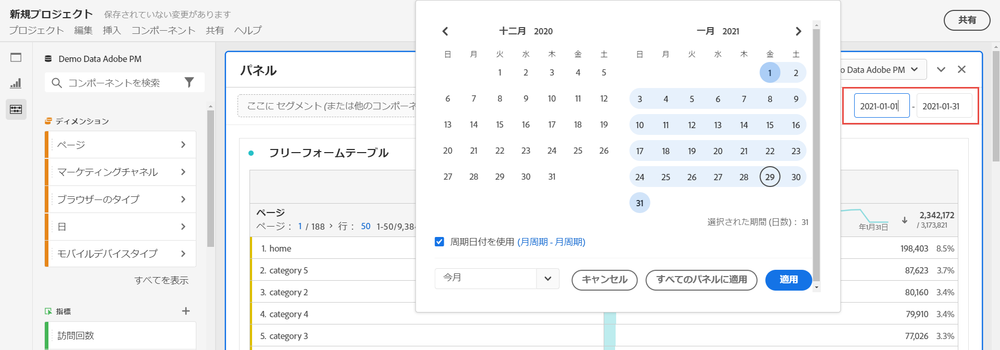
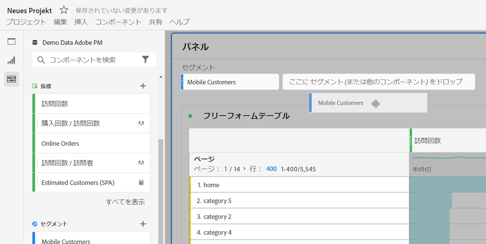
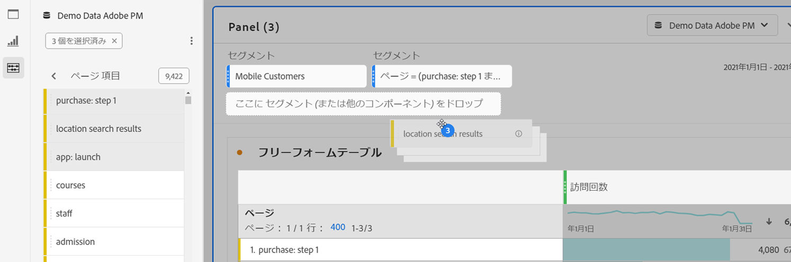
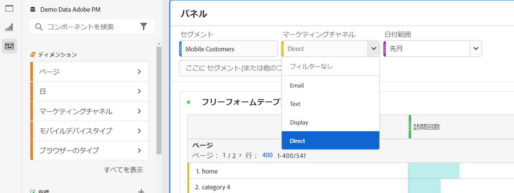
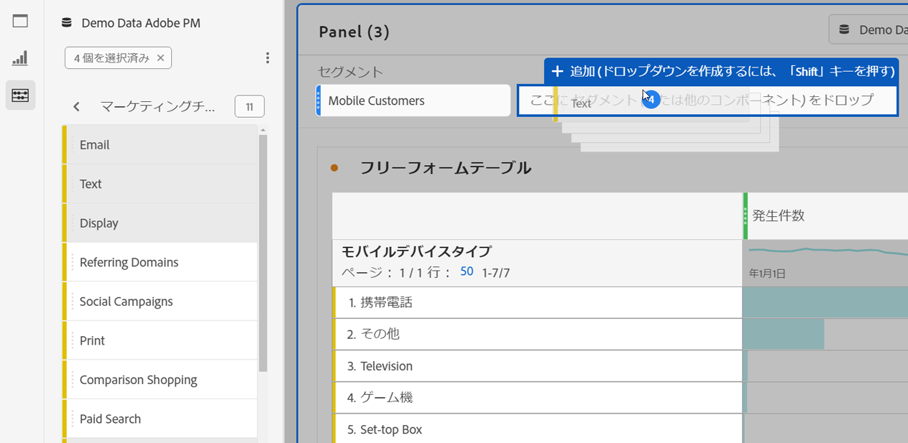

# パネルの概要

[!UICONTROL パネル] は、テーブルとビジュアライゼーションの集まりです。 パネルには、Workspaceの左上のアイコンまたは [空白のパネルからアクセスできます](blank-panel.md)。 パネルは、期間、レポートスイート、分析の使用例に従ってプロジェクトを整理する場合に便利です。 Analysis Workspaceでは、次のパネルタイプを利用できます。

| パネル名 | 説明 |
| --- | --- |
| [空のパネル](blank-panel.md) | 使用可能なパネルおよびビジュアライゼーションから選択し、分析を開始します。 |
| [クイックインサイトパネル](quickinsight.md) | フリーフォームテーブルとそれに伴うビジュアライゼーションを素早く作成し、インサイトを迅速に分析して取得できます。 |
| [Analytics for Target パネル](a4t-panel.md) | Analysis Workspace で Target アクティビティとエクスペリエンスを分析します。 |
| [アトリビューションパネル](attribution.md) | 任意のディメンションとコンバージョン指標を使用して、任意の数のアトリビューションモデルをすばやく比較および視覚化できます。 |
| [フリーフォームパネル](freeform-panel.md) | 無制限の比較および分類を実行し、ビジュアライゼーションを追加してリッチデータストーリーを示します。 |
| [メディアの同時視聴者パネル](media-concurrent-viewers.md) | ピーク同時実行数の詳細と分類および比較機能を使用して、同時視聴者を経時的に分析します。 |
| [セグメント比較パネル](c-segment-comparison/segment-comparison.md) | すべてのデータポイントにわたって2つのセグメントをすばやく比較し、関連する差異を自動的に見つけます。 |

[!UICONTROL クイックインサイト、][!UICONTROL 空白] および [!UICONTROL フリーフォーム] パネルは分析を開始するためのパネルで、ターゲットを分析するためのパネルはをAttribution IQするための場所、Analytics、Analytics、Analytics、Media  を並行するViewers並行するConcurrent Segment To Analys プロジェクトでは `"+"` ボタンが使用できるので、いつでも空白のパネルを追加できます。

The default starting panel is the [!UICONTROL Freeform] panel, but you can make the [blank panel](/help/analyze/analysis-workspace/c-panels/blank-panel.md) your default as well.

## レポートスイート {#report-suite}

パネル内のテーブルとビジュアライゼーションは、パネルの右上部で選択した [!UICONTROL レポートスイート] からデータを取得します。 また、レポートスイートでは、左側のレールで使用できるコンポーネントも決定します。 プロジェクト内では、分析の使用例に応じて1つまたは [複数のレポートスイートを使用できます](https://experienceleague.adobe.com/docs/analytics/analyze/analysis-workspace/build-workspace-project/multiple-report-suites.html?lang=ja-JP) 。 1つのレポートスイートをプロジェクト内のすべてのパネルに適用するには、パネルヘッダーを **右クリックし、レポートスイートをすべてのパネルに適用します**。

レポートスイートのリストは、関連性に基づいて並べ替えられます。関連性に基づいて、現在のAdobeがスイートを使用した最近の頻度と頻度、および組織内でスイートを使用した頻度に基づいて定義されます。

## カレンダー {#calendar}

パネルカレンダーは、パネル内のテーブルおよびビジュアライゼーションのレポート範囲を制御します。

注意：テーブル、ビジュアライゼーション、パネルドロップゾーン内で（紫色の）日付範囲コンポーネントを使用すると、パネルカレンダーが上書きされます。

## ドロップゾーン {#dropzone}

パネルドロップゾーンを使用すると、セグメントおよびドロップダウンフィルターをパネル内のすべてのテーブルおよびビジュアライゼーションに適用できます。 1つのパネルに1つまたは複数のフィルターを適用できます。 各フィルターの上のタイトルは、編集鉛筆をクリックして変更できます。また、右クリックして削除することもできます。

### セグメントフィルター

左側のレールからパネルのドロップゾーンにセグメントをドラッグ&amp;ドロップして、パネルのフィルタリングを開始します。

### アドホックセグメントフィルター

セグメント以外のコンポーネントをドロップゾーンに直接ドラッグしてアドホックセグメントを作成することもできるので、セグメントビルダーに移る手間を省くことができます。 この方法で作成されたセグメントは、自動的にヒットレベルのセグメントとして定義されます。 この定義を変更するには、セグメントの横にある情報アイコン(i)をクリックし、次に鉛筆形の編集アイコンをクリックして、セグメントビルダーで編集します。

アドホックセグメントはプロジェクトのローカルなセグメントで、公開しない限り左側のナビゲーションバーに表示されません。

### ドロップダウンフィルター {#dropdown-filter}

ドロップダウンフィルターを使用すると、セグメントフィルターに加えて、データを制御した方法で操作できます。 例えば、モバイルデバイスタイプにドロップダウンフィルターを追加して、パネルをタブレット、携帯電話、デスクトップでセグメント化できます。

ドロップダウンフィルターを使用して、多くのプロジェクトを1つに統合することもできます。 例えば、同じプロジェクトの多くのバージョンで異なる国セグメントが適用されている場合、すべてのバージョンを単一のプロジェクトに統合し、国ドロップダウンフィルターを追加できます。

ドロップダウンフィルターを作成するには：

1. マー [!UICONTROL ケティングチャネルディメンション内の値など、]Dimension項目を使用してドロップダウンフィルターを作成するには  、左側のナビゲーションバーで、ディメンションの横にある右矢印アイコンをクリックします。 これにより、使用可能なすべての項目が表示されます。 左側のレールから1つまたは複数のコンポーネント項目を選択し、Shiftキーを押しながらパネルのドロップゾーン **にドロップします**。 これにより、コンポーネントが単一のセグメントではなく、ドロップダウンフィルターに変換されます。
1. 指標、セグメント、日付範囲などの他のコンポーネントを使用してドロップダウンフィルターを作成するには、左側のレールで1つのコンポーネントタイプから選択し、Shiftキーを押しながらパネルのドロップゾーン **にドロップします**。
1. ドロップダウンからオプションの1つを選択して、パネル内のデータを変更します。 You can also choose to not filter any of the panel data by selecting **[!UICONTROL No filter]**.

[プロジェクトにドロップダウンフィルターを追加する方法について詳しくは](https://docs.adobe.com/content/help/en/analytics-learn/tutorials/analysis-workspace/using-panels/using-panels-to-organize-your-analysis-workspace-projects.html) 、このビデオをご覧ください。

## 右クリックメニュー {#right-click}

パネルの追加機能は、パネルのヘッダーを右クリックすると使用できます。 次の設定を使用できます。

| 設定 | 説明 |
| --- | --- |
| コピーしたパネル/ビジュアライゼーションを挿入 | コピーしたパネルやビジュアライゼーションをプロジェクト内の別の場所に貼り付けたり、完全に異なるプロジェクトに貼り付け（「挿入」）できます。 |
| パネルをコピー | 右クリックしてパネルをコピーし、プロジェクト内の別の場所に挿入したり、完全に別のプロジェクトに挿入したりできます。 |
| すべてのパネルへのレポートスイートの適用 | アクティブなパネルレポートスイートをプロジェクト内のすべてのパネルに適用できます。 |
| 重複パネル | 現在のパネルを正確に重複し、変更できます。 |
| すべてのパネルを折りたたむ/展開する | すべてのプロジェクトパネルを折りたたんで展開します。 |
| パネル内のすべてのビジュアライゼーションを折りたたむ/展開する | 現在のパネル内のすべてのビジュアライゼーションを折りたたんで展開します。 |
| 説明を編集 | パネル追加の説明テキストを編集（または編集）します。 |
| パネルリンクを取得 | プロジェクト内の特定のパネルに他のユーザーを誘導することができます。リンクをクリックすると、受信者は、リンク先の正確なパネルに導かれる前にログインする必要があります。 |
