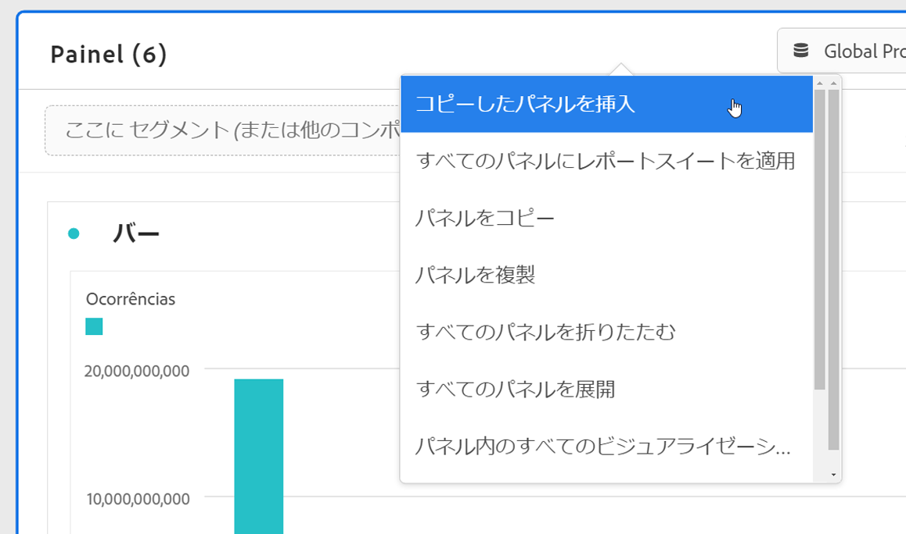

# パネルの概要

[!UICONTROL パネル]は、テーブルとビジュアライゼーションのコレクションです。パネルには、Workspace の左上のアイコンまたは[空のパネル](blank-panel.md)からアクセスできます。 パネルは、期間、レポートスイート、分析の使用例に従ってプロジェクトを整理する場合に便利です。 Analysis Workspace では、次のパネルタイプを利用できます。

| パネル名 | 説明 |
| --- | --- |
| [空のパネル](blank-panel.md) | 使用可能なパネルおよびビジュアライゼーションから選択し、分析を開始します。 |
| [クイックインサイトパネル](quickinsight.md) | フリーフォームテーブルとそれに伴うビジュアライゼーションを素早く作成し、インサイトを迅速に分析して取得できます。 |
| [Analytics for Target パネル](a4t-panel.md) | Analysis Workspace で Target アクティビティとエクスペリエンスを分析します。 |
| [アトリビューションパネル](attribution.md) | 任意のディメンションとコンバージョン指標を使用して、アトリビューションモデルをすばやく比較および視覚化します。 |
| [フリーフォームパネル](freeform-panel.md) | 無制限の比較および分類を実行し、ビジュアライゼーションを追加して豊かなデータのストーリーを示します。 |
| [メディアの同時視聴者パネル](media-concurrent-viewers.md) | 同時実行のピークの詳細と分類および比較機能を使用して、経時的に同時視聴者を分析します。 |
| [セグメント比較パネル](c-segment-comparison/segment-comparison.md) | すべてのデータポイントで 2 つのセグメントをすばやく比較し、関連性の高い違いを自動的に見つけます。 |

[!UICONTROL クリックインサイト]、[!UICONTROL 空白]、[!UICONTROL フリーフォーム]パネルは、分析を開始するのに最適です。[!UICONTROL Analytics for Target]、[!UICONTROL Attribution IQ]、[!UICONTROL メディア同時ビューア]および[!UICONTROL セグメント比較]は、より高度な分析に役立ちます。プロジェクトでは `"+"` ボタンが使用できるので、いつでも空白のパネルを追加できます。

デフォルトの開始パネルは[!UICONTROL フリーフォーム]パネルですが、[空白パネル](/help/analyze/analysis-workspace/c-panels/blank-panel.md)をデフォルトにすることも可能です。

## レポートスイート {#report-suite}

パネル内のテーブルとビジュアライゼーションは、パネルの右上で選択された[!UICONTROL レポートスイート]からデータを取得します。 また、レポートスイートでは、左パネルで使用できるコンポーネントも決定します。 プロジェクト内では、分析の使用例に応じて、1 つまたは[複数のレポートスイート](https://docs.adobe.com/content/help/ja-JP/analytics/analyze/analysis-workspace/build-workspace-project/multiple-report-suites.html)を使用できます。 1 つのレポートスイートをプロジェクト内のすべてのパネルに適用するには、**パネルヘッダーを右クリックし、レポートスイートをすべてのパネルに適用**&#x200B;します。

レポートスイートのリストは、関連性に基づいて並べ替えられます。これらの関連性は、現在のユーザーがスイートを使用した最近のタイミングと頻度、および組織内でスイートを使用した頻度に基づき、アドビによって定義されます。

## カレンダー {#calendar}

パネルカレンダーは、パネル内のテーブルおよびビジュアライゼーションのレポート範囲を制御します。

注意：テーブル、ビジュアライゼーション、パネルドロップゾーン内で（紫色の）日付範囲コンポーネントを使用すると、パネルカレンダーが上書きされます。

## ドロップゾーン {#dropzone}

パネルドロップゾーンを使用すると、パネル内のすべてのテーブルおよびビジュアライゼーションにセグメントおよびドロップダウンフィルターを適用できます。 1 つのパネルに 1 つまたは複数のフィルターを適用できます。 各フィルターの上のタイトルは、編集（鉛筆）マークをクリックすることで変更できます。また、右クリックして削除することもできます。

### セグメントフィルター

左パネルからパネルのドロップゾーンにセグメントをドラッグ＆ドロップして、パネルのフィルタリングを開始します。

### アドホックセグメントフィルター

セグメント以外のコンポーネントをドロップゾーンに直接ドラッグしてアドホックセグメントを作成し、セグメントビルダーへの移行にかかる時間と手間を節約することもできます。 この方法で作成されたセグメントは、自動的にヒットレベルのセグメントとして定義されます。 これらの定義は、セグメントの隣の情報アイコン (I)、鉛筆の形をした編集アイコンの順にクリックし、セグメントビルダーで編集することで変更できます。

アドホックセグメントはプロジェクトのローカルなセグメントで、公開しない限り左側のナビゲーションバーに表示されません。

### ドロップダウンフィルター {#dropdown-filter}

ドロップダウンフィルターを使用すると、セグメントフィルターに加えて、データを制御された方法で操作できます。 例えば、モバイルデバイスタイプにドロップダウンフィルターを追加して、パネルをタブレット、携帯電話、デスクトップ別にセグメント化できます。

ドロップダウンフィルターを使用して、多くのプロジェクトを 1 つに統合することもできます。 例えば、同じプロジェクトの多くのバージョンで異なる国セグメントが適用されている場合、すべてのバージョンを 1 つのプロジェクトに統合し、国ドロップダウンフィルターを追加できます。

ドロップダウンフィルターを作成するには、以下を実行します。

1. [!UICONTROL ディメンション項目]を使用してドロップダウンフィルターを作成するには（例：[!UICONTROL マーケティングチャネル]ディメンション内の値）、左パネルでディメンションの横にある右矢印アイコンをクリックします。 これにより、使用可能なすべての項目が表示されます。 左側のパネルから 1 つまたは複数のコンポーネント項目を選択し、**Shift キーを押しながら**&#x200B;パネルドロップゾーンにドロップします。 これにより、そのコンポーネントがセグメントではなくドロップダウンリストになります
1. 指標、セグメント、日付範囲などの他のコンポーネントを使用してドロップダウンフィルターを作成するには、左側のパネルでコンポーネントタイプを 1 つ選択し、**Shift キー**&#x200B;を押しながらパネルドロップゾーンにドロップします。
1. ドロップダウンからオプションを 1 つ選択して、パネルのデータを変更します。**[!UICONTROL フィルターなし]**&#x200B;を選択することで、パネルデータをフィルタリングしないよう選択することもできます。

プロジェクトにドロップダウンフィルターを追加する方法について詳しくは、[ビデオをご覧ください](https://docs.adobe.com/content/help/ja-JP/analytics-learn/tutorials/analysis-workspace/using-panels/using-panels-to-organize-your-analysis-workspace-projects.html)。 

## 右クリックメニュー {#right-click}

パネルの追加機能は、パネルのヘッダーを右クリックすると使用できます。

次の設定があります。

| 設定 | 説明 |
| --- | --- |
| コピーしたパネル／ビジュアライゼーションを挿入 | コピーした要素をプロジェクト内の別の場所、または完全に別のプロジェクトに貼り付ける（「挿入」する）ことができます。 |
| パネルをコピー | 右クリックしてパネルをコピーし、プロジェクト内の別の場所に挿入したり、完全に別のプロジェクトに挿入したりできます。 |
| レポートスイートをすべてのパネルに適用 | アクティブなパネルレポートスイートをプロジェクト内のすべてのパネルに適用できます。 |
| パネルを複製 | 現在のビジュアライゼーションの完全な複製を作成して、修正できます。 |
| すべてのパネルを折りたたむ／展開 | すべてのプロジェクトパネルを折りたたんだり展開したりします。 |
| パネル内のすべてのビジュアライゼーションを折りたたむ／展開 | 現在のパネル内のすべてのビジュアライゼーションを折りたたんだり展開したりします。 |
| 説明を編集 | パネルの説明テキストを追加（または編集）します。 |
| パネルリンクを取得 | プロジェクト内の特定のパネルに他のユーザーを誘導することができます。受信者は、リンクをクリックした後、リンク先の正確なパネルにリダイレクトされる前にログインする必要があります。 |
