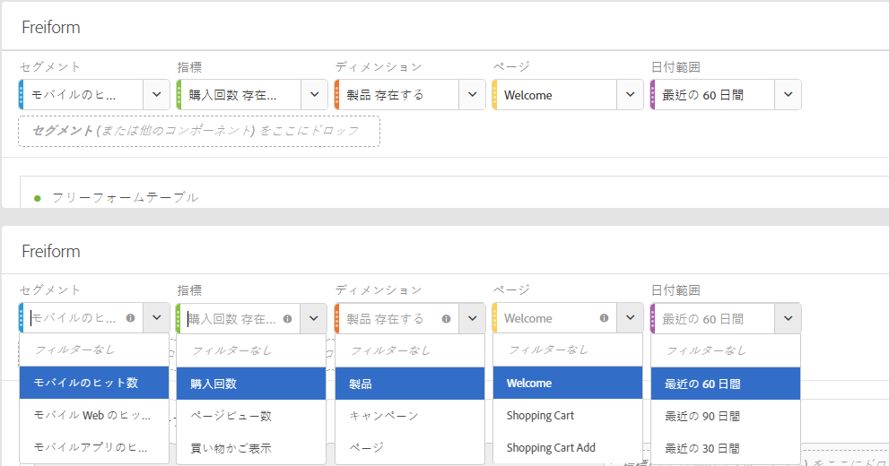
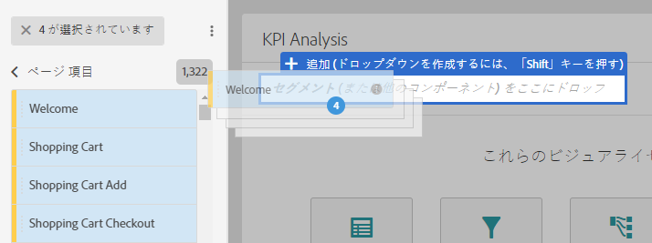
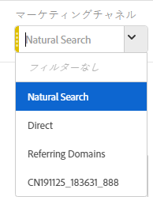

# パネルの概要

パネルは、テーブルとビジュアライゼーションのコレクションです。ワークスペースの左上にあるアイコンからパネルへアクセスできます。期間、ビジネス単位、地理などによってプロジェクトを組み立てたい場合、パネルが役立ちます。Analysis Workspace では、空のパネル、アトリビューション、フリーフォームパネル、セグメント比較の 4 種類のパネルが利用できます。

空のパネルとフリーフォームパネルは、分析を開始する場所で、他方 Attribution IQ とセグメント比較は、より高度な分析に役立ちます。「+」パネルボタンを追加したため、空のパネルをいつでも追加できます。

デフォルトの開始パネルはフリーフォームパネルですが、[空のパネル](../../../analyze/analysis-workspace/c-panels/blank-panel.md#concept_B0AD924A792F4166B13448AC253CE7E2)をデフォルトにすることも可能です。

## パネルのドロップダウンフィルター {#section_D2828EEDD52944528E87F470EAB581CF}

パネルのドロップゾーンには、ドロップダウンフィルター性能があります。これらのフィルターは、奥深い分析、プロジェクトの簡略化、他との見識の共有の全部またはいずれかができるよう、制御された方法でプロジェクトのデータとやりとりをさせてくれます。

簡略化したプロジェクトの一例を紹介します。国ごとのレポートを提供するために、プロジェクトまたはパネルのバージョンがいくつかあると想定します。これらのプロジェクトまたはパネルを単一のパネルに集約し、異なるデータセット間をフィルターする代わりに国のドロップダウンに追加できるようになりました。

次の点に注意してください。

* 複数のコンポーネント（またはディメンションアイテム）でドロップインでき、次にドロップダウンでそれらを切り替えてパネルのコンテンツをフィルタリングします。
* また、同じパネルに複数のドロップダウンリストを作成することもできます。
* タイトルをクリックしたり、変更したりすることでドロップダウンリストのタイトルをカスタマイズでき、またはその隣の ｘ をクリックすることで完全に削除することができます。
* 寸法、日付範囲、セグメント、指標といった任意のコンポーネントタイプを使ってドロップダウンフィルターを作成できます。ドロップダウンの日付範囲は、常にパネルの日付範囲を上書きすることに注意してください。
* 左側のレールからコンポーネントの色を維持しており、黄色はディメンションアイテムのドロップダウン用、緑は指標用、青はセグメント用、紫は日付範囲用です。
* ドロップゾーンは、セグメントとしてドラッグされるアイテムに対するヒットレベルセグメントを今までどおり作成します。これらについては、セグメントの隣の情報アイコン (I)、次に鉛筆の形をした編集アイコンをクリックし、セグメントビルダーで編集することでいつもどおり変更することができます。

**ドロップダウンフィルターの作成と使用方法**

1. Select any items from the left rail and, **while holding down the  key**, drop them into the panel drop zone.

   

   これにより、そのコンポーネントがセグメントではなくてドロップダウンリストになります。（キーを押さずにセグメントを追加することもできます）。

   

1. ドロップダウンからオプションの 1 つを選択して、下のパネルのデータを変更します。(You can also choose to not filter any of the panel data by selecting **[!UICONTROL No filter]**.)
1. たとえば、マーケティングチャンネルによってデータのスライスもしたい場合、「マーケティングチャンネル」と呼ばれる別のドロップダウンを追加することができます。

   

