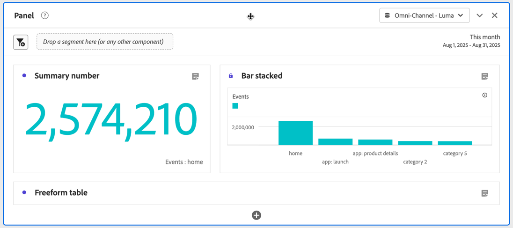
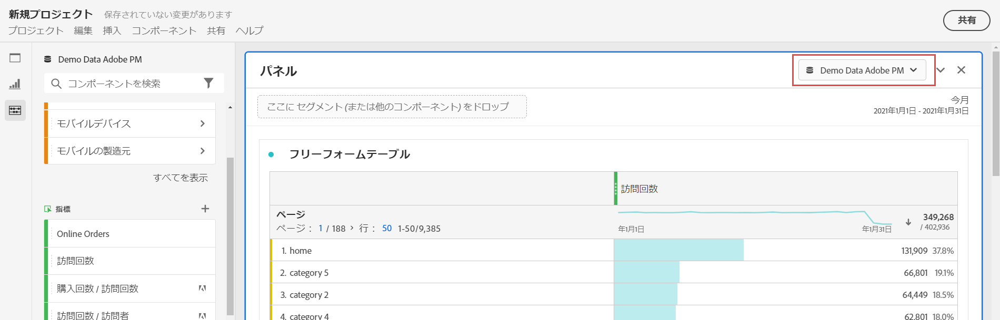
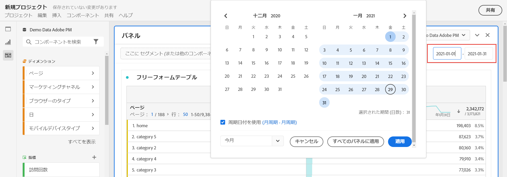
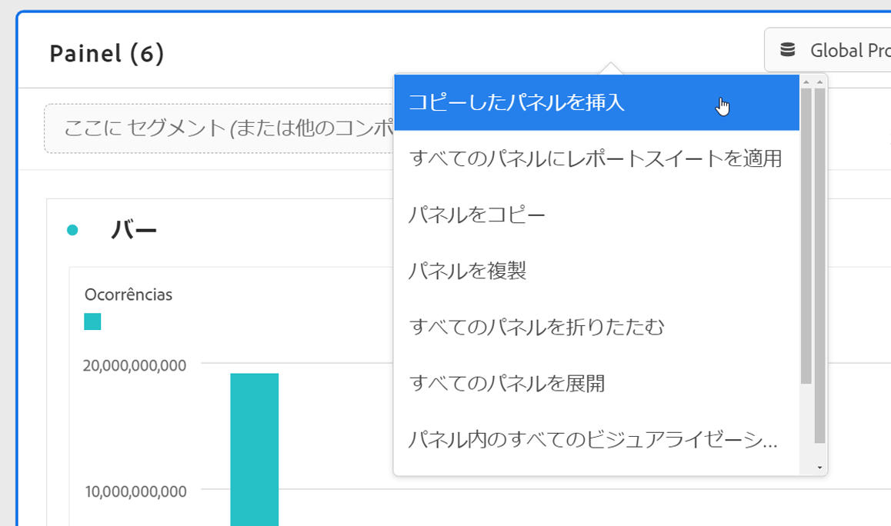

# パネルの概要

[!UICONTROL パネル]は、テーブルとビジュアライゼーションのコレクションです。パネルには、Workspace の左上のアイコンまたは[空のパネル](/help/analyze/analysis-workspace/c-panels/blank-panel.md)からアクセスできます。パネルは、期間、レポートスイートまたは分析のユースケースに従ってプロジェクトを整理する場合に役立ちます。

## パネルタイプ

[!UICONTROL Adobe Analytics] の Analysis Workspace では、次のパネルタイプを使用できます。

| パネル名 | 説明 |
| --- | --- |
| [空のパネル](/help/analyze/analysis-workspace/c-panels/blank-panel.md) | 使用可能なパネルおよびビジュアライゼーションから選択し、分析を開始します。 |
| [アトリビューション](attribution.md) | 任意のディメンションとコンバージョン指標を使用して、アトリビューションモデルをすばやく比較および視覚化します。 |
| [Analytics for Target](a4t-panel.md) | Analysis Workspace で Target アクティビティとエクスペリエンスを分析します。 |
| [フリーフォーム](freeform-panel.md) | 無制限の比較および分類を実行し、ビジュアライゼーションを追加して豊かなデータのストーリーを示します。 |
| [メディア分平均オーディエンス](average-minute-audience-panel.md) | 特定のコンテンツまたはカスタマイズされた期間での分平均オーディエンスを分析します。 |
| [メディア同時閲覧者数](media-concurrent-viewers.md) | 同時実行のピークの詳細と分類および比較機能を使用して、経時的に同時視聴者を分析します。 |
| [メディア再生滞在時間](/help/analyze/analysis-workspace/c-panels/media-playback-time-spent.md) | 再生に費やした時間を分析して、同時実行のピークが発生した場所やドロップオフが発生した場所を把握します。 |
| [次または前の項目](next-previous.md) | ユーザーが移動する次のページまたは前のページを表示します。 |
| [クイックインサイト](quickinsight.md) | フリーフォームテーブルとそれに伴うビジュアライゼーションを素早く作成し、インサイトを迅速に分析して取得します。 |
| [ページの概要](page-summary.md) | 特定のページに関する主要な統計を探索します。 |
| [セグメント比較](/help/analyze/analysis-workspace/c-panels/c-segment-comparison/segment-comparison.md) | すべてのデータポイントで 2 つのセグメントをすばやく比較し、関連性の高い差異を自動的に見つけます。 |

分析を開始するには、[!UICONTROL クイックインサイト]パネル、[!UICONTROL 空白]パネル、[!UICONTROL フリーフォーム]パネルが最適です。一方、[!UICONTROL アトリビューション]は、より高度な分析に適しています。キャンバスの下部に  が表示されるので、いつでも空白のパネルを追加できます。

デフォルトの開始パネルは[!UICONTROL フリーフォーム]パネルですが、[空白パネル](/help/analyze/analysis-workspace/c-panels/blank-panel.md)または[クイックインサイト](/help/analyze/analysis-workspace/c-panels/quickinsight.md)をデフォルトにすることができます。詳しくは、[プロジェクトと分析の環境設定](/help/analyze/analysis-workspace/user-preferences.md#projects--analyses-preferences)を参照してください。

## パネルの作成

パネルを作成するには：

* 左パネルから&#x200B;**[!UICONTROL パネル]**&#x200B;をキャンバスにドラッグ＆ドロップします。
* [空白のパネル](blank-panel.md)からパネルを選択します。
* Workspace の&#x200B;**[!UICONTROL 挿入]**&#x200B;メニューを使用してパネルを選択します。または、任意の[ショートカット](../build-workspace-project/fa-shortcut-keys.md)を使用してパネルを挿入することもできます。

  

次のことができます。

* 任意のパネル&#x200B;**内**&#x200B;の  を選択して、別のビジュアライゼーションを追加します。ビジュアライゼーションを選択できるポップアップが表示されます。

  

  | 選択... | ...を作成するには |
  |---|---|
  |  | [フリーフォームテーブル](/help/analyze/analysis-workspace/visualizations/freeform-table/freeform-table.md) |
  |  | [折れ線グラフ](/help/analyze/analysis-workspace/visualizations/line.md) |
  |  | [棒グラフ](/help/analyze/analysis-workspace/visualizations/bar.md) |
  |  | [数値の概要](/help/analyze/analysis-workspace/visualizations/summary-number-change.md) |
  |  | [テキスト](/help/analyze/analysis-workspace/visualizations/text.md) |
  |  | [フォールアウト](/help/analyze/analysis-workspace/visualizations/fallout/fallout-flow.md) |
  |  | [フロー](/help/analyze/analysis-workspace/visualizations/c-flow/flow.md) |
  |  | [積み重ね面グラフ](/help/analyze/analysis-workspace/visualizations/area.md) |
  |  | [コホートテーブル](/help/analyze/analysis-workspace/visualizations/cohort-table/t-cohort.md) |
  |  | [ブレット](/help/analyze/analysis-workspace/visualizations/bullet-graph.md) |
  |  | [ドーナツ](/help/analyze/analysis-workspace/visualizations/donut.md) |
  |  | [変更の概要](/help/analyze/analysis-workspace/visualizations/summary-number-change.md) |
  |  | [ヒストグラム](/help/analyze/analysis-workspace/visualizations/histogram.md) |
  |  | [散布図](/help/analyze/analysis-workspace/visualizations/scatterplot.md) |
  |  | [ベン図](/help/analyze/analysis-workspace/visualizations/venn.md) |
  |  | [ツリーマップ](/help/analyze/analysis-workspace/visualizations/treemap.md) |

* ワークスペースの最後のパネル&#x200B;**外**&#x200B;の  を選択し、別の[空白のパネル](blank-panel.md)を追加します。

## パネルの管理

パネルは、次の方法で管理できます。

* パネルを折りたたむには、 を選択します。
* 折りたたまれたパネルを表示するには、 を選択します。
* パネルを削除するには、を選択します。 取り消すには、**[!UICONTROL 編集]** > **[!UICONTROL 取り消し]** （**[!UICONTROL *cmd *+*z *]**|**[!UICONTROL * ctrl *+* z *]**）を選択します。
* パネルを移動するには、が表示されるたびにパネルをドラッグ&amp;ドロップします（通常はヘッダーにカーソルを合わせると）。

## レポートスイート

各パネルは、[レポートスイート](/help/admin/tools/manage-rs/report-suites-admin.md)に関連付けられており、パネルの右上にあるドロップダウンメニューの&#x200B;**[!UICONTROL *レポートスイート&#x200B;*]**&#x200B;ので識別されます。

新しいパネルを作成する場合、デフォルトのレポートスイートは、Analysis Workspace プロジェクトで最後に作業したパネルのレポートスイートに基づいています。

プロジェクト内では、分析のユースケースに応じて、1 つまたは[複数のレポートスイート](/help/analyze/analysis-workspace/build-workspace-project/multiple-report-suites.md)を使用できます。

レポートスイートのリストは、関連性に基づいてソートされます。Adobeでは、現在のユーザーがスイートを使用した回数と頻度に基づいて定義されます。 組織内でスイートが使用される頻度です。

>[!IMPORTANT]
>
>選択したレポートスイートによって、パネル内のビジュアライゼーションの作成に使用できるディメンション、指標、セグメントが決まります。
>
>
>パネルのレポートスイートを切り替えると、その新しいレポートスイートで一部のコンポーネントを使用できなくなる場合があります。この変更により、ビジュアライゼーションが正しくレンダリングされない可能性があります。次のような警告が表示される場合があります。
>
>* このパネルには、選択したレポートスイートで有効になっていないコンポーネントが含まれています。レポートスイートを変更するか、レポートスイートで必要なコンポーネントを有効にしてください。
>* ビジュアライゼーションをレンダリングできません。列と行で有効なコンポーネントが含まれていることを確認してください。
>

## カレンダー

パネルカレンダーは、パネル内のテーブルおよびビジュアライゼーションのレポート日付範囲を制御します。

>[!NOTE]
>
>日付範囲コンポーネントがビジュアライゼーションまたはパネル内で（例えばセグメントとして）使用されている場合、日付範囲コンポーネントがパネルカレンダーを上書きします。
>

1. 最初に開始日を選択し、次に終了日を選択して、日付範囲を選択します。
または、**[!UICONTROL プリセットを選択]**&#x200B;ドロップダウンメニューから「[!UICONTROL *プリセット*]」を選択できます。

1. オプションで、「**[!UICONTROL 詳細設定を表示]**」を選択して、次の操作を行います。

   * デフォルトの `12:00 AM`（`0:00`）と `11:59 PM`（`23:59`）以外の&#x200B;**[!UICONTROL 開始時間]**&#x200B;と&#x200B;**[!UICONTROL 終了時間]**&#x200B;を指定します。終了時間には常に 59 秒が含まれます。日付範囲が何日にもわたる場合、開始時間は日付範囲の最初の日、終了時間は日付範囲の最終日に適用されます。**[!UICONTROL 日時の値をリセット]**&#x200B;を使用して、開始時間と終了時間をデフォルトにリセットします。
   * **[!UICONTROL パネルカレンダーを基準とした日付範囲コンポーネントの作成]**&#x200B;無効にした場合、パネルで使用される日付範囲コンポーネントは現在の時間に関連します。 有効にすると、パネルで使用される日付範囲コンポーネントは、パネルカレンダーに関連します。
   * **[!UICONTROL 相対日付の使用]**&#x200B;有効にすると、**[!UICONTROL 過去7日間]**&#x200B;などの事前設定された日付範囲が、現在の日付と時刻の進行状況に合わせて動的に更新されます。 無効にすると、そのようなプリセットは適用されると更新されません。

     

     括弧内のテキストを選択して（例：**[!UICONTROL 固定開始 – ローリング日]**）、パネルを拡張し、**[!UICONTROL 開始]**&#x200B;および&#x200B;**[!UICONTROL 終了]**&#x200B;の詳細を指定できます。

      1. 「**[!UICONTROL 開始日]**」、「**[!UICONTROL 終了日]**」または「**[!UICONTROL 固定日]**」を選択します。
      1. 「**[!UICONTROL 開始日]**」または「**[!UICONTROL 終了日]**」を選択すると、完全な式を作成できます。例：**[!UICONTROL End of]** **[!UICONTROL current year]** **[!UICONTROL plus]** `1` **[!UICONTROL day]**。式の個々の部分に適した値を選択します。
         * 現在の値を選択します。例：**[!UICONTROL 現在の年]**。
         * 追加の計算の値を選択します。例：**[!UICONTROL plus]**。
         * 追加の計算を指定した場合は、値を指定します。例：`1`。
         * 追加の計算を指定した場合は、計算に使用する期間を選択します。例：**[!UICONTROL day]**。

     周期的な日付の計算の詳細を非表示にするには、「**[!UICONTROL 詳細を非表示]**」を選択します。

1. 「**[!UICONTROL 適用]**」を選択して、カレンダーを呼び出したパネルに日付範囲を適用します。
「**[!UICONTROL すべてのパネルに適用]**」を選択すると、Workspace プロジェクトのすべてのパネルに日付範囲が適用されます。

## ドロップゾーン {#dropzone}

「**[!UICONTROL _データをフィルタリングまたは分割するコンポーネントをドロップ_]**」というラベルの付いたパネルドロップゾーンを使用すると、パネルのデータをフィルタリングまたは分割できます。 データのフィルタリングや分類に使用するセグメントや分類は、パネル内のすべてのフリーフォームテーブルとビジュアライゼーションに適用されます。

セグメントと分類を利用して、管理された方法でデータを操作できます。 例えば、モバイルデバイスタイプのセグメントドロップダウンメニューを追加して、「タブレット」、「携帯電話」、「デスクトップ」を選択してパネルをフィルタリングできます。

また、多くのプロジェクトを1つに統合するために、セグメントを使用することもできます。 例えば、同じプロジェクトの異なるバージョンを持ち、それぞれの国セグメントが適用されている場合、すべてのバージョンを1つのプロジェクトに統合し、国セグメントドロップダウンメニューを追加できます。

下の図は、ドロップゾーンにコンポーネントを追加する際に生じる（クイック）セグメントまたは分類の様々なバリエーションを示しています。

### 追加または置換

セグメントまたは分類を追加または置換するには：

1. コンポーネントパネルから1つ以上のコンポーネントを選択します。 ⇧+または^+を使用して、複数のコンポーネントを選択します。
1. 選択範囲をドロップゾーンにドラッグし、**[!UICONTROL _コンポーネントをドロップしてデータをフィルタリングまたは分類_]** ❶するか、ドロップゾーンの近くに既に配置されている既存のコンポーネントの上に配置します。
1.  **[!UICONTROL 追加（「shift」を押してドロップダウンを作成）]**&#x200B;または **[!UICONTROL 置換（「shift」を押してドロップダウンに追加）]**&#x200B;が表示される場合、2つのオプションがあります。

   

   * 選択範囲をドロップして、次のコンポーネントを作成します。
      * [をドロップした任意のセグメントコンポーネントの](#segment) セグメント ❷。
      * [をドロップしたセグメント以外のコンポーネント（日付範囲、指標、ディメンション、ディメンション項目）の](#quick-segment) クイックセグメント ❸。
   * **を押しながら選択範囲**&#x200B;をドロップし（シフト）、次のコンポ⇧ネントを作成します。
      * 静的セグメント [&#x200B; ドロップダウンメニュー](#drop-down-menu)と、選択したセグメント ❹に対するフィルタリング対象のアイテム。
      * 静的セグメント [&#x200B; ドロップダウンメニュー](#drop-down-menu)と、選択した日付範囲❺でフィルタリングする項目。
      * 静的セグメント [&#x200B; ドロップダウンメニュー](#drop-down-menu)と、選択した指標に対してフィルターを適用する項目❻が含まれています。
      * 静的セグメント [&#x200B; ドロップダウンメニュー](#drop-down-menu)または分類[&#x200B; ドロップダウンメニュー](#drop-down-menu)で、選択したディメンション *個のアイテム*&#x200B;に対してフィルタリングまたは分類するアイテムが❼に含まれています。
      * 動的セグメント [&#x200B; ドロップダウンメニュー](#drop-down-menu)または分類[&#x200B; ドロップダウンメニュー](#drop-down-menu)で、選択したディメンションに対してフィルタリングまたは分類する項目が含まれています（❽）。

### セグメント

ドロップしたセグメントコンポーネントは、パネルのセグメント化に使用されます。 セグメントを使用して、パネルのデータとビジュアライゼーションに関するセグメント化されたインサイトを取得します。

### クイックセグメント

ドロップされた非セグメントコンポーネント（ディメンション、ディメンション項目、指標、日付範囲）は、パネルをセグメント化するための[&#x200B; クイックセグメント &#x200B;](#quick-segment)を定義します。 [&#x200B; セグメントビルダー](/help/components/segmentation/segmentation-workflow/seg-quick.md)を使用せずにクイックセグメントを作成するには、セグメント以外のコンポーネントを使用します。 この方法で作成されたセグメントは、イベントレベルのセグメントとして自動的に定義され、デフォルトで&#x200B;**[!UICONTROL クイックセグメント]**&#x200B;というラベルが付けられます。

または、を使用して、クイックセグメントを作成することもできます。

クイックセグメントを作成および管理する方法については、[&#x200B; クイックセグメント &#x200B;](/help/components/segmentation/segmentation-workflow/seg-quick.md)を参照してください。

### ドロップダウンメニュー

保持している間に作成されるドロップダウンメニューで⇧次の操作を実行できます。

* アイテムの[static](#static)または[dynamic](#dynamic) リストが含まれます。
* [&#x200B; パネルのフィルター](#filter)または[&#x200B; パネルの分割](#breakdown)を行います。

#### 静的

選択したディメンション *項目*、指標、セグメント、日付範囲の静的ドロップダウンメニューが作成されます。 静的ドロップダウンメニューの項目は、ドロップした選択したコンポーネントに基づいています。また、コンポーネントを追加または置換しても項目は変更されません。

#### 動的

動的ドロップダウンメニューは、ディメンションコンポーネントをドロップした場合にのみ作成されます。 動的なドロップダウンメニューは、ラベルの一部としてで示されます。

動的ドロップダウンメニューで使用できる項目は、次の項目に基づいています。

* パネルのドロップゾーン内の他のドロップダウンメニュー、セグメントおよびクイックセグメントで選択した項目から得られるデータ
* パネルのレポート範囲内で使用可能なデータ。

例えば、国ディメンションと都市ディメンションを使用して、2つの動的ドロップダウンメニューを追加できます。 **[!UICONTROL 国]** ドロップダウンメニューから国を選択すると、**[!UICONTROL 都市]** ドロップダウンメニューが動的に調整され、選択した国内の都市のみが表示されます。 追加の静的ドロップダウンメニューがある場合、これらのドロップダウンメニューで選択した項目は、動的ドロップダウンメニューで使用可能な項目にも影響します。 動的ドロップダウンメニューで選択された項目は、静的ドロップダウンメニューで使用できる項目には影響しません。

#### パネルのフィルター

**⇧を保持している間に**&#x200B;をドロップした指標、セグメントまたは日付範囲のコンポーネントの場合、セグメントドロップダウンメニューが作成されます。 このドロップダウンメニューでは、ドロップされたコンポーネントで使用可能な項目に基づいてパネルをフィルタリングできます。

*⇧を保持している間に*&#x200B;をドロップした&#x200B;**ディメンション** コンポーネントの場合、セグメントドロップダウンメニューが作成されます。 このドロップダウンメニューを使用すると、ドロップされたディメンション項目（[静的](#static) セグメントドロップダウンメニュー）またはディメンションコンポーネント（[動的](#dynamic) セグメントドロップダウンメニュー）に使用できる項目に基づいてパネルをフィルタリングできます。 セグメントを使用してパネルをフィルタリングするようにドロップダウンメニューを明示的に設定するには：

* を選択し、 **[!UICONTROL セグメント]** | **[!UICONTROL コンポーネント]**&#x200B;のコンテキストメニューからパネル ❾内のデータをフィルタリングします。

#### パネルの分割

*⇧を保持している間に*&#x200B;をドロップした&#x200B;**ディメンション** コンポーネントの場合、セグメントドロップダウンメニューが作成されます。 ドロップダウンメニューを設定して、ドロップされたディメンション項目（[静的](#static)分類ドロップダウンメニュー）またはディメンションコンポーネント（[動的](#dynamic)分類ドロップダウンメニュー）に使用できる項目に基づいてパネルを分類できます。 ドロップダウンメニューを明示的に設定して、分類を使用してパネルを分割するには、次の手順を実行します。

* を選択し、 **[!UICONTROL 分類]** | **[!UICONTROL コンポーネント]**&#x200B;のコンテキストメニューからパネル ❾のデータを分類します。

>[!IMPORTANT]
>
>分類は、ディメンションとディメンション項目にのみ使用でき、セグメント、日付範囲、指標には使用できません。
>

#### セグメントと内訳

次のシナリオでは、（セグメントを使用して）パネルをフィルタリングする代わりに、パネルを分割することを検討してください。

* パネル内でアトリビューション対応の指標を使用している場合、セグメントはアトリビューション対応の指標をクリアすることがよくあります。 分類は、パネルのデータを取得するために実行されるクエリ内の別のポイントに適用されます。 その結果、分類はこれらの属性対応指標を明確にしません。

  例として、**[!UICONTROL Luma：製品カテゴリ]** **[!UICONTROL フィルター]**  セグメントを使用する場合の&#x200B;**[!UICONTROL オンライン収益]**&#x200B;指標に基づく属性と、**[!UICONTROL Luma：製品カテゴリ]**  **[!UICONTROL 女性]**&#x200B;分類の違いを参照してください。

  

* 分類ドロップダウンメニュー内でサブイベントレベルのディメンションを使用している場合、分類はそのサブイベントレベルで実行されます。 セグメントドロップダウンメニュー内のセグメントは、イベントレベルで実行されます。

  例として、**[!UICONTROL Luma：製品サブカテゴリ]** **[!UICONTROL フィルター]**  セグメントを使用する場合の&#x200B;**[!UICONTROL オンライン収益]**&#x200B;指標と、**[!UICONTROL Luma：製品サブカテゴリ]**  **[!UICONTROL Tops]**&#x200B;内訳の違いを参照してください。 分類は、サブイベントレベルでクエリを明示的に実行し、セグメントはイベントレベルでクエリを実行します。

  

### 管理

ドロップゾーンのコンポーネントは、次のように管理できます。

| パネルドロップゾーンで何をすべきか… | 方法… |
|---|---|
| セグメントまたはクイックセグメントを削除するには、次の手順を実行します。 | コンポーネント内のを選択します。 |
| ドロップダウンメニューから選択した項目を削除するには、次の手順を実行します。 | 項目内のを選択します。 |
| 選択したすべての項目をドロップダウンメニューから削除するには、次の手順を実行します。 | ドロップダウンメニューで「」を選択します。 |
| 任意のコンポーネントのラベルを編集します。 | コンポーネントのラベルにカーソルを合わせ、を選択します。 |
| 任意のコンポーネントのラベルを削除します。 | コンポーネントのラベルにカーソルを合わせ、コンポーネントのコンテキストメニューから「**[!UICONTROL ラベルを削除]**」を選択します。 |
| ドロップゾーンからコンポーネントを削除するには、次の手順を実行します。 | コンポーネントのコンテキストメニューから&#x200B;**[!UICONTROL ドロップダウンを削除]**&#x200B;を選択します。 |
| 必要な情報を確認することができます。 | コンポーネント内にマウスポインターを置き、を選択して、コンポーネントに関する情報を含むデータ要素を開きます。 |
| ドロップダウンメニューを定義するコンポーネントに関する情報を取得します。 | ドロップダウンメニュー内にマウスポインターを置き、を選択して、コンポーネントに関する情報を含むデータディクショナリを開きます。 |
| クイックセグメントを編集するには、次の手順に従います。 | クイックセグメント内にマウスポインターを置き、を選択します。 詳しくは、[&#x200B; クイックセグメント &#x200B;](/help/components/segmentation/segmentation-workflow/seg-quick.md)を参照してください。 |
| ドロップダウンメニューの選択を要求するには | コンポーネントのコンテキストメニューから「**[!UICONTROL 選択を要求]**」を選択します。 |
| ドロップダウンメニューにフィルターを許可しない。 | コンポーネントのコンテキストメニューから「**[!UICONTROL フィルターを許可しない]**」を選択します。 |
| すべてのコンポーネントをリセットし、ドロップダウンメニューのすべての選択項目をクリアします。 | 「**[!UICONTROL すべてをリセット]**」を選択します。 |

>[!BEGINSHADEBOX]

デモ動画については、 [Analysis Workspaceでのフィルターの使用](https://experienceleague.adobe.com/en/docs/analytics-learn/tutorials/analysis-workspace/using-panels/using-drop-down-filters){target="_blank"}を参照してください。

>[!ENDSHADEBOX]

>[!BEGINSHADEBOX]

デモ動画については、 [動的ドロップダウンメニュー](https://experienceleague.adobe.com/en/docs/customer-journey-analytics-learn/tutorials/analysis-workspace/tips-and-tricks/dynamic-drop-downs){target="_blank"}を参照してください。

{{videocja}}

>[!ENDSHADEBOX]

## コンテキストメニュー

パネルの追加機能は、パネルのヘッダーのコンテキストメニュー（右クリック）から使用できます。

次のオプションがあります。

| オプション | 説明 |
| --- | --- |
| **[!UICONTROL コピーしたパネルを挿入]** | コピーしたパネルをプロジェクト内の別の場所または別のプロジェクトにペーストできます。 |
| **[!UICONTROL コピーしたビジュアライゼーションを挿入]** | コピーしたビジュアライゼーションをプロジェクト内の別の場所または別のプロジェクトにペーストできます。 |
| **[!UICONTROL レポートスイートをすべてのパネルに適用]** | このパネルのレポートスイートを、プロジェクト内の他のすべてのパネルに適用します。 |
| **[!UICONTROL パネルをコピー]** | パネルをコピーして、プロジェクト内の別の場所または別のプロジェクトに挿入できます。 |
| **[!UICONTROL パネルを複製]** | 現在のパネルの完全な複製を作成して、修正できます。 |
| **[!UICONTROL すべてのパネルを折りたたむ]** | すべてのプロジェクトパネルを折りたたみます。 |
| **[!UICONTROL すべてのパネルを展開]** | すべてのプロジェクトパネルを展開します。 |
| **[!UICONTROL パネル内のすべてのビジュアライゼーションを折りたたむ]** | 現在のパネルのすべてのビジュアライゼーションを折りたたみます。 |
| **[!UICONTROL パネル内のすべてのビジュアライゼーションを展開]** | 現在のパネル内のすべてのビジュアライゼーションを展開します。 |
| **[!UICONTROL 説明を編集]** | パネルの説明テキストを追加（または編集）します。 |
| **[!UICONTROL パネルリンクを取得]** | プロジェクト内の特定のパネルに他のユーザーを誘導します。受信者は、リンクを選択した後、リンク先の正確なパネルにリダイレクトされる前にログインする必要があります。 |

## 設定

一部のパネル（[!UICONTROL アトリビューション]、[!UICONTROL 実験]、[!UICONTROL メディア分平均オーディエンス]など）には、ビジュアライゼーションの構築を支援する設定ダイアログがあります。パネルの上部にある「」を使用して、設定にアクセスして変更します。

