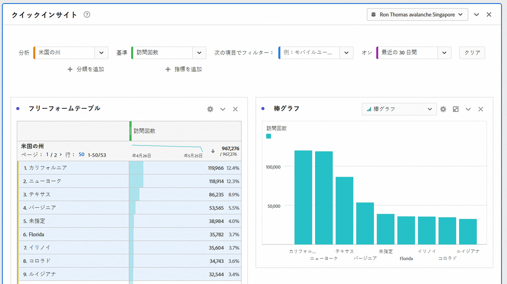
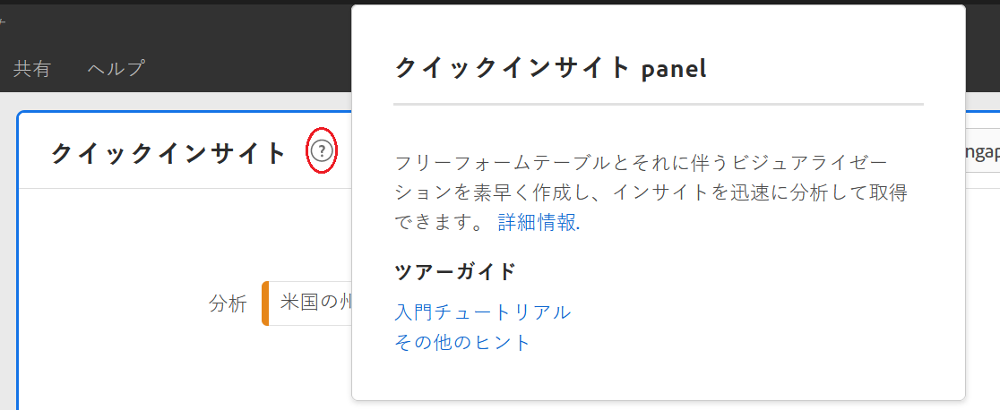
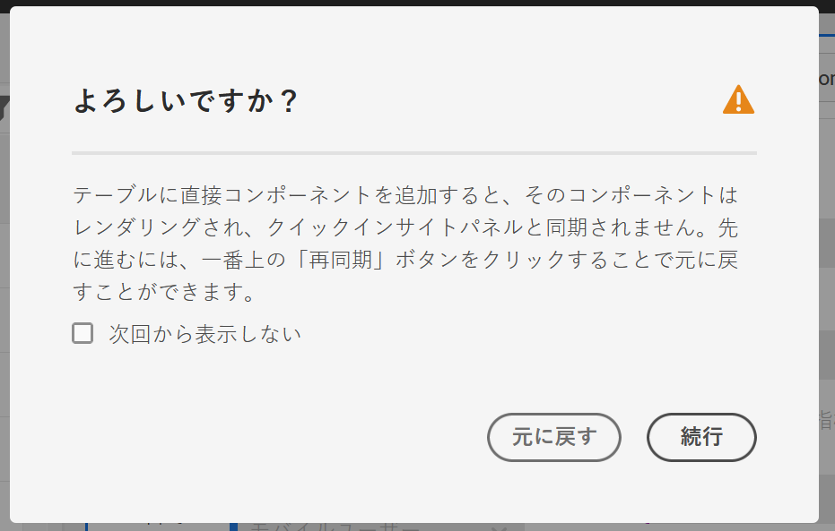
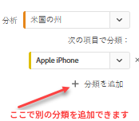
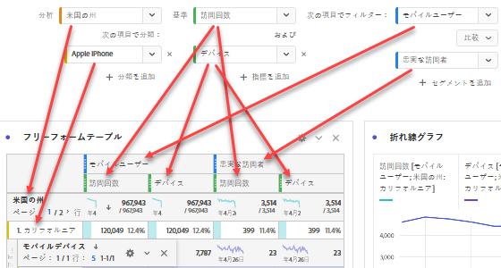

# クイックインサイトビルダー

>[!IMPORTANT]
>
>**[!UICONTROL Quick Insights]** は現在ベータテスト中で、Adobe Analyticsのすべてのお客様はまだご利用いただけません。

[!UICONTROL Quick Insights] ビジネスの質問に迅速かつ容易に答える方法を学ぶための、アナリストでな [!UICONTROL Analysis Workspace] いユーザーおよび新しいユーザー向けのガイダンスを提供します。 また、テーブルを自分で作成しなくても簡単な質問にすばやく答えたいと考える上級ユーザーにとっても優れたツールです。

これを初めて開始する [!UICONTROL Analysis Workspace]とき、最も役に立つビジュアライゼーションは何か、どのディメンションや指標がインサイトを促進するか、項目のドラッグ&amp;ドロップ先、セグメントの作成先などを考えることができます。

これに役立つため、およびの会社のデータコンポーネントの使用状況に基づいて、会社が使用する最も人気のあるディメンション、指標、セグメントおよび日付範囲を示すアルゴリズムを利用します。 [!UICONTROL Analysis Workspace][!UICONTROL Quick Insights]

[!UICONTROL Quick Insights] ヘルプ

* データテーブルと付属のビジュアライゼーションをに適切に構築しま [!UICONTROL Analysis Workspace]す。
* 基本的なコンポーネントや要素の用語と語彙を学びま [!UICONTROL Analysis Workspace]す。
* ディメンションの簡単な分類、複数の指標の追加、またはセグメントの比較を1つの内で簡単に行いま [!UICONTROL Freeform table]す。
* 様々なビジュアライゼーションタイプを変更または試し、すばやく直感的に分析の検索ツールを見つけます。

## 基本的なキー用語

以下に、よく理解する必要のある基本的な用語を示します。 各データテーブルは、データストーリーを伝えるために使用する2つ以上の構築ブロック（コンポーネント）で構成されます。

| 構築ブロック（コンポーネント） | 定義 |
|---|---|
| [!UICONTROL Dimension] | ディメンションは、プロジェクトで表示、分類および比較できる指標データの説明または特性です。 ディメンション項目に分類される数値以外の値および日付です。 例えば、「browser」や「page」はディメンションです。 |
| [!UICONTROL Dimension item] | ディメンション項目は、ディメンションの個々の値です。 例えば、ブラウザーディメンションのディメンション項目は、「Chrome」、「Firefox」、「Edge」などです。 |
| [!UICONTROL Metric] | 指標は、表示、クリックスルー、リロード、平均滞在時間、数量、注文件数、売上高など、訪問者のアクティビティに関する量的な情報です。 |
| [!UICONTROL Visualization] | Workspaceオファーに [は](/help/analyze/analysis-workspace/visualizations/t-sync-visualization.md) 、棒グラフ、ドーナツグラフ、ヒストグラム、折れ線グラフ、マップ、散布グラフなど、データを視覚的に表現するための様々なビジュアライゼーションが含まれています。 |
| [!UICONTROL Breakdown] | 内訳は、ディメンションを他のディメンションで逐語的に分類する方法です。 この例では、米国の州をモバイルデバイス別に分類して、モバイルデバイスの訪問回数を都道府県別、モバイルデバイスのタイプ別、地域別、内部キャンペーン別などに取得できます。 |
| [!UICONTROL Segment] | セグメントを使用すると、特性やWebサイトのインタラクションに基づいて訪問者のサブセットを識別できます。 例えば、次の属性に基づいてセグメ [!UICONTROL Visitor] ントを作成できます。ブラウザーのタイプ、デバイス、訪問数、国、性別、またはインタラクションに基づく：キャンペーン、キーワード検索、検索エンジン、または出口と入口に基づく検索エンジン：Facebookの訪問者、定義済みのランディングページ、参照ドメインまたはカスタム変数に基づくドメイン：フォームフィールド、定義済みカテゴリ、顧客ID。 |

## クイックインサイトの概要

1. 指定した資格情報を使用してAdobe Analyticsにログインします。
1. に移動し、を [!UICONTROL Workspace] クリックし **[!UICONTROL Create New Project]** て、をクリックしま **[!UICONTROL Quick Insights Builder]**&#x200B;す。

   

1. 初めて開始を行うときは、基本のいくつかを学ぶ短いチュートリアルに従ってく [!UICONTROL Quick Insights Builder] ださい。 または、をクリックして **[!UICONTROL Skip Tutorial]**。
1. 構築ブロック（コンポーネントとも呼ばれる）を選択します。ディメンション（オレンジ色）、指標（緑色）、セグメント（青色）または日付範囲（紫色）。自動的に作成されるテーブルに対して、少なくとも1つのディメンションと1つの指標を選択する必要があります。

   

   構成要素を選択する方法は3つあります。
   * 左のレールからドラッグ&amp;ドロップします。
   * 探しているものがわかっている場合：開始が名前を入力す [!UICONTROL Quick Insights Builder] ると、空白が入力されます。
   * ドロップダウンをクリックし、リストを検索

1. 少なくとも1つのディメンションと1つの指標を追加すると、次が作成されます。

   * ディメンション（ここでは米国の州）が垂直で、指標（ここでは訪問回数）が上に水平に表示されたフリーフォームテーブル。 次の表を見て下さい。
   

   * 付属のビジュアライゼーション(この場合は棒グ [ラフ](/help/analyze/analysis-workspace/visualizations/bar.md))。 生成されるビジュアライゼーションは、テーブルに追加したデータのタイプに基づいています。 ビジュアライゼーションのタイプを変更するには、の横にあるドロップダウン矢印をクリックしま **[!UICONTROL Bar]**&#x200B;す。

1. （オプション）ディメンションをドリルダウンし、ディメンションの横にある>右矢印をクリックして、ディメンション項目を表示します。

1. 「その他の役に立つオプション」の説明に従って、さらに絞り込みを追加してみてください。

## その他の役に立つオプション

他の便利なヒントがに表示されます。最後のアク [!UICONTROL Quick Insights Builder]ションに応じてヒントの一部が表示されます。

* **ドラッグ&amp;ドロップを試す**:例えば、ドロップダウンを使用して文書パーツを選択した場合、次のように表示されます。

   

* **ビジュアライゼーションの変更**:本当に輝くデータが見つかるまで、様々な視覚的表現を試してみることを推奨します。 折れ線グラフの例を次に示します。

   

* **分類基準**:ディメンションで最大3レベルの分類を使用して、本当に必要なデータを掘り下げることができます。

   

* **その他追加の指標**:AND演算子を使用してテーブルに追加することで、指標をさらに2つまで追加できます。

   

* **その他の追加セグメント**:ANDまたはOR演算子を使用して、テーブルに追加できるセグメントは、さらに2つまで追加できます。 モバイルユーザーまたは常連ユーザーを追加した場合の表への影響を確認します。訪問者 指標の上で、お互いに隣り合っています。 モバイル訪問者と常連ユーザーを追加すると、両方のセグメントの結果が一緒に表示され、表内で各セグメントの上に積み重ねられます。

   

## 既知の制限

テーブル内で直接編集しようとすると、 [!UICONTROL Quick Insights Builder] （空欄埋めツール）が同期しなくなります。 クイックインサイトを前のクイックインサイト設定に戻すには、に移動します。また、クイックインサイ **[!UICONTROL Help > Tutorials]**&#x200B;トパネルの右上にあるをクリックし **[!UICONTROL Resync Builder]** て、テーブルをクリアすることもできます。

そうしないと、テーブルを直接作成すると、新しいユーザーに役立つ機能を使用せずに、従来のフリーフォームテーブルとして動作するようになります。

