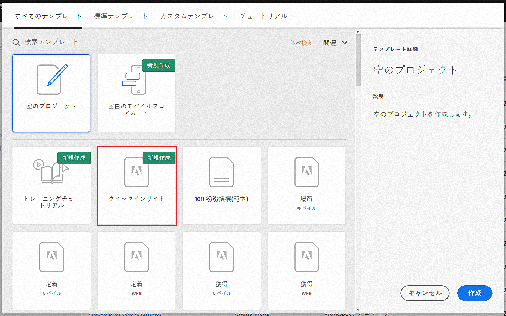
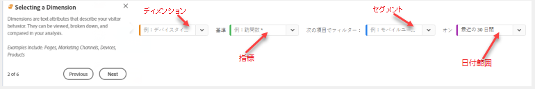

# クイックインサイトビルダー

>[!IMPORTANT]
>
>現在、Quick Insightsはベータテスト中で、Adobe Analyticsのすべてのお客様はまだ一般にご利用いただけません。

クイックインサイトは、分析ワークスペースのアナリストでないユーザーや新しいユーザー向けのガイダンスを提供し、ビジネスの質問にすばやく簡単に答える方法を学びます。 また、テーブルを自分で作成しなくても簡単な質問にすばやく答えたいと考える上級ユーザーにとっても優れたツールです。

この分析ワークスペースを初めて開始したとき、最も役に立つビジュアライゼーションは何か、どのディメンションと指標がインサイトを促進するか、項目をドラッグ&amp;ドロップする場所、セグメントの作成場所などを考えることができます。

Quick Insightsは、会社が分析ワークスペースで使用するデータコンポーネントを基に、会社が使用する最も人気の高いディメンション、指標、セグメントおよび日付範囲を示すアルゴリズムを利用して、これを支援します。

クイックインサイトは

* データテーブルと付属のビジュアライゼーションを適切に作成し、分析ワークスペースで表示します。
* 基本的なコンポーネントとワークスペースの用語と語彙について分析します。
* フリーフォームテーブル内で、ディメンションの単純な分類、複数の指標の追加、セグメントの比較を簡単に行えます。
* 様々なビジュアライゼーションタイプを変更または試し、すばやく直感的に分析の検索ツールを見つけます。

## 基本的なキー用語

以下に、よく理解する必要のある基本的な用語を示します。 各データテーブルは、データストーリーの伝え方に使用する2つ以上の構成要素で構成されます。

| 文書パーツ | 定義 |
|---|---|
| ディメンション | ディメンションは、プロジェクトで表示、分類および比較できる指標データの説明または特性です。 ディメンション項目に分類される数値以外の値および日付です。 例えば、「browser」や「page」はディメンションです。 |
| 分析コード項目 | ディメンション項目は、ディメンションの個々の値です。 例えば、ブラウザーディメンションのディメンション項目は、「Chrome」、「Firefox」、「Edge」などです。 |
| 指標 | 指標は、表示、クリックスルー、リロード、平均滞在時間、数量、注文件数、売上高など、訪問者のアクティビティに関する量的な情報です。 |
| 視覚化 | Workspaceオファー [には、データを視覚的に表現する](/help/analyze/analysis-workspace/visualizations/t-sync-visualization.md) ための多くのビジュアライゼーションが含まれています。 |
| セグメント | セグメントを使用すると、特性やWebサイトのインタラクションに基づいて訪問者のサブセットを識別できます。 例えば、次の属性に基づいて訪問者セグメントを作成できます。ブラウザーのタイプ、デバイス、訪問数、国、性別、またはインタラクションに基づく：キャンペーン、キーワード検索、検索エンジン、または出口と入口に基づく検索エンジン：Facebookの訪問者、定義済みのランディングページ、参照ドメインまたはカスタム変数に基づくドメイン：フォームフィールド、定義済みカテゴリ、顧客ID。 |

## クイックインサイトの概要

1. 指定した資格情報を使用してAdobe Analyticsにログインします。
1. に移動し、を [!UICONTROL Workspace] クリックし **[!UICONTROL Create New Project]** て、をクリックしま **[!UICONTROL Quick Insights Builder]**&#x200B;す。

   

1. 最初に開始したら、Quick Insight Builderの基本について教える短いチュートリアルに従って作業を進めます。 または、をクリックして **[!UICONTROL Skip Tutorial]**。
1. 構築ブロック（コンポーネントとも呼ばれる）を選択します。ディメンション（オレンジ色）、指標（緑色）、セグメント（青色）または日付範囲（紫色）。自動的に作成されるテーブルに対して、少なくとも1つのディメンションと1つの指標を選択する必要があります。

   

   構成要素を選択する方法は3つあります。
   * 左のレールからドラッグ&amp;ドロップします
   * 探しているものがわかっている場合：開始が名前を入力すると、空欄が埋められます
   * ドロップダウンをクリックし、リスト

1. 少なくとも1つのディメンションと1つの指標を追加すると、次が作成されます。

   * 左（垂直）にディメンション、上（水平）に指標を持つフリーフォームテーブル。 次の表を見て下さい。

1. （オプション）ディメンションをドリルダウンし、ディメンションの横にある>右矢印をクリックして、ディメンション項目を表示します。

## 既知の制限

表内で直接編集しようとすると、空欄の埋め込みツールであるQuick Insight Builderの同期がとれなくなります。 以前のQuick Insightの設定に戻すことができますが、直接作成すると、従来のフリーフォームテーブルとして動作するようになります。

