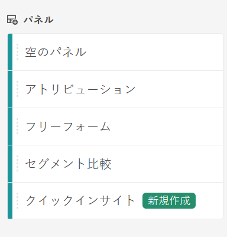
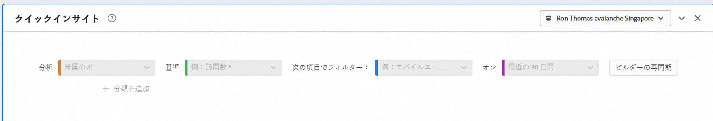

# クイックインサイトビルダー

>[!IMPORTANT]
>
>**[!UICONTROL クイックインサイト]** は現在制限付きのテスト中です。 [詳細情報...](https://docs.adobe.com/content/help/en/analytics/landing/an-releases.html)

[!UICONTROL クイックインサイト] (Quick Insights [!UICONTROL )では、] 分析ワークスペースのアナリストでないユーザーおよび新しいユーザーに対して、ビジネスの質問にすばやく簡単に答える方法を学ぶためのガイダンスを提供します。 また、テーブルを自分で作ることなく、簡単な質問にすばやく答えたいと考える上級ユーザーにとっても優れたツールです。

この 分析ワークスペースを最初に開始したとき、最も役立つビジュアライゼーションは何か、どのディメンションと指標がインサイトを促進するか、項目をドラッグ&amp;ドロップする場所、セグメントを作成する場所などに疑問を持つかもしれません。

これを支援するため、また、 [!UICONTROL 分析ワークスペースでの会社のデータコンポーネントの使用状況に基づいて、]Quick Insights  は、会社が使用する最も人気のあるディメンション、指標、セグメントおよび日付範囲を示すアルゴリズムを利用します。

[!UICONTROL クイックインサイト] :

* データテーブルとそれに付随するビジュアライゼーションを [!UICONTROL 分析ワークスペースに適切に構築]。
* 基本的なコンポーネントと [!UICONTROL 分析ワークスペースの用語と用語について説明します]。
* ディメンションの単純な分類、複数の指標の追加、フリー [!UICONTROL フォームテーブル内でのセグメントの比較を簡単に行う]。
* 様々なビジュアライゼーションタイプを変更または試して、分析の検索ツールをすばやく直感的に見つけます。

## 基本的なキー用語

以下に、理解する必要がある基本用語の一部を示します。 各データテーブルは、データストーリーの伝えに使用する2つ以上の構築ブロック（コンポーネント）で構成されます。

| 構築ブロック（コンポーネント） | 定義 |
|---|---|
| [!UICONTROL ディメンション] | ディメンションは、プロジェクト内で表示、分類および比較できる指標データの説明または特性です。 ディメンション項目に分類される非数値および日付です。 例えば、「ブラウザー」や「ページ」はディメンションです。 |
| [!UICONTROL 分析コード項目] | ディメンション項目は、ディメンションの個々の値です。 例えば、ブラウザーディメンションのディメンション項目は、「Chrome」、「Firefox」、「Edge」などです。 |
| [!UICONTROL 指標] | 指標は、ビュー数、クリックスルー数、リロード数、平均滞在時間、数量、注文件数、売上高など、訪問者の行動に関する量的な情報です。 |
| [!UICONTROL ビジュアライゼーション] | Workspaceオファー [には、棒グラフ、ドーナツグラフ、ヒストグラム](/help/analyze/analysis-workspace/visualizations/freeform-analysis-visualizations.md) 、折れ線グラフ、マップ、散布図など、データを視覚的に表現する様々なビジュアライゼーションがあります。 |
| [!UICONTROL ディメンションの分類] | ディメンション分類は、ディメンションを他のディメンションで逐語的に分類する方法です。 この例では、米国の州をモバイルデバイスで分類してモバイルデバイスの訪問回数を都道府県別に取得したり、モバイルデバイスの種類別、地域別、内部キャンペーン別に分類したりできます。 |
| [!UICONTROL セグメント] | セグメントを使用すると、特性やWebサイトでのインタラクションに基づいて訪問者のサブセットを識別できます。 例えば、次の属性に基づいて [!UICONTROL 訪問者] ・セグメントを作成できます。 ブラウザーのタイプ、デバイス、訪問回数、国、性別、またはインタラクションに基づく： キャンペーン、キーワード検索、検索エンジン、または出口と入口に基づく検索： Facebookの訪問者、定義済みのランディングページ、参照ドメインまたはカスタム変数に基づくドメイン。 フォームフィールド、定義されたカテゴリ、顧客ID。 |

## クイックインサイトの概要

1. 提供された資格情報を使用してAdobe Analyticsにログインします。
1. 「 [!UICONTROL ワークスペース] 」に移動し、「新しいプロジェクトを **[!UICONTROL 作成」をクリックし、「]** クイックインサイト ****」をクリックします。 (このパネルは、左側のレールの **[!UICONTROL パネル]** メニューからもアクセスできます)。

   

   

1. 最初に開始を出すときは、 [!UICONTROL クイックインサイトパネルの基本について説明する短いチュートリアルに従ってください] 。 または、をクリックしてチュートリアルを **[!UICONTROL スキップ]**。
1. 構築ブロック（コンポーネントとも呼ばれる）を選択します。 ディメンション（オレンジ色）、指標（緑色）、セグメント（青色）または日付範囲（紫色）。自動的に作成されるテーブルに対して、少なくとも1つのディメンションと1つの指標を選択する必要があります。

   

   構築ブロックを選択する方法は3つあります。
   * 左側のレールからドラッグ&amp;ドロップします。
   * 検索対象がわかっている場合： 開始の入力と [!UICONTROL クイックインサイト] （英語のみ）に空白が入力されます。
   * ドロップダウンをクリックし、リストを検索します。

1. 少なくとも1つのディメンションと1つの指標を追加すると、次の情報が作成されます。

   * ディメンション（ここでは米国の州）が垂直方向に、指標（ここでは訪問回数）が上部に水平方向に表示されたフリーフォームテーブル。 次の表を見て下さい。
   

   * 付属のビジュアライゼーション(この場合は [棒グラフ](/help/analyze/analysis-workspace/visualizations/bar.md))。 生成されるビジュアライゼーションは、テーブルに追加したデータのタイプに基づいています。 時間ベースのデータ(日別/月別 [!UICONTROL 訪問回数など] )は、デフォルトで  折れ線グラフになります。 時間ベースでないデータ( [!UICONTROL 訪問回数] / [!UICONTROL デバイス])は、デフォルトで  棒グラフになります。 ビジュアライゼーションのタイプを変更するには、ビジュアライゼーションのタイプの横にあるドロップダウン矢印をクリックします。

1. （オプション）ディメンションをドリルダウンし、ディメンションの横にある>右矢印をクリックして、ディメンション項目を表示します。

1. 後述の「その他のヒント」の説明に従って、さらに絞り込みを追加してみてください。

1. プロジェクト/保存をクリックして、 **[!UICONTROL プロジェクトを保存します]**。

## その他のヒント

他の便利なヒントは、 [!UICONTROL クイックインサイトビルダーに表示されます]。ヒントの中には、最後の操作に応じて表示されるものもあります。

* 最初に、 **[!UICONTROL その他のヒントのチュートリアルを完了します]** 。 ヘルプ(?)からアクセスする アイコンをク [!UICONTROL イックインサイト] タイトルの横に表示します。 このチュートリアルでは、少なくとも1つのディメンションと1つの指標を持つプロジェクトを作成してから24時間後に説明します。

   

* **分類基準**: ディメンションで最大3レベルの分類を使用して、本当に必要なデータに掘り下げることができます。

   

* **その他の追加指標**: AND演算子を使用してテーブルに追加することで、さらに2つまでの指標を追加できます。

   

* **その他の追加セグメント**: ANDまたはOR演算子を使用してテーブルに追加することで、最大2つのセグメントを追加できます。 モバイル訪問者または常連ユーザーを追加した場合の表の動作を確認します。 指標の上で、お互いに隣り合っています。 モバイル訪問者と常連ユーザーを追加すると、両方のセグメントの結果が一緒に表示され、表内で各セグメントが重ねて表示されます。

   

## 既知の制限

テーブル内で直接編集しようとすると、 [!UICONTROL クイックインサイト] パネル（空白の埋め込みツール）が同期しなくなります。 パネルの右上にある「 [!UICONTROL クイックインサイト]**** 」をクリックして、以前の設定に戻すことができます。

何かを直接テーブルに追加する前に、次の警告が表示されます。

そうしないと、直接作成したテーブルは、従来のフリーフォームテーブルとして動作し、新しいユーザーには役立つ機能が不要になります。

