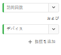

# クイックインサイトパネル {#quick-insights-panel}

<!-- markdownlint-disable MD034 -->

>[!CONTEXTUALHELP]
>id="workspace_quickinsights_button"
>title="クイックインサイト"
>abstract="パネルを作成してフリーフォームテーブルとそれに伴うビジュアライゼーションを素早く作成し、インサイトをより迅速に分析して明らかにします。"

<!-- markdownlint-enable MD034 -->

>[!BEGINSHADEBOX]

_この記事では、_  _&#x200B;**Adobe Analytics** のクイックインサイトパネルについて説明します。_ _この記事の [CustomerJourneyAnalytics](/help/analyze/analysis-workspace/c-panels/quickinsight.md)_  版については、_&#x200B;**クイックインサイトパネル** を参照してください。_

>[!ENDSHADEBOX]

[!UICONTROL クイックインサイト]は、アナリスト以外のユーザーおよび [!UICONTROL Analysis Workspace] の新規ユーザーに対して、ビジネスの質問にすばやく簡単に答える方法を学ぶためのガイダンスを提供します。また、テーブルを自分で作ることなく、簡単な質問にすばやく答えたいと考える上級ユーザーにとっても優れたツールです。

この [!UICONTROL Analysis Workspace] を初めて使用するときは、次のような疑問が生じるかもしれません。

* 最も役立つビジュアライゼーションは何か。
* インサイトを促進できるディメンションと指標は何か。
* アイテムをドラッグ＆ドロップする場所はどこか。
* どこにフィルターを作成するか。
* その他の機能

これらの質問に役立つように、[!UICONTROL &#x200B; クイックインサイト &#x200B;] では、会社が最もよく使用するディメンション、指標、セグメントおよび日付範囲を表示するアルゴリズムを活用します。 このアルゴリズムは、[!UICONTROL Analysis Workspace] での会社のデータコンポーネント使用状況に基づいています。実際、以下に示すように、ドロップダウンリストには、「[!UICONTROL 人気]」とタグ付けされたディメンション、指標およびセグメントが表示されます。

[!UICONTROL クイックインサイト]：

* データテーブルと付属のビジュアライゼーションを [!UICONTROL Analysis Workspace] で適切に構築できます。
* [!UICONTROL Analysis Workspace] の基本的なコンポーネントやパーツに関する用語と語彙を学びます。
* ディメンションのシンプルな分類、複数の指標の追加、[!UICONTROL フリーフォームテーブル]内でのセグメントの比較を簡単に行います。
* 様々なビジュアライゼーションタイプを変更または試して、分析の検索ツールをすばやく直感的に見つけます。

## 基本的な主要用語

次に、理解する必要がある基本用語の一部を示します。各データテーブルは、データストーリーを伝えるのに使用する 2 つ以上の構築ブロック（コンポーネント）で構成されています。

| 構築要素（コンポーネント） | 定義 |
|---|---|
| **[!UICONTROL ディメンション]** | ディメンションは、プロジェクトで表示、分類、比較できる指標データの説明または特性です。ディメンションは、ディメンション項目に分類される数以外の値および日付です。例えば、*ブラウザー*&#x200B;や&#x200B;*ページ*&#x200B;はディメンションです。 |
| **[!UICONTROL ディメンション項目]** | ディメンション項目は、ディメンションの個々の値です。例えば、ブラウザーディメンションのディメンション項目は、*Chrome*、*Firefox*、*Edge* などです。 |
| **[!UICONTROL 指標]** | 指標は、ビュー数、クリックスルー数、リロード数、平均滞在時間、数量、注文件数、売上高など、訪問者のアクティビティに関する量的な情報です。 |
| **[!UICONTROL ビジュアライゼーション]** | Workspace には、データを視覚的に表現する[様々なビジュアライゼーション](/help/analyze/analysis-workspace/visualizations/freeform-analysis-visualizations.md)が用意されています。棒グラフ、ドーナツグラフ、ヒストグラム、折れ線グラフ、マップ、散布図などがあります。 |
| **[!UICONTROL ディメンションの分類]** | ディメンションの分類は、ディメンションを他のディメンションで分類する方法です。例えば、モバイルデバイスごとに米国の州を分類して、州ごとのモバイルデバイス訪問数を取得できます。または、モバイルデバイスをモバイルデバイスタイプ、地域、内部キャンペーンなどで分類することもできます。 |
| **[!UICONTROL セグメント]** | セグメントを使用すると、特性や Web サイトでのインタラクションに基づいて訪問者のサブセットを識別できます。例えば、次のような条件に基づいて、[!UICONTROL 訪問者]フィルターを作成できます。 <li>属性：ブラウザータイプ、デバイス、訪問回数、国、性別、または</li><li>インタラクション：キャンペーン、キーワード検索、検索エンジン、または</li><li>離脱とエントリ：Facebook、定義済みランディングページ、参照ドメインの訪問者、または</li><li> カスタム変数：フォームフィールド、定義済みのカテゴリ、顧客 ID。 |

## 使用

**[!UICONTROL クイックインサイト]**&#x200B;パネルを使用するには：

1. **[!UICONTROL クイックインサイト]**&#x200B;パネルを作成します。パネルの作成方法について詳しくは、[パネルの作成](panels.md#create-a-panel)を参照してください。

1. **[!UICONTROL クイックインサイト]**&#x200B;パネルを初めて使用する際には、いくつかの基本を説明している短い[!UICONTROL チュートリアル概要]を参照することをお勧めします。クイックインサイトパネルのタイトルの横にある「」を選択し、ポップアップから「**[!UICONTROL チュートリアル概要]**」を選択します。

1. パネルの[入力](#panel-input)を指定します。

1. パネルの[出力](#panel-output)を確認します。

### パネル入力

構築ブロックを選択します。

* **[!UICONTROL 分析]** - ディメンション（オレンジ色）を指定
* **[!UICONTROL 条件]** - 指標（緑色）を指定
* **[!UICONTROL フィルター条件]** - セグメント（青色）を指定
* **[!UICONTROL 対象]** - 日付範囲（紫色）を指定。

ビジュアライゼーションが正しく機能するには、少なくとも 1 つのディメンションと 1 つの指標を選択する必要があります。

構築ブロックは、次の 3 つの方法で指定できます。

* 左パネルからコンポーネントをドラッグ＆ドロップします。
* 構築ブロックフィールドの 1 つに入力を開始します。入力が見つかると、構築ブロックフィールドに使用可能な値が自動的に入力されます。
* 構築ブロックドロップダウン（例：**[!UICONTROL Analyze]** の **[!UICONTROL Country]**）を指定し、使用可能な値のリスト（ を使用）を使用して、使用する値（例：**[!UICONTROL 国コード]**）を検索します。

すべての入力フィールドを消去するには、「**[!UICONTROL 消去]**」を選択します。

### パネル出力

1. 少なくとも 1 つのディメンションと 1 つの指標を追加すると、結果を確認できます。

   

   * [!UICONTROL 過去 12 か月間]の[!UICONTROL 検索エンジン]からの[!UICONTROL 訪問数]でセグメント化された、ディメンション（[!UICONTROL 国サイト]）と指標（[!UICONTROL 訪問数]）を含むフリーフォームテーブル。

   * 付属のビジュアライゼーション（この場合は[棒グラフ](/help/analyze/analysis-workspace/visualizations/bar.md)）。生成されるビジュアライゼーションは、テーブルに追加したデータのタイプに基づいています。時間ベースのデータ（日別／月別の[!UICONTROL 訪問回数]など）は、デフォルトで[!UICONTROL 折れ線]グラフになります。時間ベースでないデータ（[!UICONTROL デバイス]ごとの[!UICONTROL 訪問回数]）は、デフォルトで[!UICONTROL 棒グラフ]になります。ビジュアライゼーションのタイプを変更するには、ビジュアライゼーションのタイプの横にあるドロップダウン矢印をクリックします。

1. 後述の[その他のヒント](#more-tips)の説明に従って、さらに絞り込みを追加してみてください。

1. **[!UICONTROL プロジェクト／保存]**&#x200B;を使用して、プロジェクトを保存できます。

## その他のヒント

他の便利なヒントは、[!UICONTROL クイックインサイトビルダー]に表示されます。ヒントの中には、最後のアクションに応じて表示されるものもあります。

* 最初に、**[!UICONTROL その他のヒント]**&#x200B;チュートリアルを完了します。このチュートリアルは、少なくとも 1 つのディメンションと 1 つの指標を持つプロジェクトを作成してから 24 時間後に表示されます。クイックインサイトパネルのタイトルの横にある「」を選択し、ポップアップから「**[!UICONTROL その他のヒント]**」を選択します。

  

* 複数のディメンションと指標の分析、セグメントの組み合わせや比較、日付範囲の指定を行うことができます。

  

   * **[!UICONTROL 分類基準]**&#x200B;を使用してディメンションを&#x200B;**[!UICONTROL 分析]**：ディメンションで最大 3 レベルの分類を使用して、必要なデータに掘り下げることができます。➊、➋、➌ を参照してください。

   * **[!UICONTROL 条件]**&#x200B;付きで指標を追加：指標は最大 2 つ追加できます。➍ および ➎ を参照してください。

   * **[!UICONTROL フィルター条件]**：さらに最大 2 つのセグメントを追加できます。例えば、「予約」をセグメントとして追加し、そのセグメントを、比較対象の「頻繁に予約する人」セグメントおよび「初めて利用する人」セグメントと組み合わせます。➏、➐、➑ を参照してください。

   * 対象：日付範囲を指定できます。➒ を参照。

## 既知の制限事項

テーブル内で直接編集しようとすると、[!UICONTROL クイックインサイト]パネルが同期されなくなります。パネルの右上にある「**[!UICONTROL 再同期ビルダー]**」を選択して、以前の[!UICONTROL クイックインサイト]設定に復元します。

何かを直接テーブルに追加する前に、次の警告が表示されます。

そうしないと、直接作成したテーブルは、従来のフリーフォームテーブルとして動作し、新規ユーザーにとって役立つ機能が使用できなくなります。

>[!MORELIKETHIS]
>
>[パネルの作成](/help/analyze/analysis-workspace/c-panels/panels.md#create-a-panel)
>
<!--
# Quick Insights panel

[!UICONTROL Quick Insights] provides guidance for non-analysts and new users of [!UICONTROL Analysis Workspace] to learn how to answer business questions quickly and easily. It is also a great tool for advanced users who want to answer a simple question quickly without having to build a table themselves.

When you first start using this [!UICONTROL Analysis Workspace], you might wonder what visualizations would be most useful, which dimensions and metrics might facilitate insights, where to drag and drop items, where to create a segment, etc. 

To help with this, and based on your own company's usage of data components in [!UICONTROL Analysis Workspace], [!UICONTROL Quick Insights] leverages an algorithm that will present you with the most popular dimensions, metrics, segments, and date ranges your company uses. In fact, you will see dimensions, metrics, and segments tagged as [!UICONTROL Popular] in the drop-down list, as shown here:

[!UICONTROL Quick Insights] helps you

* Properly build a data table and an accompanying visualization in [!UICONTROL Analysis Workspace].
* Learn the terminology and vocabulary for basic components and pieces of [!UICONTROL Analysis Workspace].
* Do simple breakdowns of dimensions, add multiple metrics, or compare segments easily within a [!UICONTROL Freeform table].
* Change or try out various visualization types to find the find tool for your analysis quickly and intuitively.

Here is a video overview of the [!UICONTROL Quick Insights] panel:

>[!VIDEO](https://video.tv.adobe.com/v/37248/?quality=12)

## Basic key terminology

Following are some of the basic terms you need to be familiar with. Each data table consists of 2 or more building blocks (components) that you utilize to tell your data story.

|Building block (Component)|Definition|
|---|---|
|[!UICONTROL Dimension]|Dimensions are descriptions or characteristics of metric data that can be viewed, broken down, and compared in a project. They are non-numeric values and dates that break down into dimension items. For example, "browser", or "page" are dimensions.|
|[!UICONTROL Dimension item]|Dimension items are individual values for a dimension. For example, dimension items for the browser dimension would be "Chrome", "Firefox", "Edge", etc.|
|[!UICONTROL Metric]|Metrics are quantitative information about visitor activity, such as views, click-throughs, reloads, average time spent, units, orders, revenue, and so on.|
|[!UICONTROL Visualization]|Workspace offers [a number of visualizations](/help/analyze/analysis-workspace/visualizations/freeform-analysis-visualizations.md) to build visual representations of your data, such as bar charts, donut charts, histograms, line charts, maps, scatterplots, and others.|
|[!UICONTROL Dimension Breakdown]|A dimension breakdown is a way to literally break down a dimension by other dimensions. In our example, you could break down US States by Mobile Devices to get the mobile device visits per state, or you could break Mobile Devices down by Mobile Device types, by Regions, by Internal Campaigns, etc..|
|[!UICONTROL Segment]|Segments let you identify subsets of visitors based on characteristics or website interactions. For example, you can build [!UICONTROL Visitor] segments based on attributes: browser type, device, number of visits, country, gender, or based on interactions: campaigns, keyword search, search engine, or based on exits and entries: visitors from Facebook, a defined landing page, referring domain, or based on custom variables: form field, defined categories, customer ID.  |

## Get started with Quick Insights

1. Log in to Adobe Analytics using the credentials you have been provided with.
1. Go to [!UICONTROL Workspace] and click **[!UICONTROL Create New Project]** and then click **[!UICONTROL Quick Insights]**. (You can also access this panel from the **[!UICONTROL Panel]** menu in the left rail.)

    

    

1. When you first start out, go through the short tutorial that teaches you some of the [!UICONTROL Quick Insights panel] basics. Or, click to **[!UICONTROL Skip Tutorial]**.
1. Select your building blocks (also known as components): dimensions (orange), metrics (green), segments (blue), or date ranges (purple) You have to select at least one dimension and one metric for a table to be built automatically. 

    

    You have three ways of selecting the building blocks:
    * Drag and drop them from the left rail.
    * If you know what you are looking for: Start typing and [!UICONTROL Quick Insights] will fill in the blanks for you.
    * Click on the drop-down and search the list.

1. When you have added at least one dimension and one metric, the following will be created for you:

    * A Freeform table with the dimension (here, US States) vertically and the metric (here, Visits) horizontally at the top. Check out this table: 

    

    * An accompanying visualization, in this case a [bar chart](/help/analyze/analysis-workspace/visualizations/bar.md). The visualization that is generated is based on the type of data you added to the table. Any time-based data (such as [!UICONTROL Visits] per Day/Month) defaults to a [!UICONTROL Line] chart. Any non-time-based data (such as [!UICONTROL Visits] per [!UICONTROL Device]) defaults to a [!UICONTROL Bar] chart. You can change the type of visualization by clicking on the drop-down arrow next to the visualization type.

1. (Optional) Drill down on dimensions and see dimension items by clicking the > right-arrow next to the dimension.

1. Try adding some more refinements as described below under "More tips."

1. Save your project by clicking **[!UICONTROL Project > Save]**.

## More tips

Other useful hints will pop up in the [!UICONTROL Quick Insights Builder], some of them depending on your last action.

* First, complete the **[!UICONTROL More tips]** tutorial: Access it via the Help (?) icon next to the [!UICONTROL Quick Insights] title. This tutorial shows up 24 hours after you have created a project with at least one dimension and one metric.

    

* **Breakdown by**: You can use up to 3 levels of breakdowns on dimensions to drill down to the data you really need.

    

* **Add more metrics**: You can add up to 2 more metrics by using the AND operator to add them the table.

    

* **Add more segments**: You can add up to 2 more segments by using the AND or OR operators to add them the table. Look at what happens to the table when you add Mobile Users OR Loyal Visitors. They are next to each other, above the metrics. If you added Mobile Users AND Loyal Visitors, you would see results from both segments together, and they would be stacked on top of each other in the table.

    

## Known limitations

If you try to edit directly within the table, it will cause the [!UICONTROL Quick Insights] panel to become out of sync. You can restore it to the previous [!UICONTROL Quick Insights] settings by clicking **[!UICONTROL Resync Builder]** at the top right of the panel.

 

You will get a warning before adding anything directly to the table:

 

Otherwise, building directly will cause the table to now behave as a traditional Freeform table, without the helpful features for new users.

-->