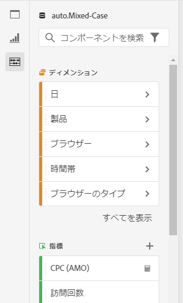
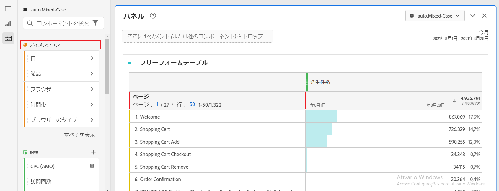
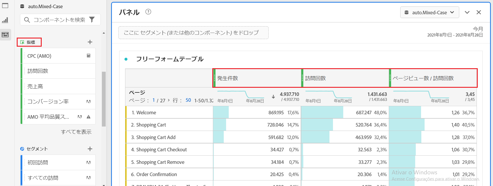
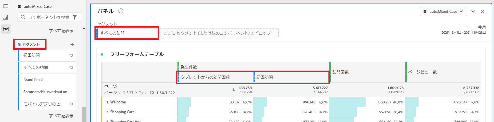
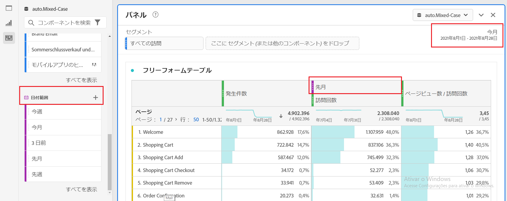
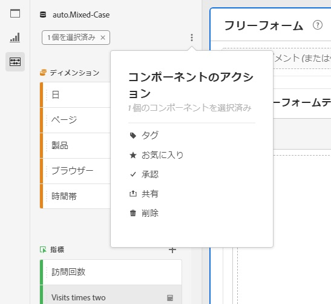

# コンポーネントの概要

Analysis Workspaceのコンポーネントは、ディメンション、指標、セグメントおよび日付範囲で構成され、これらはプロジェクトにドラッグ&amp;ドロップできます。

To access the Components menu, click the **[!UICONTROL Components]** icon in the left rail. 左側のレールアイコンまたは [ホットキーを使用して、](https://docs.adobe.com/content/help/en/analytics/analyze/analysis-workspace/panels/panels.html)パネル [、](https://docs.adobe.com/content/help/ja-JP/analytics/analyze/analysis-workspace/visualizations/freeform-analysis-visualizations.html)ビジュアライゼーション [、コンポーネントを切り替えることができます](/help/analyze/analysis-workspace/build-workspace-project/fa-shortcut-keys.md)。

また、プロジェクト/ [表示情報と設定/表示密度に移動して、プロジェクトの](https://docs.adobe.com/content/help/ja-JP/analytics/analyze/analysis-workspace/build-workspace-project/view-density.html) 密度の設定を調整し ****、左側のレールに一度に表示される値を増やすこともできます。

## ディメンション {#dimensions}

[**Dimension**](https://docs.adobe.com/content/help/en/analytics/components/dimensions/overview.html) は、訪問者の動作を説明するテキスト属性で、分析内での表示、分類および比較が可能です。 これらは左側のコンポーネントレール（オレンジ色のセクション）にあり、通常はテーブルの行として適用されます。

ディメンションの例としては、 [!UICONTROL ページ名]、 [!UICONTROL マーケティングチャネル]、 [!UICONTROL デバイスタイプ]、 Productsなどがあります。 Dimensionは、Adobeによって提供され、カスタム導入(eVar、Prop、分類など)で取得されます。

各ディメンションには、 **ディメンション項目も含まれ** ます。 Dimension項目は、任意のディメンション名の横の右矢印をクリックすると、左側のコンポーネントレールに表示されます（項目が黄色になります）。

ディメンション項目の例としては、 [!UICONTROL Homepage] ( [!UICONTROL ページディメンション内)Paid Paid Paid Search] (Marketing [!UICONTROL チャネル内)] （Marketing Dimension内）Tablet Device(Mobile Type Dimension)、Mobile Dimension(Mobile Type Type Type Dimension内 [!UICONTROL )、 Page) Padion) Paid Paid Paid Paid Paid Paid Pad Paid Pad Pad Paid Paid Pad Pad Pad Pad Paid Pad Pad Pad Pad Pad Pad Pad Pad Pad Pad Par] (Pared Pad Se Seard Pa

## 指標 {#metrics}

[**指標**](https://docs.adobe.com/content/help/en/analytics/components/metrics/overview.html) (Metrics)は、訪問者の行動に関する定量的な指標です。 これらは左側のコンポーネントレール（緑のセクション）にあり、通常は表の列として適用されます。

指標の例としては、[!UICONTROLページ表示数 [!UICONTROL 、訪問回数]、 [!UICONTROL 注文件数]、 [!UICONTROL 平均滞在時間]、 [!UICONTROL 売上高/注文]時間などがあります。 指標は、Adobeが提供するか、カスタム導入([!UICONTROL 成功イベント])で取得するか、 [計算指標ビルダーを使用して作成します](https://docs.adobe.com/content/help/ja-JP/analytics/components/calculated-metrics/calcmetric-workflow/cm-build-metrics.html)。

## セグメント {#segments}

[**セグメント**](https://docs.adobe.com/content/help/ja-JP/analytics/analyze/analysis-workspace/components/t-freeform-project-segment.html) は、分析に適用されるオーディエンスフィルターです。 これらは左側のコンポーネントレール（青いセクション）にあり、通常はパネルの上部または表の指標列の上に適用されます。

セグメントの例としては、 [!UICONTROL モバイルデバイス訪問者]、電子メールからの [!UICONTROL 訪問]、 [!UICONTROL 認証されたヒットがあります]。 セグメントはAdobeが提供するか、 [パネルのドロップゾーン](https://docs.adobe.com/content/help/en/analytics/analyze/analysis-workspace/panels/panels.html)、または [セグメントビルダーを使用して作成します](https://docs.adobe.com/content/help/ja-JP/analytics/components/segmentation/segmentation-workflow/seg-build.html)。

## 日付範囲 {#date-ranges}

[**日付範囲**](https://docs.adobe.com/content/help/ja-JP/analytics/analyze/analysis-workspace/components/calendar-date-ranges/calendar.html) :分析を実行する日付の範囲です。 これらは左側のコンポーネントレール（紫のセクション）にあり、通常は各パネルのカレンダーに適用されます。

日付範囲の例としては、2019年7月、 [!UICONTROL 過去4週間]、 [!UICONTROL 今月などがあります]。 日付範囲は、Adobeが提供するか、 [パネルカレンダーで適用するか](https://docs.adobe.com/content/help/en/analytics/analyze/analysis-workspace/panels/panels.html)、 [日付範囲ビルダーを使用して作成します](https://docs.adobe.com/content/help/en/analytics/analyze/analysis-workspace/components/calendar-date-ranges/custom-date-ranges.html)。

## コンポーネントのアクション {#actions}

左側のレールで、コンポーネントを直接（個別に、または複数を選択して）管理できます。 コンポーネントを右クリックするか、コンポーネントリストの上部にあるアクションドットアイコンをクリックします。

| コンポーネントのアクション | 説明 |
|--- |--- |
| タグ | コンポーネントにタグを適用して整理したり管理したりします。その後、左側のナビゲーションバーのタグでフィルターをクリックするか、#を入力して検索できます。 タグは、コンポーネントマネージャーのフィルターとしても機能します。 |
| お気に入り | コンポーネントをお気に入りのリストに追加します。タグと同様に、左側のレールのお気に入りで検索し、コンポーネントマネージャーでフィルターできます。 |
| 承認 | コンポーネントを「承認済み」とマークして、コンポーネントが組織で承認されたことをユーザーに伝えます。 タグと同様に、左側のレールで「承認済み」で検索し、コンポーネントマネージャーでフィルターできます。 |
| 共有 | 組織内のユーザーとコンポーネントを共有します。 このオプションは、セグメントや計算指標などのカスタムコンポーネントでのみ使用できます。 |
| 削除 | 不要になったコンポーネントを削除します。 このオプションは、セグメントや計算指標などのカスタムコンポーネントでのみ使用できます。 |

カスタムコンポーネントは、それぞれのコンポーネントマネージャーを通じて管理することもできます。 例えば、 [セグメントマネージャ](/help/components/segmentation/segmentation-workflow/seg-manage.md)。
