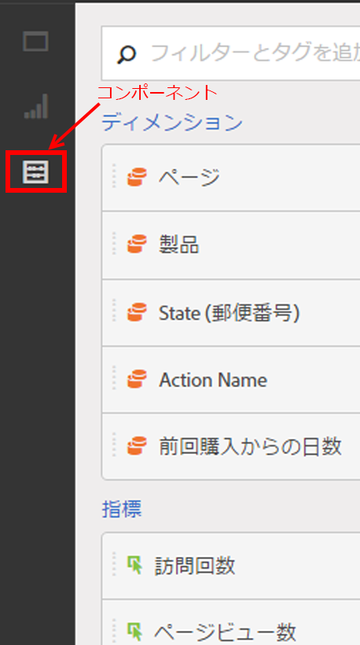

# コンポーネントの概要

Analysis Workspace のコンポーネントは、指標、ディメンション、セグメントおよび時間の精度で構成されており、これらはプロジェクトにドラッグ＆ドロップできます。カスタム日付範囲などの、作成したカスタムコンポーネントがこれらのパネルに追加されます。

コンポーネントパネルにアクセスするには、左側のレールで&#x200B;**[!UICONTROL コンポーネント]アイコンをクリックします。** You can switch among Panels (Blank panel, [Freeform panel](../../../analyze/analysis-workspace/visualizations/freeform-table.md#concept_0D2E24FCCBAF4194AA941448860E422F), or [Segment Comparison](../../../analyze/analysis-workspace/c-panels/c-segment-comparison/segment-comparison.md#concept_74FAC1C6D0204F9190A110B0D9005793) panel), [Visualizations](../../../analyze/analysis-workspace/visualizations/freeform-analysis-visualizations.md#concept_09242627629147A88A68F1506954C276), and Components using the left-rail icons or by using [hotkeys](../../../analyze/analysis-workspace/build-workspace-project/fa-shortcut-keys.md#concept_9A6356084DBC4D468E265E7A65B3E051).

See [Create a freeform analysis project](../../../analyze/analysis-workspace/build-workspace-project/t-freeform-project.md#task_C2C698ACC7954062A28E4784911E6CF2) for information about using Components in a project.

## コンポーネントのアクション {#section_B7BB29B89AE04297874CDE2C52EAD516}

コンポーネントは、様々な方法で（個別に、または複数選択して同時に）管理できます。コンポーネントを右クリックするか、コンポーネントリストの上部にある「**[!UICONTROL アクション]」をクリックします。**

>[!NOTE]
>
>これらのアクションは、時間コンポーネントには適用されません。

| コンポーネントのアクション | 説明 |
|--- |--- |
| タグ | コンポーネントにタグを適用して整理したり管理したりします。このアクションは各コンポーネントマネージャーに表示されます（Analytics／コンポーネント／セグメントや Analytics／コンポーネント／プロジェクトなど）。 |
| お気に入り | コンポーネントをお気に入りのリストに追加します。このアクションは各コンポーネントマネージャーに表示されます（Analytics／コンポーネント／セグメントや Analytics／コンポーネント／プロジェクトなど）。 |
| 承認 | コンポーネントを正規のものとして承認します。このアクションは各コンポーネントマネージャーに表示されます（Analytics／コンポーネント／セグメントや Analytics／コンポーネント／プロジェクトなど）。 |
| 共有 | セグメントにのみ適用します。 |
| 削除 | セグメントにのみ適用します。 |

[YouTube上での指標、セグメントおよび日付の作成](https://www.youtube.com/watch?v=XXJuNAte8E8&index=25&list=PL2tCx83mn7GuNnQdYGOtlyCu0V5mEZ8sS) （2:51）