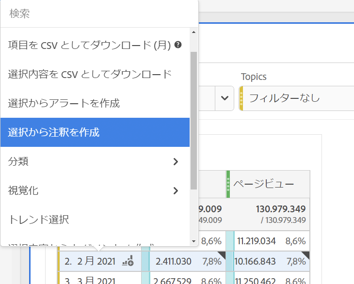
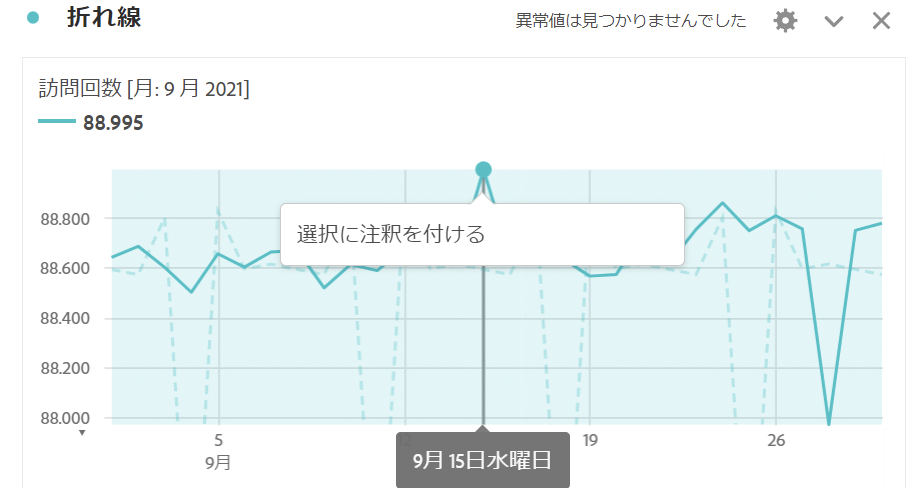
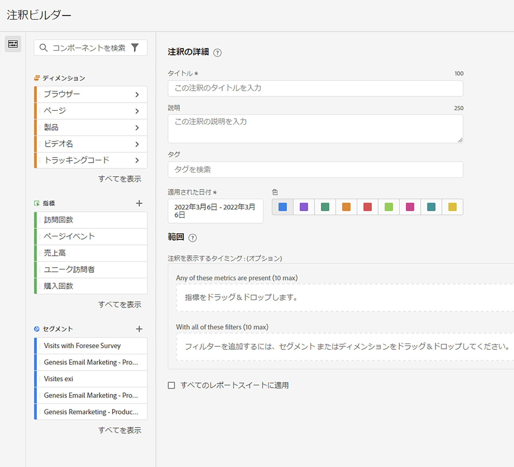
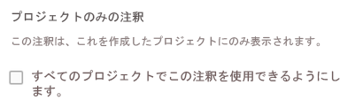

# 注釈を作成

1. 注釈を作成するには、次のいくつかの方法があります。

| 作成方法 | 詳細 |
| --- | --- |
| **[!UICONTROL Analytics]／[!UICONTROL コンポーネント]／[!UICONTROL 注釈]に移動します。** | 注釈マネージャーのページが開きます。「[!UICONTROL 新しい注釈を作成]」をクリックすると、[!UICONTROL 注釈ビルダー]が開きます。 |
| **テーブル上の点を右クリックします。** | [!UICONTROL 注釈ビルダー]が開きます。なお、この方法で作成された注釈は、デフォルトでは、作成されたプロジェクトでのみ表示されます。ただし、すべてのプロジェクトで利用できるようにすることができます。日付や指標などは既に入力されていることにも注意してください。
 |
| **[!UICONTROL 折れ線]グラフの点を右クリックします。** | [!UICONTROL 注釈ビルダー]が開きます。なお、この方法で作成された注釈は、デフォルトでは、作成されたプロジェクトでのみ表示されます。ただし、すべてのプロジェクトで利用できるようにすることができます。日付や指標などは既に入力されていることにも注意してください。
 |
| **ワークスペースで、[!UICONTROL コンポーネント]／[!UICONTROL 注釈を作成]に移動します。** | [!UICONTROL 注釈ビルダー]が開きます。 |
| **次のホットキーを使用**&#x200B;して注釈ビルダーを開きます。PC：`ctrl` + `shift` + o、Mac：`shift` + `command` + o | なお、ホットキーを使用して注釈を作成すると、事前に選択された範囲（指標またはディメンション）を含まずに、現在の日付に対して 1 日分の注釈が作成されます。 |

{style=&quot;table-layout:auto&quot;}

1. [!UICONTROL 注釈ビルダー]の要素を入力します。

   

   | 要素 | 説明 |
   | --- | --- |
   | [!UICONTROL プロジェクトのみの注釈] | デフォルトでは、注釈は現在のプロジェクトに適用されます。このチェックボックスをオンにすると、所有するすべてのプロジェクトに注釈を利用できるようになります。
  |
   | [!UICONTROL タイトル] | 注釈に名前を付ける（例：「記念日」） |
   | [!UICONTROL 説明] | （オプション）注釈の説明をします（例：「米国で制定された祝日」）。 |
   | [!UICONTROL タグ] | （オプション）タグを作成または適用して、注釈を整理します。 |
   | [!UICONTROL 適用された日付] | 注釈を表示するために必要な日付または日付範囲を選択します。 |
   | [!UICONTROL カラー] | 注釈にカラーを適用します。注釈は、選択されたカラーでプロジェクトに表示されます。カラーを使用すると、祝日、外部イベント、トラッキングの問題などの注釈を分類できます。 |
   | [!UICONTROL 範囲] | （オプション）注釈をトリガーする指標をドラッグ＆ドロップします。次に、フィルターとして機能する（つまり、注釈が表示される）ディメンションまたはセグメントをドラッグ＆ドロップします。範囲を指定しない場合、注釈はすべてのデータに適用されます。<ul><li>**[!UICONTROL これらの指標のいずれかが存在する場合]**：注釈を表示するトリガーとなる指標を最大 10 個までドラッグ＆ドロップします。</li><li>**[!UICONTROL これらのフィルターを全て使用する場合]**：注釈が表示されるときにフィルタリングされるディメンションまたはセグメントを最大 10 個までドラッグ＆ドロップします。</li></ul>
ユースケース：ある eVar は特定の日付範囲のデータ収集を停止しました。eVar を「**[!UICONTROL これらの指標のいずれかが存在する]**」ダイアログにドラッグします。または、[!UICONTROL 訪問回数]指標でデータが報告されていない場合も、同じプロセスに従います。
**メモ：**&#x200B;コンポーネントに適用された注釈で、計算指標またはセグメント定義の一部として使用されるものは、注釈を自動的には継承しません。 注釈を表示するには、目的の計算指標を範囲セクションに追加する必要もあります。ただし、同じ情報で注釈を付けるセグメントに対しては、新しい注釈を作成する必要があります。
例：特定の日に[!UICONTROL 注文]に注釈を適用します。次に、同じ日付範囲の計算指標で[!UICONTROL 注文]を使用します。新しい計算指標では、注文の注釈は自動的には表示されません。また、注釈を表示するには、計算指標を範囲セクションに追加する必要もあります。 |
   | [!UICONTROL すべてのレポートスイートに適用] | デフォルトでは、注釈は作成元のレポートスイートに適用されます。このチェックボックスをオンにすると、会社内のすべてのレポートスイートに注釈を適用できます。 |

   {style=&quot;table-layout:auto&quot;}

1. 「**[!UICONTROL 保存]**」をクリックします。
