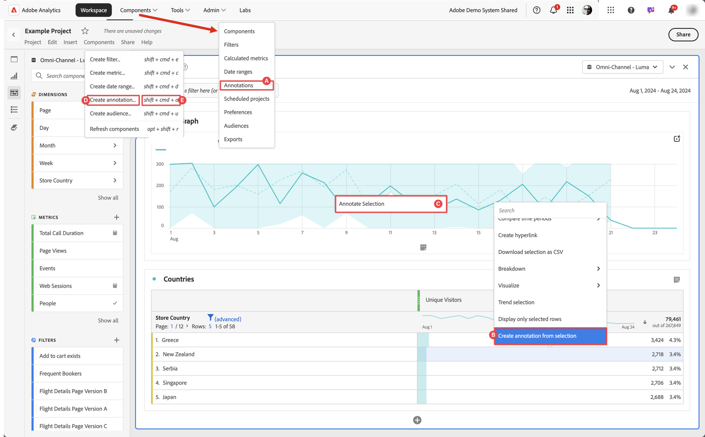
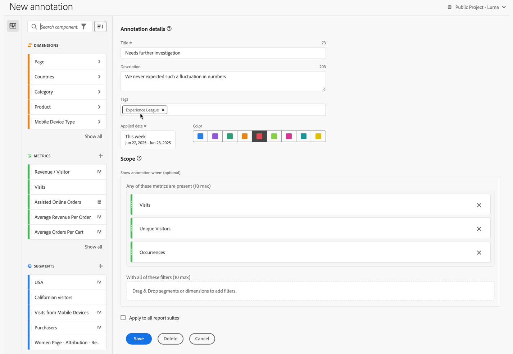
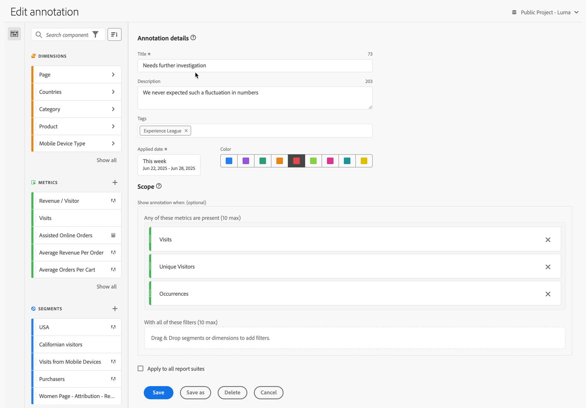

# 注釈を作成

デフォルトでは、管理者のみが注釈を作成できます。 ユーザーには、他のコンポーネント（セグメント、計算指標など）と同様に、注釈を表示する権限があります。

ただし、管理者は、[Adobe Admin Console](/help/admin/admin-console/permissions/analytics-tools.md) を介してユーザーに[!UICONTROL 注釈の作成]権限（Analytics ツール）を付与できます。

注釈は、次の方法で作成できます。

* **A**。メインインターフェイスで、**[!UICONTROL コンポーネント]**&#x200B;を選択し、**[!UICONTROL 注釈]**&#x200B;を選択します。 [[!UICONTROL 注釈]マネージャー](/help/analyze/analysis-workspace/components/annotations/manage-annotations.md)から 「 [!UICONTROL **[!UICONTROL 追加]**]」を選択します。
* **B**。Workspace プロジェクトで、ビジュアライゼーションのコンテキストメニューから「**[!UICONTROL 選択範囲から注釈を作成]**」を選択します。
* **C**。Workspace プロジェクトで、折れ線グラフのコンテキストメニューから「**[!UICONTROL 選択範囲に注釈を付ける]**」を選択します。
* **D**。Workspace プロジェクトで、メニューから「**[!UICONTROL コンポーネント]**」を選択し、「**[!UICONTROL 注釈を作成]**」を選択します。
* **E**。  Workspace プロジェクトで、ショートカット **[!UICONTROL Ctrl + Shift + O キー]**（Windows）または **[!UICONTROL Shift + Command + O キー]**（macOS）を使用します。

注釈を定義するには、[[!UICONTROL 注釈ビルダー]](#annotation-builder)を使用します。

## 注釈ビルダー {#annotation-builder}

>[!CONTEXTUALHELP]
>id="components_annotations_details"
>title="注釈の詳細"
>abstract="注釈を使用すると、コンテキストデータのニュアンスとインサイトを組織に効果的に伝えることができます。 カレンダーイベントを特定のディメンションや指標に関連付けることができます。"

>[!CONTEXTUALHELP]
>id="components_annotations_scope"
>title="範囲"
>abstract="範囲を使用すると、どのデータに注釈を付けるかをカスタマイズできます。 計算指標とセグメントは、その定義で使用されるコンポーネントに適用される注釈を自動的に継承しません。 既存の注釈の範囲セクションに新しい計算指標を追加できます。 新しいセグメントには新しい注釈が必要です。"

**[!UICONTROL 注釈ビルダー]**&#x200B;ダイアログは、新しい注釈の作成または既存の注釈の編集に使用します。 ダイアログのタイトルは、[[!UICONTROL 注釈]マネージャー](/help/analyze/analysis-workspace/components/annotations/manage-annotations.md)から作成または管理する注釈の場合、**[!UICONTROL 新しい注釈]**&#x200B;または&#x200B;**[!UICONTROL 注釈を編集]**&#x200B;になります。

>[!BEGINTABS]

>[!TAB 注釈ビルダー]

>[!TAB 注釈の作成と編集]

>[!ENDTABS]

1. 次の詳細を指定します（は必須です）。

   | 要素 | 説明 |
   | --- | --- |
   | **[!UICONTROL レポートスイート]** | 注釈のレポートスイートを選択できます。 定義した注釈は、選択したレポートスイートに基づいて、Workspace プロジェクトで注釈として使用できます。 この選択は、[!UICONTROL すべてのレポートスイートに適用]を有効にした場合に無効になります。 |
   | **[!UICONTROL プロジェクトのみの注釈]** | 作成する注釈が作業中の Workspace プロジェクトにのみ表示されることを説明する情報ボックス。 「**[!UICONTROL この注釈をすべてのプロジェクトで使用できるようにする]**」を有効にして、注釈をすべてのプロジェクトで表示します。 この情報ボックスは、Workspace プロジェクト内から注釈を作成する場合にのみ表示されます。 |
   | **[!UICONTROL タイトル]**  | 注釈に名前を付けます（例：`Needs further investigation`）。 |
   | **[!UICONTROL 説明]** | 注釈に説明を付けます（例：`We never expected such a fluctuation in numbers.`）。 |
   | **[!UICONTROL タグ]** | 1 つ以上のタグを作成または適用して、注釈を整理します。 入力を開始して、選択可能な既存のタグを検索します。 または、**[!UICONTROL Enter]** キーを押して新しいタグを追加します。 「」を選択して、タグを削除します。 |
   | **[!UICONTROL 適用日]**  | 注釈を表示するのに必要な日付または日付範囲を選択します。 ショートカットを使用して注釈を作成すると、注釈はデフォルトでその日の日付範囲に設定されます。 ビジュアライゼーション内の選択を使用して注釈を作成すると、注釈はデフォルトでビジュアライゼーションが属するパネルの日付範囲に基づいた日付範囲に設定されます。 |
   | **[!UICONTROL カラー]** | 注釈にカラーを適用します。 注釈は、選択されたカラーでプロジェクトに表示されます。 カラーを使用すると、祝日、外部イベント、トラッキングの問題などの注釈を分類できます。 |
   | **[!UICONTROL 範囲]** | 注釈をトリガーするコンポーネントパネルから指標をドラッグ＆ドロップします。 例えば、人物、セッション、イベントなどです。 次に、セグメントとして機能するディメンションまたはセグメントをコンポーネントパネルからドラッグ＆ドロップして、注釈を表示するかどうかを決定します。 範囲を指定しない場合、注釈はすべてのデータに適用されます。  次の 2 つのオプションがあります。<ul><li>**[!UICONTROL これらの指標のいずれかが存在する場合]**：注釈を表示するトリガーとなる指標を最大 10 個までドラッグ＆ドロップします。 例えば、売上高指標が特定の日付範囲のデータ収集を停止したとします。 売上高指標をこのボックスにドラッグします。</li><li>**[!UICONTROL これらすべてのセグメントを使用]**：注釈が表示されるかどうかをセグメント化するディメンションまたはセグメントを最大 10 個までドラッグ＆ドロップします。</li></ul>

**メモ：**&#x200B;コンポーネントに適用された注釈で、計算指標またはセグメント定義の一部として使用されるものは、注釈を自動的には継承しません。 注釈を表示するには、目的の計算指標を範囲セクションに追加する必要もあります。 ただし、同じ情報で注釈を付けるセグメントに対しては、新しい注釈を作成する必要があります。 例えば、特定の日に[!UICONTROL 注文]に注釈を適用します。 次に、同じ日付範囲の計算指標で[!UICONTROL 注文]を使用します。 新しい計算指標では、注文の注釈は自動的には表示されません。 また、表示する注釈の範囲セクションに計算指標を追加します。 |
   | **[!UICONTROL すべてのレポートスイートに適用]** | デフォルトでは、注釈は作成元のレポートスイートに適用されます。 このチェックボックスをオンにすると、会社内のすべてのレポートスイートに注釈を適用できます。 |

   {style="table-layout:auto"}

1. 選択
   * 「**[!UICONTROL 保存]**」を選択して、注釈を保存します。
   * 「**[!UICONTROL 名前を付けて保存]**」を選択して、注釈のコピーを保存します。
   * 「**[!UICONTROL 削除]**」を選択して、注釈を削除します。
   * 「**[!UICONTROL キャンセル]**」を選択して、注釈に対して行った変更をキャンセルするか、新しい注釈の作成をキャンセルします。
