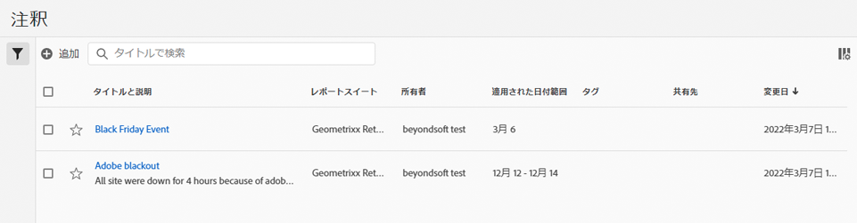

# 注釈を管理

>[!NOTE]
>
>この機能の段階的な展開は、2022 年 3 月 23 日から始まります。 一般公開：2022 年 4 月 11 日。

[!UICONTROL コンポーネント]／[!UICONTROL 注釈]マネージャーは、共有、フィルタリング、タグ付け、承認、コピー、削除、お気に入りとしてマークするなど、注釈を管理する様々な方法を提供します。

[!UICONTROL 注釈]マネージャーには、すべてのプロジェクトを対象し、自身と共有されている、すべての注釈が表示されます。

>[!NOTE]
>
>特定のプロジェクトに対してのみ作成した[!UICONTROL 注釈]は、マネージャーに表示されません。

## 注釈マネージャーのユーザーインターフェイス

| UI 要素 | 説明 |
| --- | --- | 
| [!UICONTROL タイトルと説明] | 注釈ビルダーで提供されます。タイトルと説明を編集するには、タイトルリンクをクリックします。タイトルリンクをクリックすると、注釈ビルダーに戻ります。 |
| [!UICONTROL レポートスイート] | この注釈が適用されるレポートスイート。 |
| [!UICONTROL 所有者] | 注釈の所有者を示します。管理者以外のユーザーには、自分が所有している注釈または自分と共有されていた注釈のみが表示されます。 |
| [!UICONTROL 適用された日付範囲] | この注釈が適用される日付または日付範囲。 |
| [!UICONTROL 共有先] | 注釈を共有した個人またはグループの数を一覧表示します。詳細については、ここをクリックしてください。 |
| [!UICONTROL 修正日] | 注釈が最後に変更された日時を表示します。 |

## 注釈を編集

注釈の編集とは、日付範囲、カラー、範囲、すべてのレポートスイートまたはプロジェクトに適用するかどうかを調整することです。注釈は以下の 2 つの方法で編集できます。

* 折れ線グラフで、注釈にカーソルを合わせ、ポップオーバー内の鉛筆アイコンをクリックします。

* [!UICONTROL 注釈マネージャー]で、注釈のタイトルをクリックします。

両方のオプションを選択すると、 [!UICONTROL 注釈ビルダー]. そこで、必要な調整を行い、新しいバージョンを保存できます。

## 注釈の共有

注釈を共有したり、自分と共有されていた注釈を操作したりする場合は、次の点に注意してください。

* プロジェクトのみの注釈を持つプロジェクトを作成し、そのプロジェクトを別のユーザーと共有したとします。 これらの注釈は表示されますが、プロジェクトを共有しているユーザーは、注釈を編集または削除できません。

* 注釈を保存してユーザーと直接共有する場合、ユーザーは管理者権限を持つユーザーのみ注釈の編集/削除ができます。

* まとめると、プロジェクトが共有されている場合は、そのプロジェクトにのみ表示されます。 注釈が直接共有されている場合は、その注釈を表示できるすべてのプロジェクトに表示されます。

## 注釈とタイムゾーン

すべての注釈はタイムスタンプを使用して作成されますが、時間やタイムゾーンの情報は含まれません。 レポート時には、パネルのレポートスイートのタイムゾーンが常に適用されます。 したがって、クリスマス日用に作成された注釈は、現在のレポートスイートタイムゾーンに関係なく、12 月 25 日に発生します。

もう 1 つの例は元日です。 毎時、新年が始まるときに花火のタイムゾーンが変わります。 米国山岳部時間の午後 10 時に、米国東海岸は、すでに東部時間の午前 12 時なので、火事工事を停止しています。

## その他の注釈タスク

注釈マネージャーでは、管理者が注釈の編集、追加、タグ付け、削除、名前の変更、承認、コピー、書き出しおよびフィルタリングできます。管理者以外のユーザーには表示されません。

1 つ以上の注釈を選択すると、タスクバーが表示されます。

| タスク | 説明 |
| --- | --- |
| [!UICONTROL 追加] | 新しい注釈を作成できる注釈ビルダーに移動します。 |
| [!UICONTROL タグ] | すべてのユーザーが注釈にタグを付けることができます。注釈には 1 つ以上のタグを適用できます。ただし、自分が所有している注釈に対するタグのみを表示できます。 どのような種類のタグを作成する必要がありますか。次に、便利なタグのいくつかを示します。<ul><li>ソーシャルマーケティング、モバイルマーケティングなど、チーム名に基づくタグ</li><li>プロジェクトタグ（分析タグ）：入口ページ分析など</li><li>カテゴリタグ：メンズ、地域</li><li>ワークフロータグ：（特定の事業単位用に）キュレーション済み、承認済み</li></ul> |
| [!UICONTROL 削除] | 注釈を削除すると、組織内のすべてのプロジェクトから注釈が削除されます。 |
| [!UICONTROL 名前変更] | 注釈の名前を変更すると、その注釈が適用されているすべてのプロジェクトで名前が変更されます。 |
| [!UICONTROL Copy] | 独自の注釈 ID を使用して、同じ名前と定義を持つ別個のコピーを作成します。 |
| [!UICONTROL CSV に書き出し] | 注釈の定義を .csv ファイルに書き出します。 |
| [!UICONTROL フィルター] （左レール） | タグ、レポートスイート、所有者、その他のフィルター（自分が所有、承認済み、お気に入り、自分と共有、すべて表示）でフィルタリングします。 |
