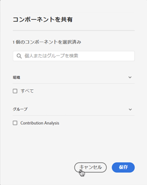

# 注釈の管理

>[!NOTE]
>
>この機能は現在、制限付きテストになっています。

この [!UICONTROL コンポーネント] > [!UICONTROL 注釈] manager では、注釈を様々な方法で管理できます。例えば、共有、フィルタリング、タグ付け、承認、コピー、削除およびお気に入りへの登録が可能です。

この [!UICONTROL 注釈] manager には、自分が所有するすべての注釈（すべてのプロジェクトに対してスコープされ、自分と共有されている注釈）が表示されます。

>[!NOTE]
>
>[!UICONTROL 注釈] 特定のプロジェクトに対してのみ作成したものは、マネージャに表示されません。

## 注釈マネージャのユーザインタフェース

| UI 要素 | 説明 |
| --- | --- | 
| [!UICONTROL タイトルと説明] | 注釈ビルダーで提供されます。 タイトルと説明を編集するには、タイトルリンクをクリックします。タイトルリンクをクリックすると、注釈ビルダーに戻ります。 |
| [!UICONTROL レポートスイート] | この注釈が適用されるレポートスイート。 |
| [!UICONTROL 所有者] | 注釈の所有者を示します。 管理者以外のユーザーは、自分が所有している注釈、または自分が共有していた注釈のみを表示できます。 |
| [!UICONTROL 適用された日付範囲] | この注釈が適用される日付または日付範囲。 |
| [!UICONTROL 共有先] | 注釈を共有している個人またはグループの数を表示します。 「 」をクリックして詳細を表示します。 |
| [!UICONTROL 修正日] | 注釈が最後に変更された日時を表示します。 |

## 注釈の編集

注釈を編集すると、日付範囲、色、範囲、またはすべてのレポートスイートやプロジェクトに適用するかどうかを調整できます。 注釈の編集方法は 2 つあります。

* 折れ線グラフで、注釈の上にマウスポインターを置いて、ポップオーバー内の鉛筆アイコンをクリックします。

* 内 [!UICONTROL 注釈マネージャ]、注釈のタイトルをクリックします。

これらのオプションはどちらも注釈ビルダーに戻ります。 ここで、必要な調整を行い、新しいバージョンを保存できます。

## 注釈の共有

1. 共有する注釈を選択し、 [!UICONTROL 共有].

1. 内 [!UICONTROL コンポーネントを共有] ダイアログで、注釈を共有する個人またはグループを検索します。

1. の下 [!UICONTROL 組織], ....

1. 「[!UICONTROL 保存]」をクリックします。

## 注釈のタグ付け

フォローする

