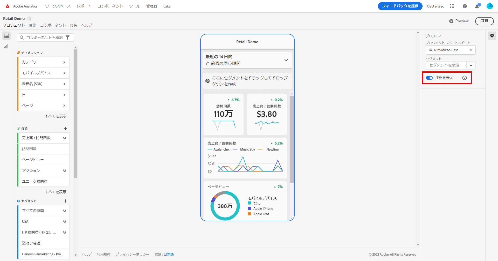
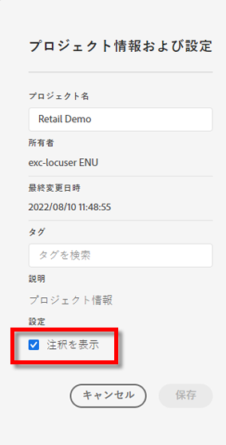
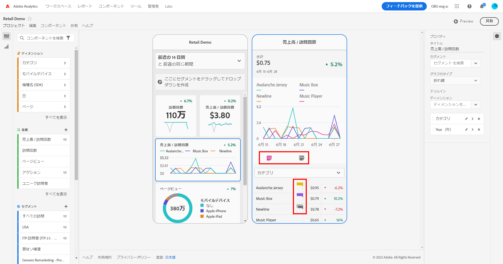
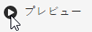
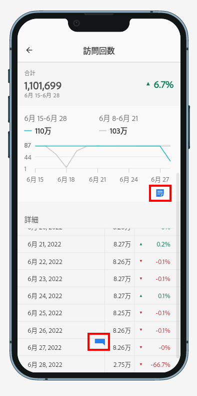
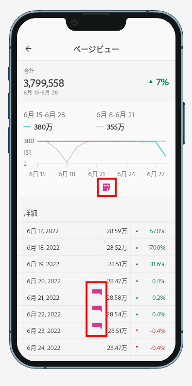
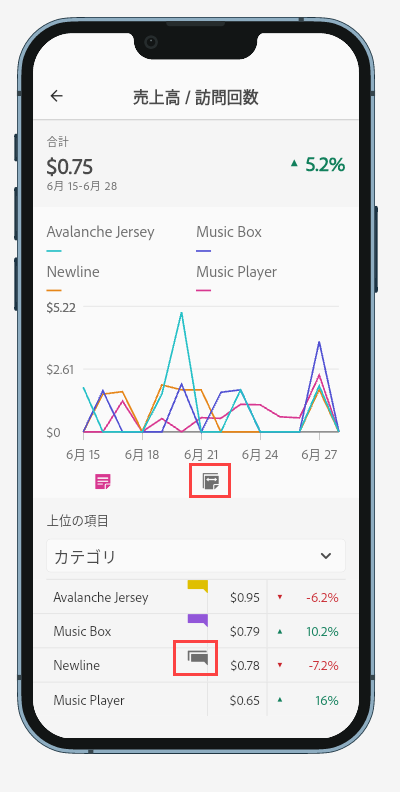
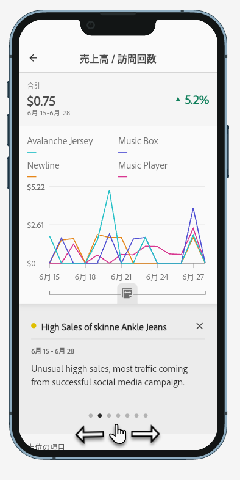
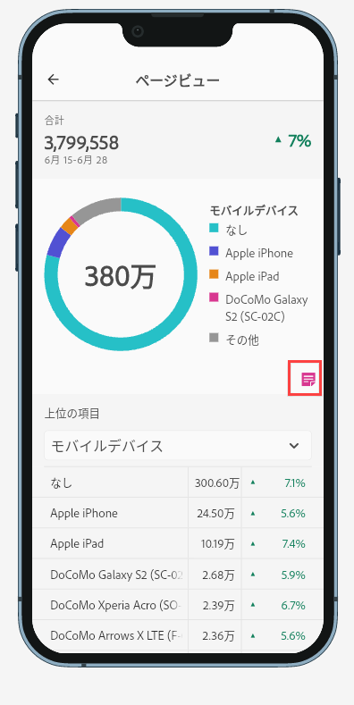

# モバイルスコアカードでの注釈の共有

Workspace で作成された注釈をモバイルスコアカードに表示できます。 これにより、組織とキャンペーンに関するコンテキストデータのニュアンスやインサイトを、Mobile Scorecard プロジェクト内で直接共有でき、Analytics ダッシュボードモバイルアプリで表示できます。

## モバイルスコアカードでのサーフェス注釈

モバイルスコアカードで注釈を表示するには、まず Workspace プロジェクトから、またはコンポーネントメニューから注釈を作成します。

注釈の作成について詳しくは、 [注釈の作成](create-annotations.md). モバイルスコアカードでは、注釈はデフォルトで無効になっており、モバイルスコアカードで表示する各スコアカードに対して有効にする必要があります。

1. 注釈をオンにする。 注釈をオンにするには、 [注釈のオン/オフの切り替え](overview.md#annotations-on-off).

1. 注釈を作成し、すべてのプロジェクトで共有されていることを確認します。 Workspace で注釈を作成するには、 [注釈の作成](create-annotations.md).

1. 選択 **注釈を表示** 「モバイルスコアカード」に注釈を表示するには

   

1. 注釈の表示が選択されていることを確認するには、に移動します。 **プロジェクト** > **プロジェクト情報と設定**.

   

## モバイルスコアカードでの注釈の表示

注釈が有効な場合、スコアカードビルダーに注釈アイコンが表示されます。 注釈は、詳細ビューのグラフとテーブルにのみ表示されます。 注釈は、スコアカードのメインタイル表示には表示されません。

注釈アイコンが表示されている場合、ビルダーキャンバスで注釈を完全に表示したり操作したりすることはできません。 プレビューモードを使用すると、アプリに表示される注釈の表示と操作を行うことができます。 

注釈の色は、Workspace で注釈を作成する際に選択します。 グレーの注釈で、複数の注釈が表示されていました。  

## グラフの注釈の表示

| 日付 | 外観 |
| --- | --- |
| **1 日** |    |
| **日付範囲** |  |
| **重複する注釈** |   Analytics ダッシュボードアプリで注釈の詳細を表示するには、注釈アイコンをタップします。   グラフで注釈を表示している場合は、左右にスワイプして、グラフに存在するすべての注釈に移動できます。 テーブルで注釈を表示している場合は、左右にスワイプして、テーブル内のその行項目に関連付けられているすべての注釈に移動します。      時間に基づくグラフの場合 *x 軸*&#x200B;ドーナツグラフや横棒グラフなど、グラフに適用される注釈は、右下隅にあるアイコンをタップすると表示できます。    |
