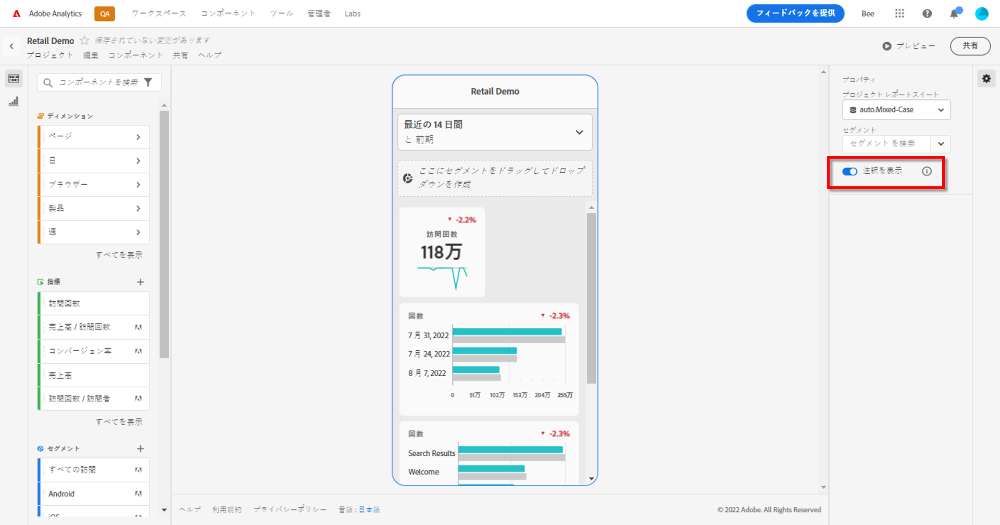

# モバイルスコアカード注釈

Analysis Workspaceで作成される注釈をモバイルスコアカードに表示できます。 モバイルスコアカードの注釈を使用すると、組織とキャンペーンに関するコンテキストデータのニュアンスやインサイトを共有できます。

## モバイルスコアカードでの注釈の表示

モバイルスコアカードに注釈を表示するには、まず Workspace プロジェクトまたはコンポーネントメニューから注釈を作成します。

注釈の作成について詳しくは、[注釈の作成](create-annotations.md)を参照してください。モバイルスコアカードでは、注釈はデフォルトで無効になっており、モバイルスコアカードで表示する各スコアカードに対して有効にする必要があります。

1. 注釈を有効にします。注釈を有効にするには、[注釈の有効／無効の切り替え](overview.md#turn-annotations-on-or-off)を参照してください。

1. 注釈を作成し、すべてのプロジェクトで共有されていることを確認します。詳しくは、[注釈の作成](create-annotations.md)を参照してください。

1. 「**[!UICONTROL 注釈を表示]**」を選択し、モバイルスコアカードに注釈を表示します。

   

   必要に応じて、**[!UICONTROL プロジェクト]**／**[!UICONTROL プロジェクト情報と設定]**&#x200B;で、「**[!UICONTROL 注釈を表示]**」が選択されていることを確認できます。

## モバイルスコアカードでの注釈の表示

注釈を有効にすると、スコアカードビルダーに注釈アイコンが表示されます。注釈は、詳細ビューのグラフとテーブルにのみ表示されます。注釈は、スコアカードのメインタイル表示には表示されません。

注釈アイコンが表示されている場合、ビルダーキャンバスで注釈を完全に表示したり操作したりすることはできません。 **[!UICONTROL プレビュー]**&#x200B;を使用して、アプリに表示される注釈を表示して操作します。

注釈の色は、Workspace で注釈を作成する際に選択します。灰色の注釈は、複数の注釈が存在することを示します。

## 注釈のプレビュー

 プレビューを使用して注釈をプレビューできます。注釈を選択して、その注釈の詳細を開きます。

さらに注釈を追加できる場合は、注釈の下部に複数のドット（●）が表示されます。 左右にスワイプして、注釈を切り替えます。

<!--
# Share Annotations in Mobile Scorecards

You can display annotations that are created in Workspace in Mobile Scorecards. This allows you to share contextual data nuances and insights about your organization and campaigns directly within Mobile Scorecard projects, viewable in the Analytics dashboards mobile app.

## Surface Annotations in Mobile Scorecards

To surface annotations in mobile scorecards, create the annotation first from Workspace projects or from the components menu.

For information on creating annotations, see [Create Annotations](create-annotations.md). Annotations are turned off in mobile scorecards by default and must be enabled for each scorecard that you want to surface in mobile scorecards.

1. Turn on annotations. To turn annotations on, see [Turn annotations on or off](overview.md#annotations-on-off).

1. Create an annotation and make sure it is shared to all your projects. To create an annotation in Workspace,  see [Create Annotations](create-annotations.md).

1. Select **Show annotations** to display the annotation in Mobile Scorecards.

   

1. Confirm that show annotations is selected, go to **Project** > **Project info and settings**.

   

## View annotations in Mobile Scorecards

When annotations are enabled, annotation icons are visible in the Scorecard Builder. Annotations appear only on charts and tables in the detailed view. Annotations are not visible from the main tile view of the scorecard.

 

When annotation icons are visible, you can't fully view or interact with annotations in the builder canvas. Use the Preview mode to view and interact with annotations as they appear in the app  **Preview**.

Annotation colors are selected when the annotation is created in workspace. Gray annotations indicated the presence of more than one annotation.

## View chart annotations

| Date | Appearance |
| --- | --- |
| **Single day** |     |
| **Date range** |  |
| **Overlapping annotations** |   To view annotation details in the Analytics dashboards app, tap an annotation icon.   When viewing an annotation in a chart, you can swipe left and right to navigate all annotations present in the chart. When viewing an annotation in the table, swipe left and right to navigate all annotations associated with that row item in the table.      In charts that do not have a time-based *x axis*, such as the donut or horizontal bar charts, annotations that apply to the chart can be viewed by tapping the icon located in the lower right-hand corner.   |
-->