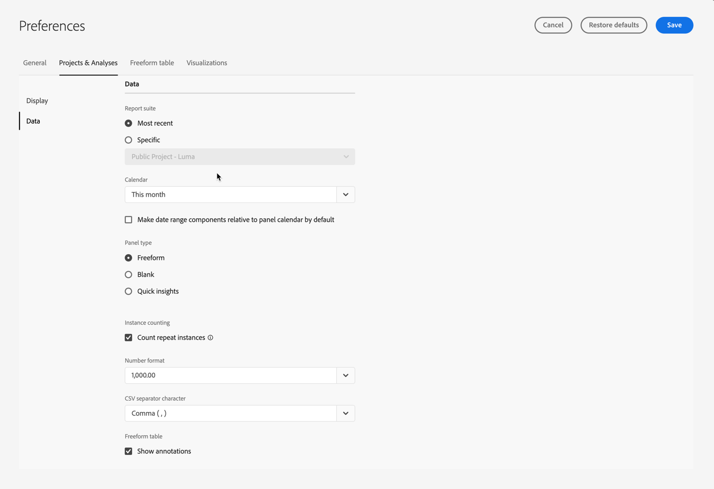
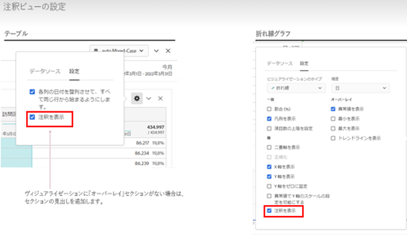
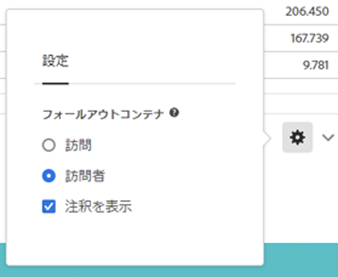

# 注釈の概要

注釈を使用すると、コンテキストデータのニュアンスとインサイトを組織内の他の関係者に効果的に伝えることができます。 注釈を使用すると、カレンダーイベントを特定のディメンションや指標に関連付けることができます。 既知のデータの問題、祝日、キャンペーンの開始などを含む日付または日付範囲に注釈を付けることができます。次に、イベントを視覚的に表示し、キャンペーンやその他のイベントが、サイトトラフィック、モバイルアプリの利用状況、売上などの指標に影響を与えたかどうかを確認できます。

例えば、プロジェクトを組織と共有しているとします。 ユニーク訪問者が大幅に減少した場合は、**訪問者減少**&#x200B;注釈を作成して、その注釈の範囲をレポートスイート全体に設定できます。 その日付を含んだレポートスイートをユーザーが表示すると、データと共に、プロジェクト内の注釈が表示されます。

注釈は次の場所に適用できます。

* 単一の日付または日付範囲。

* データセット全体、または特定の指標、ディメンション、セグメント。

* 注釈が作成されるプロジェクト（デフォルト）またはすべてのプロジェクト。

* 注釈が作成されるレポートスイート（デフォルト）、またはすべてのレポートスイート。

注釈の作成に使用できる様々なオプションについて詳しくは、[注釈の作成](create-annotations.md)を参照してください。 その後、[注釈ビルダー](create-annotations.md#annotation-builder)で注釈を作成、変更および保存します。

注釈を管理するには、[注釈マネージャー](manage-annotations.md)を使用します。

## 注釈のオンまたはオフ

注釈は、複数のレベルでオンまたはオフにできます。

| レベル | 方法 |
|---|---|
| **ビジュアライゼーション** | ／**[!UICONTROL 設定]**／**[!UICONTROL 注釈を表示]**&#x200B;を有効または無効にします。  |
| **プロジェクト** | Workspace プロジェクトメニューから、**[!UICONTROL プロジェクト]**／**[!UICONTROL プロジェクト情報および設定]**&#x200B;を選択し、「**[!UICONTROL 注釈を表示]**」を有効または無効にします。  |
| **ユーザー** | 「**[!UICONTROL コンポーネント]**」タブから「**[!UICONTROL 環境設定]**」を選択するか、Workspace プロジェクトメニューから&#x200B;**[!UICONTROL プロジェクト]**／**[!UICONTROL ユーザー環境設定]**&#x200B;を選択します。  **[!UICONTROL 環境設定]**&#x200B;で、「**[!UICONTROL プロジェクトと分析]**」を選択します。 左側のタブバーから、「**[!UICONTROL データ]**」を選択します。 下部で、**[!UICONTROL フリーフォームテーブル]**&#x200B;見出しの下にある「**[!UICONTROL 注釈を表示]**」を有効または無効にします。  |

<!--
# Annotations overview

Annotations in Workspace enable you to effectively communicate contextual data nuances and insights to your organization. They let you tie calendar events to specific dimensions/metrics. You can annotate a date or date range with known data issues, public holidays, campaign launches, etc. You can then graphically display events and see whether campaigns or other events have affected your site traffic, revenue, or any other metric.

For example, let's say you are sharing projects with your organization. If you had a major spike in traffic due to a marketing campaign, you could create a "Campaign launch date" annotation and scope it for your whole report suite. When your users view any data sets that included that date, they see the annotation within their projects, alongside their data.

Keep this in mind:

* Annotations can be tied to a single date or to a date range.

* They can apply to your entire data set or to specified metrics, dimensions, or segments.

* They can apply to the project in which they were created (default) or to all projects.

* They can apply to the report suite in which they were created (default) or to all report suites.

## Permissions {#permissions}

By default, only Admins can create annotations. Users have rights to view annotations like they do with other other Analytics components (such as segments, calculated metrics, etc.).

However, Admins can give the [!UICONTROL Annotation Creation] permission (Analytics Tools) to users via the [Adobe Admin Console](/help/admin/admin-console/permissions/analytics-tools.md).

## Turn annotations on or off {#annotations-on-off}

Annotations can be turned on or off at several levels:

* At the Visualization level: [!UICONTROL Visualization] settings > [!UICONTROL Show annotations]

* At the Project level: [!UICONTROL Project info & settings] > [!UICONTROL Show annotations]

* At the User level: [!UICONTROL Components] > [!UICONTROL User preferences] > [!UICONTROL Data] > [!UICONTROL Show annotations]

-->