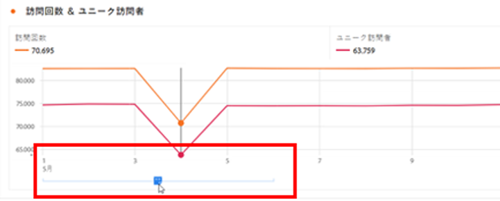

# 注釈：概要

>[!NOTE]
>
>この機能は現在、制限付きテストになっています。

注釈を使用すると、コンテキストデータのニュアンスやインサイトを組織に効果的に伝えることができます。 カレンダーイベントを特定のディメンション/指標に関連付けることができます。 データに関する既知の問題、祝日、キャンペーンの起動などを使用して、日付や日付範囲に注釈を付けることができます。 その後、イベントをグラフィカルに表示し、キャンペーンや他のイベントがサイトへのトラフィック、売上高などの指標に影響を与えたかどうかを確認できます。

例えば、組織とプロジェクトを共有しているとします。 販売イベントが原因でトラフィックが大幅に急増した場合は、「キャンペーンの開始日」注釈を作成して、レポートスイート全体に対してスコーピングできます。 ユーザーがその日付を含むデータセットを表示すると、データと共に、プロジェクト内の注釈が表示されます。

次の点に注意してください。

* 注釈は、1 つの日付または日付範囲に結び付けることができます。

* データセット全体、または指定した指標、ディメンション、セグメントに適用できます。

* 作成されたプロジェクト（デフォルト）またはすべてのプロジェクトに適用できます。

* 作成されたレポートスイート（デフォルト）またはすべてのレポートスイートに適用できます。

## 権限

デフォルトでは、注釈を作成できるのは管理者のみです。 ユーザーには、他の Analytics コンポーネントと同様に、注釈を表示する権限（セグメント、計算指標など）があります。

ただし、管理者は [!UICONTROL 注釈の作成] 権限（Analytics ツール）を [Adobe Admin Console](https://experienceleague.adobe.com/docs/analytics/admin/admin-console/permissions/analytics-tools.html?lang=en).

## 注釈のオン/オフの切り替え

注釈は、複数のレベルでオン/オフを切り替えることができます。

* ビジュアライゼーションレベル： [!UICONTROL ビジュアライゼーション] 設定/ [!UICONTROL 注釈を表示]

* プロジェクトレベルで、以下の手順に従います。 [!UICONTROL プロジェクト情報および設定] > [!UICONTROL 注釈を表示]

* ユーザーレベルで、 [!UICONTROL コンポーネント] > [!UICONTROL ユーザーの環境設定] > [!UICONTROL データ] > [!UICONTROL 注釈を表示]

