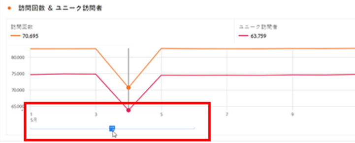
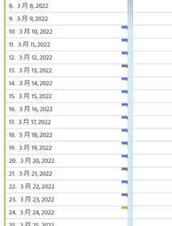
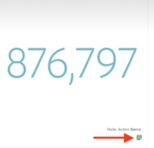
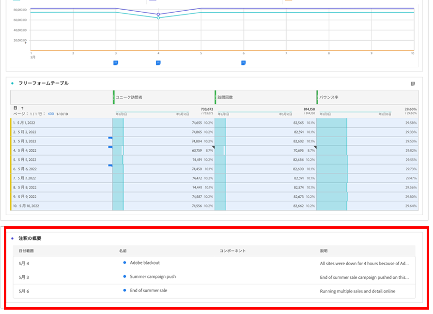

# 注釈の表示

>[!NOTE]
>
>この機能は現在、制限付きテストになっています。

注釈の表示は、1 日にまたがるか日付範囲に応じて、若干異なります。

## 折れ線グラフまたは表での注釈の表示

| 日付 | 外観 |
| --- | --- |
| **1 日** |  |
| **日付範囲** | アイコンが変わり、その上にマウスポインターを置くと、日付範囲が表示されます。

テーブルでは、日付範囲のすべての日付にアイコンが表示されます。

次の点に注意してください。複数の注釈が関連付けられている日では、アイコンはグレーになります。 |

## 概要グラフでの注釈の表示

## .pdf ファイルでの注釈の表示

.pdf ファイル内のアイコンの上にマウスポインターを置くことができないので、このファイルは（書き出し後に）パネルの下部に説明のメモを表示します。 次に例を示します。

