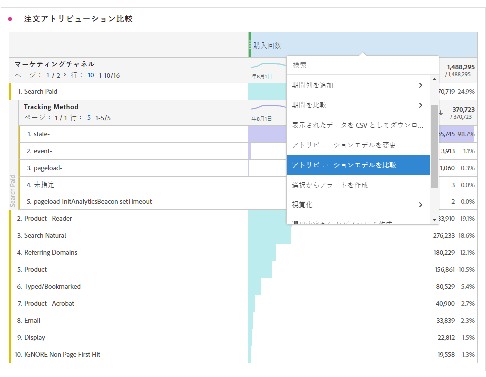

# 指標

Analysis Workspace には、指標の使用方法が 2 つあります。

標準指標、計算指標、または計算指標テンプレートを[!UICONTROL コンポーネント]メニューからテーブルにドラッグできます。

>[!NOTE]
>
>これは一見シンプルに見えますが、指標の使用はかなり強力です。レポートに指標を追加するには、適切な指標をテーブルの「指標」セクションにドラッグします。また、ディメンションを指標別に分類して、テーブルビューを細かく制御することもできます。さらに、ディメンションとして指標を挿入したり、指標としてディメンションを挿入したりして、時間外レポートを作成できます。様々なコンポーネントを操作して、機能を確認してください。ほかにも多くのことができます。

または、**[!UICONTROL コンポーネント]**／**[!UICONTROL 新しい指標]**&#x200B;をクリックします。これにより、既存の指標からカスタム指標を作成できる、[計算指標ビルダー](/help/components/c-calcmetrics/cm-overview.md)が表示されます。

計算指標をすばやく簡単に作成できるように、フリーフォームテーブルの列の右クリックメニューに「**[!UICONTROL 選択から指標を作成]**」が追加されました。このオプションは、ヘッダー列のセルが 1 つ以上選択されると表示されます。

[計算指標：実装なしの指標](https://docs.adobe.com/content/help/en/analytics-learn/tutorials/components/calculated-metrics/calculated-metrics-implementationless-metrics.html) (3:42)

## 様々なアトリビューションモデルとの指標の比較

あるアトリビューションモデルをすばやく簡単に別のアトリビューションモデルと比較する場合は、指標を右クリックし、「**[!UICONTROL アトリビューションモデルを比較]**」を選択します。

これにより、指標にドラッグして設定を 2 回おこなわなくても、アトリビューションモデルをすばやく簡単に相互比較できます。
