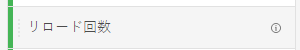
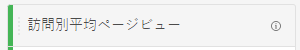
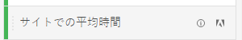

# 指標

指標を使用すると、Analysis Workspaceでデータポイントを定量化できます。 最も一般的に、ビジュアライゼーションの列として使用され、ディメンションに結び付けられます。

Adobeは、Analysis Workspaceで使用する複数のタイプの指標を提供します。

* **標準指標**:プロジェクトで使用するほとんどの指標は標準指標です。 以下に例を示します。 [ページビュー数](/help/components/metrics/page-views.md), [売上高](/help/components/metrics/revenue.md)または [カスタムイベント](/help/components/metrics/custom-events.md). 詳しくは、 [指標の概要](/help/components/metrics/overview.md) （コンポーネントユーザーガイド）を参照してください。

   

* **計算指標**:標準指標、静的数値、アルゴリズム関数に基づくユーザー定義の指標。 ユーザー定義の計算指標では、使用可能なコンポーネントのリストに計算ツールアイコンが表示されます。 詳しくは、 [計算指標の概要](/help/components/c-calcmetrics/cm-overview.md) （コンポーネントユーザーガイド）を参照してください。

   

* **計算指標テンプレート**:Adobe定義の指標で、計算指標と同じ動作をします。 これらは、Workspace プロジェクト内でそのまま使用することも、コピーを保存してロジックをカスタマイズすることもできます。 計算指標テンプレートは、使用可能なAdobeのリストに指標アイコンを表示します。

   

指標は、Analysis Workspace内で柔軟に使用できます。 空のフリーフォームテーブルに指標をドラッグして、その指標がプロジェクトの日付期間にトレンド表示されていることを確認します。 また、ディメンションが存在する場合に指標をドラッグして、各ディメンション項目と比較した指標を確認できます。 既存の指標ヘッダーの上にある指標をドラッグすると、その指標が置き換えられます。ヘッダーの横にある指標をドラッグすると、両方の指標が並べて表示されます。

>[!VIDEO](https://video.tv.adobe.com/v/40817/?quality=12)

## 計算指標

計算指標を使用すると、単純な演算子や統計関数を使用して、指標が相互にどのように関連しているかを簡単に確認できます。 計算指標を作成する方法はいくつかあります。

* 左側のコンポーネントのリストの下にある「指標」ヘッダーの横にあるプラスアイコンをクリックします。
* に移動します。 **[!UICONTROL コンポーネント]** > **[!UICONTROL 計算指標]** > **[!UICONTROL 追加]**.
* 列見出しを右クリック > **[!UICONTROL 選択から指標を作成]** （1 つ以上のヘッダー列のセルが選択されている場合）。 このオプションを選択すると、計算指標ルールビルダーを使用しなくても、計算指標が自動的に作成されます。

[計算指標： 実装なしの指標](https://experienceleague.adobe.com/docs/analytics-learn/tutorials/components/calculated-metrics/calculated-metrics-implementationless-metrics.html?lang=ja)（3:42）

## 様々なアトリビューションモデルとの指標の比較

アトリビューションモデルを別のアトリビューションモデルと素早く簡単に比較したい場合は、指標を右クリックし、「**[!UICONTROL アトリビューションモデルを比較]**」を選択します。

これにより、指標にドラッグして設定を 2 回おこなわなくても、アトリビューションモデルをすばやく簡単に相互比較できます。

## [!UICONTROL 累積平均] 関数を使用した指標スムージングの適用

以下は、このトピックに関するビデオです。

>[!VIDEO](https://video.tv.adobe.com/v/27068/?quality=12)
