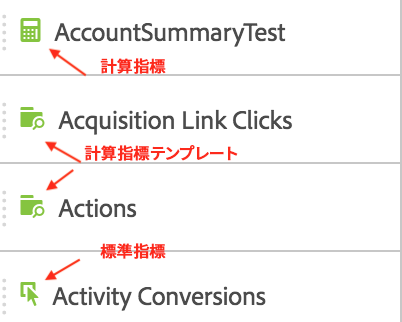
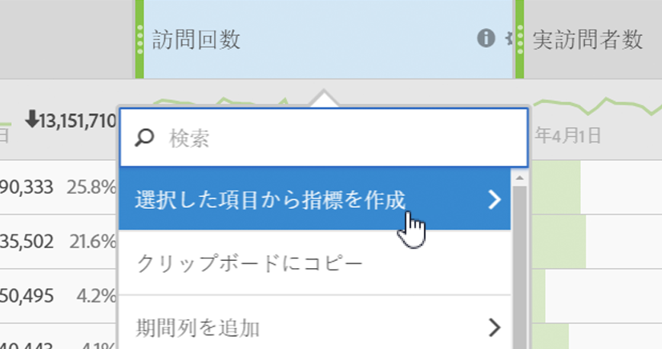

# 指標

Analysis Workspace には、指標の使用方法が 2 つあります。

標準指標、計算指標、または計算指標テンプレートを[!UICONTROL コンポーネント]メニューからテーブルにドラッグできます。

>[!NOTE]
>
>これは一見シンプルですが、指標の使用はかなり強力です。レポートに指標を追加するには、適切な指標をテーブルの指標セクションにドラッグします。また、指標ごとにディメンションを分類して、テーブル表示を細かく制御することもできます。さらに、指標をディメンションとして挿入し、ディメンションとしてディメンションを挿入して、オーバータイムレポートを作成できます。様々なコンポーネントを使用して再生し、できることを確認してください。可能性は無限です。

Or you can click **[!UICONTROL Components]** &gt; **[!UICONTROL New Metric]**. これにより、既存の指標からカスタム指標を作成できる、[計算指標ビルダー](https://marketing.adobe.com/resources/help/en_US/analytics/calcmetrics/)が表示されます。

計算指標をすばやく簡単に作成できるように、フリーフォームテーブルの列の右クリックメニューに「**[!UICONTROL 選択から指標を作成]」が追加されました。**&#x200B;このオプションは、ヘッダー列のセルが 1 つ以上選択されると表示されます。

[YouTube上のパーティシペーション指標の使用](https://www.youtube.com/watch?v=ngmJHcg65o8&list=PL2tCx83mn7GuNnQdYGOtlyCu0V5mEZ8sS&index=32) （4:16）
