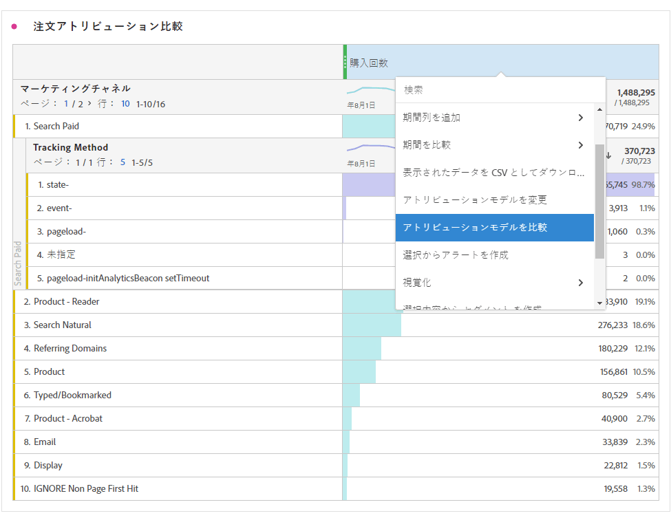

# 指標

指標を使用すると、Analysis Workspace でデータポイントを数量化できます。 これらは、ビジュアライゼーション内の列として最も一般的に使用され、ディメンションに関連付けられます。

## Analysis Workspace での指標の使用

Analysis Workspaceでは、指標を柔軟に使用できます。 指標を空のフリーフォームテーブルにドラッグすると、指標がプロジェクトの日付期間にわたってトレンド表示されます。 ディメンションが存在する場合は、指標をドラッグして、その指標が各ディメンション項目とどのように比較されるかを確認することもできます。 既存の指標ヘッダーの上に指標をドラッグすると、その指標に置き換わり、ヘッダーの横にある指標をドラッグすると、両方の指標を並べて表示できます。

Analysis Workspaceに指標やその他の種類のコンポーネントを追加する方法について詳しくは、[Analysis Workspaceでのコンポーネントの使用](use-components-in-workspace.md)を参照してください。

## 指標のタイプ

アドビでは、Analysis Workspace で使用するためのいくつかのタイプの指標を提供しています。

* **標準指標**：プロジェクトで使用するほとんどの指標は標準指標です。 例には、[ページビュー数](/help/components/metrics/page-views.md)、[収益](/help/components/metrics/revenue.md)または[カスタムイベント](/help/components/metrics/custom-events.md)が含まれます。 詳しくは、コンポーネントユーザーガイドの[指標の概要](/help/components/metrics/overview.md)を参照してください。

* **計算指標** ：標準指標、静的数値、またはアルゴリズム関数に基づくユーザー定義の指標。 ユーザー定義の計算指標では、使用可能なコンポーネントのリストに電卓アイコンが表示されます。 詳しくは、コンポーネントユーザーガイドの[計算指標の概要](/help/components/calculated-metrics/cm-overview.md)を参照してください。

* **計算指標テンプレート** ：計算指標と同様に動作するAdobe定義の指標。 これらを Workspace プロジェクトでそのまま使用することも、コピーを保存してロジックをカスタマイズすることもできます。 計算指標テンプレートでは、使用可能なコンポーネントのリストに Adobe アイコンが表示されます。

指標が承認されているかどうかを確認できます。 指標の詳細が必要な場合は、指標にカーソルを合わせて、を選択します。 詳しくは、[&#x200B; コンポーネント情報](use-components-in-workspace.md#component-info)を参照してください。

## Analysis Workspace での指標の使用

指標は、Analysis Workspace 内で様々な方法で使用できます。 Analysis Workspaceに指標やその他の種類のコンポーネントを追加する方法について詳しくは、[Analysis Workspaceでのコンポーネントの使用](/help/analyze/analysis-workspace/components/use-components-in-workspace.md)を参照してください。

>[!BEGINSHADEBOX]

デモ動画については、 [指標を使用](https://experienceleague.adobe.com/en/docs/analytics-learn/tutorials/analysis-workspace/building-freeform-tables/working-with-metrics-in-a-freeform-table){target="_blank"}を参照してください。

>[!ENDSHADEBOX]

## 計算指標の作成

計算指標では、単純な演算子や統計関数を使用して、指標が互いにどのように関連付けられているかを確認できます。

計算指標を作成するには、いくつかの方法があります。 選択した方法によって、計算指標がすべてのプロジェクトでコンポーネントリストから使用できるか、または計算指標が作成されたプロジェクトでのみ使用できるかが決まります。

### すべてのプロジェクトの計算指標の作成

[計算指標ビルダー](/help/components/calculated-metrics/workflow/c-build-metrics/cm-build-metrics.md)を使用して、[計算指標を作成](/help/components/calculated-metrics/workflow/cm-workflow.md)できます。 このように作成すると、計算指標はコンポーネントリストで利用でき、組織全体のプロジェクトで使用できます。

### 単一プロジェクトの計算指標の作成

計算指標は、作成されたプロジェクトでのみ使用できる計算指標をすばやく作成できます。

単一プロジェクトの計算指標を作成するには：

1. Analysis Workspaceで、計算指標を作成するプロジェクトを開きます。

1. フリーフォームテーブルで、1つの列の列ヘッダーを右クリックします。

   または

   Shift キーを押しながら2つの列を選択し、選択した列のいずれかを右クリックします。

1. **[!UICONTROL 選択範囲から指標を作成]**&#x200B;を選択

   選択範囲から作成を強調表示する

1. このプロジェクトのみの計算指標を作成するには、使用可能なオプションから選択します。

   1つの列を選択すると、次のオプションを使用できます。

   * [!UICONTROL **平均**]：列のディメンション要素セットの平均値を示す新しい列を作成します。 列の値には、[Mean](/help/components/calculated-metrics/cm-reference/cm-functions.md#mean)関数が使用されます。

   * [!UICONTROL **中央値**]：列のディメンション要素セットの中央値を示す新しい列を作成します。 列の値には、[Median](/help/components/calculated-metrics/cm-reference/cm-functions.md#median)関数が使用されます。

   * [!UICONTROL **列の最大値**]：列のディメンション要素セットの最大値を示す新しい列を作成します。 列の値には、[Column Maximum](/help/components/calculated-metrics/cm-reference/cm-functions.md#column-maximum)関数が使用されます。

   * [!UICONTROL **列の最小**]：列のディメンション要素のセットの最小値を示す新しい列を作成します。 列の値には、[Column Minimum](/help/components/calculated-metrics/cm-reference/cm-functions.md#column-minimum)関数が使用されます。

   * [!UICONTROL **列の合計**]: （ディメンションの要素をまたいで）列内の指標のすべての数値を追加する新しい列を作成します。 列の値には、[列の合計](/help/components/calculated-metrics/cm-reference/cm-functions.md#column-sum)関数が使用されます。

   2つの列を選択すると、次のオプションを使用できます。

   * [!UICONTROL **除算**]：選択した2つの列の値を除算する新しい列を作成します。

   * [!UICONTROL **減算**]：選択した2列の値を減算する新しい列を作成します。

   * [!UICONTROL **追加**]：選択した2列の値を追加する新しい列を作成します。

   * [!UICONTROL **乗算**]：選択した2つの列の値を乗算する新しい列を作成します。

   * [!UICONTROL **変化率**]：選択した2つの列の変化率を示す新しい列を作成します。

[計算指標：実装なしの指標](https://experienceleague.adobe.com/en/docs/analytics-learn/tutorials/components/calculated-metrics/calculated-metrics-implementationless-metrics) （3:42）

## 様々なアトリビューションモデルとの指標の比較

あるアトリビューションモデルを別のアトリビューションモデルにすばやく比較するには、指標を右クリックし、**[!UICONTROL アトリビューションモデルを比較]**&#x200B;を選択します。

このショートカットを使用すると、指標をドラッグして2回設定することなく、あるアトリビューションモデルを別のアトリビューションモデルと比較できます。

## [!UICONTROL 累積平均] 関数を使用した指標スムージングの適用

以下は、このトピックに関するビデオです。

>[!BEGINSHADEBOX]

デモ動画については、 [累積平均](https://experienceleague.adobe.com/en/docs/analytics-learn/tutorials/analysis-workspace/visualizations/using-the-cumulative-average-function-to-apply-metric-smoothing){target="_blank"}を参照してください。

>[!ENDSHADEBOX]

