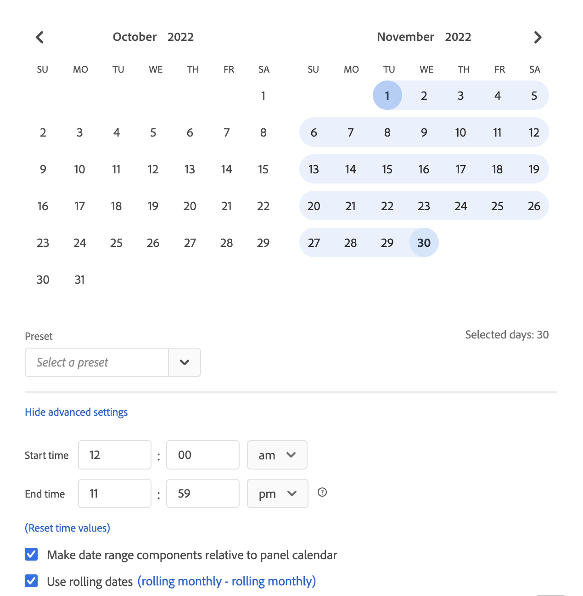

# カレンダーと日付範囲の概要

カレンダーで、日付や日付範囲を指定したり、プリセットを選択できます。

以下は、Analysis Workspace での日付範囲とカレンダーの使用に関するビデオです。

>[!VIDEO](https://video.tv.adobe.com/v/23973/?quality=12)

カレンダーの選択はパネルレベルで適用されますが、すべてのパネルに適用するオプションがあります。Workspace で日付範囲をクリックすると、インターフェイスに現在のカレンダー月と、前のカレンダー月が表示されます。これらの 2 つのカレンダーを調整するには、それぞれの上隅にある右向き矢印と左向き矢印をクリックします。

{width="60%"}

## 日付範囲の選択と適用 {#select-apply}

カレンダーの最初のクリックでは、日付範囲の選択を開始します。2 回目のクリックで日付範囲の選択が完了し、ハイライト表示されます。`Shift` キーが押された状態（または右クリックが使用された状態）の場合は、現在選択されている範囲に追加されます。

日付（および時間ディメンション）を Workspace プロジェクトにドラッグすることもできます。特定の日、週、月、年または周期的な日付を選択できます。

[Analysis Workspace での日付範囲およびカレンダーの使用](https://experienceleague.adobe.com/docs/analytics-learn/tutorials/analysis-workspace/calendar-and-date-ranges/using-dates-in-analysis-workspace.html?lang=ja)（4:07）

| 設定 | 説明 |
|--- |--- |
| 選択された期間 (日数) | 選択した日／週／月／年。 |
| パネルカレンダーに関連する日付範囲コンポーネントを作成 | パネルの日付範囲の一貫性に基づいて日付を維持します。 |
| 日周期を使用 | 日周期を使用すると、レポートを実行したタイミングに基づいて、一定期間、将来や過去を確認する動的レポートを生成できます。例えば、（「作成日」フィールドに基づく）「先月」に発行されたすべての注文をレポートしたい場合、12 月にレポートを実行すると、11 月に発行された注文が表示されます。同じレポートを 1 月に実行すると、12 月に発行された注文が表示されます。<ul><li>**[!UICONTROL 日付のプレビュー]**：周期的なカレンダーに含まれる期間を示します。</li><li>**[!UICONTROL 開始]**：本日、今週、今月、今四半期、本年から選択できます。</li><li>**[!UICONTROL 終了]**：本日、今週、今月、今四半期、本年から選択できます。</li></ul>例については、 [カスタム日付範囲](/help/analyze/analysis-workspace/components/calendar-date-ranges/custom-date-ranges.md).  デフォルトで選択されています。 |
| 日付範囲 | プリセット日付範囲を選択できます。最近の 30 日間がデフォルトです。**[!UICONTROL 今週／月／四半期／年（今日を除く）]** ：今日の日付の一部を含まない日付範囲から選択できます。 |
| すべてのパネルに適用 | 現在のパネルだけでなくプロジェクト内の他のすべてのパネルで選択された日付の範囲を変更できます。 |
| 適用 | 日付範囲をこのパネルにのみ適用します。 |

## 相対パネルの日付範囲について {#relative-panel-dates}

Workspace で作業している場合は、日付範囲コンポーネントをパネルカレンダーに対して相対的に設定できます。
相対的なパネル日付が有効になる 3 つの一般的な使用例は、コンボグラフ、主要指標の概要、フリーフォームテーブルの日付範囲です。

パネルの相対的な日付範囲を使用するには

1. を選択します。 **Workspace** タブをクリックします。
1. 「**空のプロジェクト**」を選択します。
1. 左側のパネルから、ディメンション、指標およびセグメントを追加します。
1. パネルの日付範囲の相対設定を切り替えるには、パネルの日付範囲フィールドをクリックします。
1. 選択 **パネルカレンダーに対する日付範囲コンポーネントの相対的な指定**.
   * 日付範囲コンポーネントをパネルカレンダーに対して相対的にするには、このオプションを選択します。
相対日付を選択した場合、相対日付は、今日の日付ではなく、パネルカレンダーの開始日に基づきます。
   * このオプションが選択されていない場合、相対日付は今日の日付に基づきます。

   {width="60%"}

1. 「**適用**」をクリックします。右上に相対日付が表示されます。

   

## 相対パネルの日付範囲のガイドライン {#guidelines}

相対パネルの日付範囲を使用する場合は、次のガイドラインに注意してください。

### 数式と相対的な日付範囲 {#formula-relative-dates}

相対日付を選択した場合、すべての日付式で、パネルの開始日が開始点として使用されます。

### カスタムカレンダーと相対的な日付範囲 {#custom-calendar-formulas}

週ベースのカスタムカレンダーを使用して月や年を追加する場合、指定した期間の日のオフセットが数式で計算されます。 オフセットのため、実際の日付が異なる場合があります。 数式により、カスタムカレンダーの同じ場所でのランディング日が選択されます。 例えば、カスタムカレンダーの 3 週目の第 3 金曜日などです。

### 相対日付と相対パネルの日付範囲を使用するセグメントについて {#segments-relative-dates}

セグメントを作成したり、周期的な日付（過去 7 日間や過去 2 週間など）を含むセグメントを使用していて、セグメントプレビューをクリックした場合、周期的な日付は、次の日から開始されます *今日* （パネルの開始日の代わりに）を使用します。 その結果、テーブルで実際にセグメントを使用する際に、セグメントのプレビューが一致しません。 プレビューは、セグメント自体ではなく、影響を受けます。

## パネルの日付範囲とプレビューのガイドライン {#guidelines-panel-dates}

* 2 月のリリース以降、コンポーネントとデータのプレビューは、過去 90 日間ではなく、パネルの日付範囲に基づいておこなわれます。
* 左側のパネルに表示されるすべてのコンポーネントは、パネルの日付範囲に基づいて使用できます。
* セグメントおよび計算指標ビルダーのすべての日付プレビューは、パネルの日付範囲に基づきます（関連するパネルがないコンポーネントマネージャーからアクセスしない限り、過去 90 日間の日付が基になります）。
* データプレビューでは、パネルの日付範囲に基づいて、データやコンポーネントが表示されます。