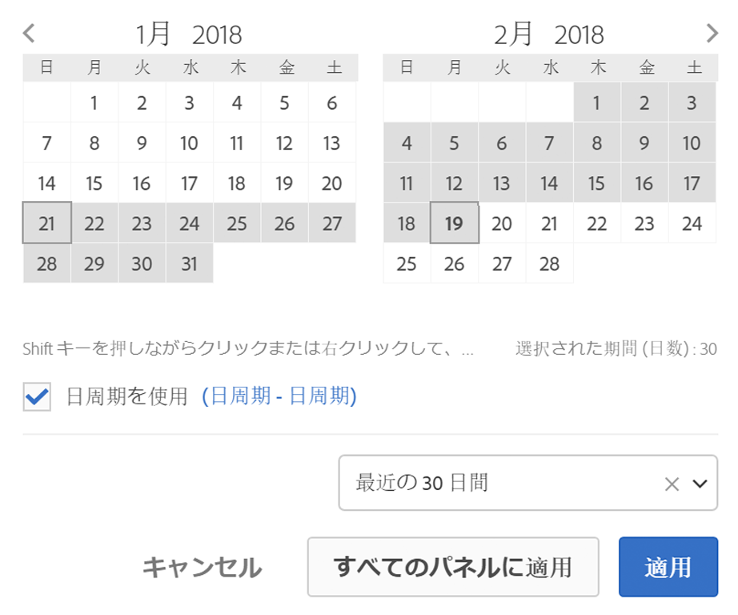

# カレンダーと日付範囲の概要

カレンダーで、日付や日付範囲を指定したり、プリセットを選択できます。

カレンダーの選択は、パネルレベルで適用されますが、すべてのパネルに適用することもできます。デフォルトでは、Workspace カレンダーには今月と先月が表示されます。

最初のクリックでは、日付範囲の選択を開始します。前または後の日付範囲をハイライト表示し、2 回目のクリックで日付範囲の終了を選択します。最初の日付をクリックしたまま `Shift` キーを押す（または右クリックを使用する）と、その日付が範囲に追加されます。

日付（および時間ディメンション）を Workspace プロジェクトにドラッグすることもできます。特定の日、週、月、年または周期的な日付を選択できます。

[YouTube上のAnalysis Workspaceでの日付範囲とカレンダーの使用](https://www.youtube.com/watch?v=L4FSrxr3SDA&list=PL2tCx83mn7GuNnQdYGOtlyCu0V5mEZ8sS&index=28) （4:07）

| 設定 | 説明 |
|--- |--- |
| 選択された期間 (日数) | 選択日/週/月/年。 |
| 日周期を使用 | 日周期を使用すると、レポートを実行したタイミングに基づいて、一定期間、将来や過去を確認する動的レポートを生成できます。例えば、（「作成日」フィールドに基づく）「先月」に発行されたすべての注文をレポートしたい場合、12 月にレポートを実行すると、11 月に発行された注文が表示されます。同じレポートを 1 月に実行すると、12 月に発行された注文が表示されます。日付のプレビュー：周期的なカレンダーに含まれる期間を示します。開始：本日、今週、今月、今四半期、本年から選択できます。終了：本日、今週、今月、今四半期、本年から選択できます。For an example, go [here](/help/analyze/analysis-workspace/components/calendar-date-ranges/custom-date-ranges.md). |
| 日付範囲 | プリセット日付範囲を選択できます。最近の 30 日間がデフォルトです。 |
| すべてのパネルに適用 | 現在のパネルだけでなくプロジェクト内の他のすべてのパネルで選択された日付の範囲を変更できます。 |
| 適用 | 日付範囲をこのパネルにのみ適用します。 |
